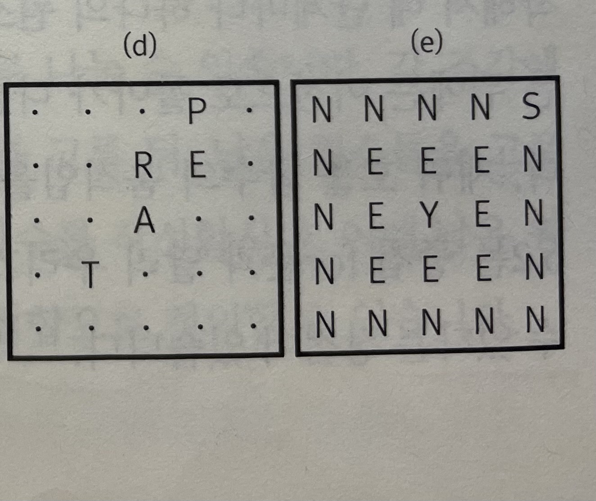

# 무식하게 풀기 

## 도입
프로그래밍 대회에서 대부분의 사람들이 가장 많이 하는 실수는 쉬운 문제를 어렵게 푸는 것이다.

바로 앞에 보이는 쉽고 간단한 답안을 간과하지 않으려면, 무식하게 풀 수 있는지 먼저 따져 보아야 한다.

'무식하게 푼다(brote-force)' 라는 말은 컴퓨터의 빠른 계산 능력을 이용해 가능한 경우의 수를 일일이 나열하면서 답을 찾는 방법을 의미한다.

이렇게 가능한 방법을 전부 만들어 보는 알고리즘들을 가리켜 흔히 완전탐색(exhaustive search)이라고 부른다.

***

## 재귀 호출과 완전 탐색 

재귀 함수란 자신이 수행할 작업을 유사한 형태의 여러 조각으로 쪼갠 뒤 그 중 한 조각을 수행하고, 나머지를 자기 자신을 호출해 실행하는 함수를 가리킨다.

```cpp
int recursiveSum(int n) {
    if(n == 1) return 1; // 기저사례(base case). 쪼개지지 않는 가장 작은 작업
    return n + recursive(n - 1);
}
```

R(n): "recursiveSum(n) 함수가 1 + 2 + $\cdots$ + n 를 반환한다" 라고 정의하자.

R(n - 1)이 참이라면 R(n) 은 참이다.

R(n - 2)이 참이라면 R(n - 1) 은 참이다.

R(n - 3)이 참이라면 R(n - 2) 은 참이다.

$\cdots$

즉 R(1)이 참이라면 R(2)가 참이고, R(3)도 참이고, $\cdots$, R(n) 까지 참이 된다.

여기서 기저사례, 즉 R(1)에 대해서는 if(n == 1) return 1; 해당 문장을 통해 참임을 확인할 수 있다.

따라서 R(n) 은 '참' 임을 알 수 있다.

즉 어떠한 결과 R을 얻기 위해 정의한 재귀함수의 정당성을 증명하기 위해서는

> 1. 재귀함수 내에서 자기 자신을 재귀호출한 부분이 결과 R을 얻는다고 가정한다.
> 2. 1번의 가정에서 재귀함수가 결과 R을 얻어내는지 확인한다.
> 3. 모든 상황에서의 기저사례가 R을 얻어내는지 확인한다.

위 3단계를 거쳐 증명한다.

비슷하게, 어떤 결과 R을 얻기 위한 재귀함수를 정의할 때에는

> 1. 재귀함수 내에서 자기 자신을 재귀호출하는 부분이 결과 R을 얻는다고 가정한다.
> 2. 1번의 가정에서 재귀함수가 결과 R을 얻어내도록 함수 몸체를 작성한다.
> 3. 존재하는 모든 입력으로부터 만들어질 수 있는 모든 기저사례들이 R을 얻어내도록 처리한다.

위의 과정을 거쳐 재귀함수를 정의한다.

함수를 작성하는 과정에서의 사고가 절대 재귀호출을 타고 들어가면 안된다 !!! 

***

### n개의 원소 중 m개를 고르는 모든 조합을 찾는 알고리즘

void pick(int n, vector<int>& picked, int toPick);

결과 R: 1 && 2 

1. n개의 원소 중에서 현재 picked에 해당하는 원소들을 뽑았을 때, 나머지 toPick개의 원소를 더 고른 후 출력하기.

2. 함수 호출시와 함수 반환 시의 picked 상태는 동일하다.

```cpp
void pick(int n, vector<int>& picked, int toPick) {
    if(toPick == 0) { printPicked(picked); return; }
    int smallest = picked.empty() ? 0 : picked.back() + 1;
    for(int next = smallest; nest < n; next++) {
        picked.push_back(next);
        pick(n, picked, toPick - 1);
        picked.pop_back();
    }
}
```

위 함수를 중첩 for문으로 구현하려 한다면 for문을 toPick 만큼 중첩시켜야 한다.

하지만 이와 같이 재귀 호출을 이용하면 특정 조건을 만족하는 조합을 모두 생성하는 코드를 쉽게 작성할 수 있다.

때문에 재귀 호출은 완전 탐색을 구현할 때 아주 유용한 도구이다.

***

### 보글 게임



```cpp
const int dx[8] = { -1, -1, -1, 0, 1, 1, 1, 0 };
const int dy[8] = { -1, 0, 1, 1, 1, 0, -1, -1 };

// [y][x] 에서 word 단어를 찾을 수 있는지 반환.
bool hasWord(int y, int x, const string& word) {
    if(!inRange(y, x)) return false; // 범위 벗어난 부분 기저사례로 처리
    if(board[y][x] != word[0]) return false;
    if(word.size() == 1) return true;
    for(int i = 0; i < 8; i++)
        if(hasWord(y + dy[i], x + dx[i], word.substr(1))) return true;
    return false;
}
```

재귀함수는 함수 몸체 내에서 여러번 호출될 수 있기 때문에, 입력이 잘못되거나 범위에서 벗어난 경우도 기저사례로 처리하면 간결한 코드를 작성할 수 있다.

1. hasword(y, x, word) : 현재 위치에서 시작해서 단어의 나머지 글자들을 찾을 수 있는가?
2. board[y][x] 에 단어의 첫 글자가 있는가?
3. hasword(y + dy[i], x + dx[i], word.substr(1)) : 현재 위치에서 시작해서 단어의 나머지 글자들을 찾을 수 있는가?

3번은 1번 문제에서 한 조각(2번)을 떼어냈을 뿐, 형식이 같은 또 다른 문제를 푼 결과이다.

이런 문제들을 원래 문제의 부분문제라고 하며, 재귀호출의 형태로 나타낼 수 있다.


***

### 시간 복잡도 분석

완전탐색 알고리즘은 가능한 답 후보를 모두 만들어보기 때문에, 시간복잡도를 계산하기 위해서는 가능한 후보의 수를 전부 세어 보면 된다. 

보글 게임 문제같은 경우에는 단어의 길이 N에 대해 재귀호출이 최대 $8^{N-1}$ 번 일어나므로 시간복잡도는 $O(8^N)$이 된다. 따라서 단어의 길이가 짧은 경우에만 해결할 수 있다.

***

### 완전 탐색 지침

> 1. 완전탐색은 존재하는 모든 답을 하나씩 검사하므로, 걸리는 시간은 가능한 답의 수에 비례한다.
> <br> 최대 크기의 입력을 가정했을 때 답의 개수를 계산하고 제한 시간 안에 생성 가능한지 가늠한다.
> 2. 가능한 모든 답의 후보를 만드는 과정을 여러 개의 조각으로 나눈다.
> 3. 그 중 하나의 조각을 선택해 답의 일부를 만들고, 나머지는 재귀 호출을 통해 완성한다.
> 4. 조각이 하나밖에 남지 않은 경우나 하나도 남지 않은 경우는 기저 사례로 선택해 처리한다.

***

### 최적화 문제

문제의 답이 하나가 아니라 여러개고, 어떤 기준에 따라 가장 좋은 답을 찾아내는 문제들을 통칭해 최적화 문제(Optimization problem) 라고 부른다.

최적화 문제를 해결하는 방식은 여러 가지가 있는데, 이중 가장 기초적인것이 완전탐색이다.

여행하는 외판원 문제(TSP)

어떤 나라에 n개의 큰 도시가 있다. 각각의 도시는 모두 연결되어있을 때 한 도시에서 출발해 다른 도시들을 전부 한 번씩 방문한 뒤 시작 도시로 되돌아오는 최단거리 구하기.

```cpp
int n;
double dist[MAX][MAX];

// path가 지금까지 만든 경로, visited가 방문한 도시 배열, currentLength가 현재 만든 경로의 길이일 때 시작 도시로부터 나머지 도시들을 모두 방문하여 시작도시로 되돌아가는 최단 경로 반환.
// 함수 호출시의 path, visited 값과 반환시의 path, visited 값은 동일.
double shortestPath(vector<int>& path, vector<bool>& visited, double currentLength) {
    if(path.size() == n) {
        return currentLength + dist[path[0]][path.back()];
    }
    double ret = INF; // 매우 큰 값
    int here = path.back();
    for(int next = 0; next < n; next++) {
        if(!visited[next]) {
            path.push_back(next);
            visited[next] = true;
            ret = min(ret, shortestPath(path, visited, currentLength + dist[here][next]));
            path.pop_back(next);
            visited[next] = false;
        }
    }
    return ret;
}
```

0번 도시에서 출발한다고 한다면, 남은 도시를 나열하는 방법의 수는 9!으로 362,880 개가 된다.

즉 완전탐색으로 1초 안에 가볍게 처리할 수 있는 양이다.

***

## 예제

### 소풍 (PICNIC)

> https://www.algospot.com/judge/problem/read/PICNIC

```cpp
#include <cstdio>
#include <cstring>

int count(int n, int pair, bool *chosen, bool (*isFriend)[10]) {
    if(pair == 0) return 1;
    int a = 0, ret = 0;
    while(chosen[a]) a++;
    chosen[a] = true;
    for(int b = a + 1; b < n; b++)
        if(!chosen[b] && isFriend[a][b]) {
            chosen[b] = true;
            ret += count(n, pair - 1, chosen, isFriend);
            chosen[b] = false;
        }
    chosen[a] = false;
    return ret;
}

int main() {
    int C; scanf("%d", &C);
    int n, m, a, b;
    bool isFriend[10][10];
    bool chosen[10];
    while(C--) {
        memset(isFriend, 0, sizeof(isFriend));
        memset(chosen, 0, sizeof(chosen));
        scanf("%d %d", &n, &m);
        while(m--) {
            scanf("%d %d", &a, &b);
            isFriend[a][b] = isFriend[b][a] = true;
        }
        printf("%d\n", count(n, n / 2, chosen, isFriend));
    }
}

```

학생의 수가 최대 10명이므로 완전탐색으로 무리 없이 풀 수 있는 문제.

가장 간단한 방법은 재귀 호출로 가능한 조합을 모두 만들어 보는것.

답을 만드는 과정을 여러 개의 조각으로 나누는데, 총 n / 2 개의 조각으로 나누어 한 조각마다 두 학생을 짝지어주기.

답의 상한 계산(만들어 질 수 있는 답의 개수): 9 x 7 x 5 x 3 x 1 = 945. -> 브루트포스 알고리즘으로 충분히 풀 수 있다.

count(n, pair, chosen, isFriend)

1. n명의 학생중에 현재 chosen에 기록되지 않은 학생들 중 isFriend상 서로 친구인 학생 pair 쌍의 개수 반환
2. chosen은 함수 호출시와 반환시 동일한 값을 갖는다.

***

### 게임판 덮기 (BOARDCOVER)

> https://www.algospot.com/judge/problem/read/BOARDCOVER

```cpp
#include <cstdio>
#include <cstring>

int H, W;
char board[20][22];

int dx[4][3] = { 0, 0, -1, 0, 0, 1, 0, 0, 1, 0, 1, 1 };
int dy[4][3] = { 0, 1, 1, 0, 1, 1, 0, 1, 0, 0, 0, 1 };

bool canPut(int r, int c, int type) {
    for(int i = 0; i < 3; i++) {
        int row = r + dy[type][i];
        int col = c + dx[type][i];
        if(row >= H || col < 0 || col >= W || board[row][col] == '#')
            return false;
    }
    return true;
}

void put(int r, int c, int type, bool p) {
    for(int i = 0; i < 3; i++) {
        int row = r + dy[type][i];
        int col = c + dx[type][i];
        board[row][col] = p ? '#' : '.';
    }
} 


int count() {
    int ret = 0;
    int r = -1, c = -1;
    for(int i = 0; i < H; i++) {
        for(int j = 0; j < W; j++)
            if(board[i][j] == '.') {
                r = i; c = j; break;
            }
        if(r != -1) break;
    }
    if(r == -1) return 1;

    for(int type = 0; type < 4; type++) {
        if(canPut(r, c, type)) {
            put(r, c, type, true);
            ret += count();
            put(r, c, type, false);
        }
    }

    return ret;
}

int main() {
    int C;
    scanf("%d", &C);
    while(C--) {
        scanf("%d %d", &H, &W);
        while(getchar() != '\n');
        for(int i = 0; i < H; i++) {
            fgets(board[i], sizeof(board[i]), stdin);
        }
        printf("%d\n", count());
    }
}

```

게임판을 덮는 '경우의 수'를 세는 문제이므로, 블록을 놓는 순서는 중요하지 않다.

따라서 블록을 놓는 방법을 중복해서 세지 않도록 주의해야 한다.

이럴때는 답을 만드는 방법을 고정하는 방식을 사용할 수 있다.

이 경우에는 두 가지 조건을 만족해야 한다.

> 1. 만드는 방법을 고정하여 만든 답들은 중복이 존재해서는 안된다.
> 2. 해당 방법으로 세지 못하는 경우의 수가 존재해서는 안된다.

게임판을 덮는 방식을 고정하여 보자.

항상 빈 칸 중에서 가장 위, 가장 왼쪽에 있는 칸부터 채워 나가는 방식을 사용하자.

1. 중복된 답이 존재할 수 있는가? 임의의 한 답을 생각했을 때, 해당 답을 만들어 나가는 방식은 하나만 존재한다.
2. 해당 방법으로 세지 못하는 경우의 수가 존재하는가? 존재하지 않는다.

따라서 위 방식으로 답을 생성하도록 강제하면 중복 없이 답을 셀 수 있다.

답의 상한을 계산한다면 $O(4^{50/3}) = O(4^{16}) = O(2^{32})$ 가 된다.

하지만 실제로 손으로 풀어본다면 가능한 답은 훨씬 더 적다는 것을 알 수 있고, 흰 칸이 48개 있는 세 번째 예제의 답이 1514 라는것을 보면 만들어 질 수 있는 답은 훨씬 적어 브루트포스 방식으로 풀 수 있다고 짐작할 수 있다.

> 답의 상한은 $4^{16}$이지만, 실제 반복되는 총 횟수는 다르다.
> <br>하지만 해당 답을 만들어가기까지의 반복문 개수는 $4+4^2+4^3+\cdots+4^n = (4/3)4^n\approx 4^n$ 이다.
> <br> 4가 아닌 $r$이라고 해도 실제 반복문 개수는 $(r/r-1)r^n$으로 $r^n$과 거의 유사하다.
> <br>따라서 만들 수 있는 답의 상한의 수는 얼추 실제 반복되는 수와 거의 같다고 봐도 된다.

***

### 시계 맞추기 (CLOCKSYNC) 

> https://www.algospot.com/judge/problem/read/CLOCKSYNC

```cpp
#include <cstdio>
#include <algorithm>
using namespace std;

#define INF 987654321

const int buttons[10][5] = {
    { 0, 1, 2, -1, -1},
    { 3, 7, 9, 11, -1},
    { 4, 10, 14, 15, -1},
    { 0, 4, 5, 6, 7 },
    { 6, 7, 8, 10, 12 },
    { 0, 2, 14, 15, -1 },
    { 3, 14, 15, -1, -1 },
    { 4, 5, 7, 14, 15 },
    { 1, 2, 3, 4, 5 },
    { 3, 4, 5, 9, 13 }
};

char clocks[16];

void push_buttons(int b) {
    for(int i = 0; i < 5; i++) {
        int clock = buttons[b][i];
        if(clock == -1) return;
        clocks[clock] += 3;
        if(clocks[clock] == 15)
            clocks[clock] = 3;
    }
}

bool allTwelve() {
    for(int i = 0; i < 16; i++)
        if(clocks[i] != 12) return false;
    return true;
}

int minSwitches(int button) {
    if(button == 10) {
        if(allTwelve()) return 0;
        else return INF;
    }
    int ret = INF;
    for(int pushed = 0; pushed < 4; pushed++) {
        ret = min(ret, pushed + minSwitches(button + 1));
        push_buttons(button);
    }
    return ret;
}

int main() {
    int C;
    scanf("%d", &C);
    while(C--) {
        for(int i = 0; i < 16; i++)
            scanf("%hhd", &clocks[i]);
        int ret = minSwitches(0);
        printf("%d\n", ret != INF ? ret : -1);
    }
}

```

이 문제에서 가장 중요한 포인트는 스위치를 누르는 순서는 전혀 중요하지 않다는 것이다.

또한 스위치를 4번 누른다면 원래 상태와 동일하게 되므로 각 스위치는 0번부터 3번까지만 누를 수 있다는 것이다.

가능한 모든 수는 $4^{10} = 1024 * 1024 \approx 10^6$ 이므로 완전 탐색으로 충분히 풀 수 있는 문제이다.

minSwitches(button) :

1. 현재 clocks 배열을 button ~ 9번 버튼을 이용하여 전부 12시로 만드는데 눌러야 하는 버튼의 최소 숫자.

2. 함수의 호출과 반환 이후의 clocks 배열은 동일하다.

재귀호출하는 부분이 위 정의를 만족한다고 가정하면, 재귀함수도 위 정의를 만족한다.
