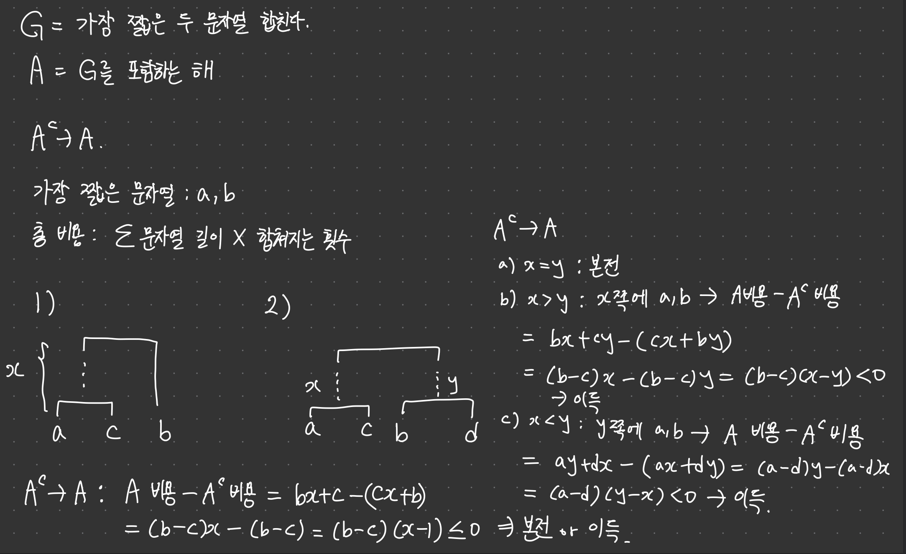

# 탐욕법

## 도입

탐욕법이란 원하는 답을 여러 개의 조각으로 쪼개고, 각 단계마다 답의 한 부분을 만들어가는것이다.

이때 탐욕법은 모든 답을 고려하는 것이 아닌, 특정한 선택지 하나를 선택한다.

탐욕법은 선택한 선택지가 최적해에 포함되는지 판단(정당성 증명) 하는 것이 가장 중요하다.

아래 예제를 통해, 탐욕법에서의 정당성 증명 방법을 설명하겠다.

**회의실 예약**

n개의 팀이 각각 회의하고 싶은 시간을 [시작시간, 끝시간] 으로 적어 제출했다고 하자.

두 팀이 회의실을 같이 쓸 수는 없기 때문에 이 중 서로 겹치지 않는 회의만을 골라내서 진행해야 한다.

최대 몇 개나 선택할 수 있을까?

1. 탐욕법의 각 단계에서 선택할 특정한 해의 형태를 정의한다.
<br> $\rightarrow A =$ 가장 먼저 끝나는 회의$(G)$를 포함하는 해.
<br> $A^c =$ 가장 먼저 끝나는 회의를 포함하지 않는 해.

2. **탐욕적 선택 속성(greedy choice property)**

   $A$ 중에서 최적해가 있음을 보이면 된다.

   $A$ 중에서 최적해가 있음을 보이기 위해서는 $A^c \rightarrow A$가 본전이거나 이득임을 보이면 된다.

   1. $A^c \rightarrow A$로 바뀜으로써 늘어난 회의가 없는 시간에 회의가 하나 더 들어감. (이득)

   2. 회의가 더 들어가지 않음. (본전)

      따라서 주어진 문제는 $A^c \rightarrow A$가 본전이거나 이득이다.

   이 때 $A$ 중에서 최적해가 존재한다는 증명은 아래와 같다.

   경우의 수는 아래와 같이 두가지로 나뉜다.

   1. $A^c$에 최적해가 존재하지 않다고 가정: 최적해는 $A$에 포함된다.

   2. $A^c$에 최적해가 존재한다고 가정

      a) $A^c \rightarrow A$가 본전 : $A$에도 최적해 존재

      b) $A^c \rightarrow A$가 이득 : ii.의 가정이 모순 $\rightarrow$ 최적해는 $A$에 포함됨.
    
   위의 증명을 통해 $A$에는 최적해가 존재함을 알 수 있다.

   $A$의 모든 해는 $G$를 포함하므로, $G$를 포함하는 최적해가 있음을 알 수 있다.

   > 즉 탐욕적 선택($G$)을 포함하지 않는 해를 $A^c$ 에서 포함하는 해 $A$로 바꾸었을 때 '본전' 이거나 '이득' 이라면 
   > <br>$A$에는 최적해가 존재하고, $A$는 $G$를 포함하는 해이므로 $G$를 포함하는 최적해가 있다는 것을 알 수 있다. 

   이를 **탐욕적 선택 속성** 을 만족한다고 한다.

3. **최적 부분 구조**

   탐욕적 선택을 하고, 해당 선택과 겹치는 모든 회의를 지우고 남은 회의들에 대해서 또 다시 동일한 형태의 부분문제를 풀어야 한다.

   전체 답에서 최대로 많은 회의들을 포함해야 하도록 부분 문제에서 회의를 선택해야 한다.

   부분 문제에서도 최대로 많은 회의들을 선택해야 전체 문제에서 최대한 많은 회의들이 포함될 것이다.

   이 속성을 ***최적 부분 구조*** 를 만족한다고 한다.

   동일한 형태의 문제이므로 부분문제에서의 $A$는 최적해를 포함하고, 이번에도 $G$를 선택한다.

> 첫 번째 단계에서 선택한 $G$는 전체 답의 최적해에 포함되는 선택이다.
> <br>두 번째 단계에서 선택한 $G$는 부분 문제의 최적해에 포함되는 선택이다.

> $G$가 문제에서의 최적해에 포함되는 하나의 선택이라면 이는 ***탐욕적 선택 속성***이다.
> <br> 탐욕적 선택 속성을 갖는 전체 문제와 동일한 형태의 부분 문제에서 최적해를 구해야 전체 문제에서 최적해를 구할 수 있다면, 부분 문제에서도 $G$를 선택하면 되고, 이는 ***최적 부분 구조*** 이다.

즉 ***탐욕적 선택 속성***과 ***최적 부분 구조***를 모두 만족하는 문제는, 모든 단계의 선택에서 $G$를 택함으로써 답을 구할 수 있다.
   

***

## 예제

출전 순서 정하기 (MATCHORDER)

> https://www.algospot.com/judge/problem/read/MATCHORDER

```cpp
#include <cstdio>
#include <algorithm>
#include <deque>
using namespace std;

int main() {
    int C, N;
    scanf("%d", &C);

    while(C--) {
        scanf("%d", &N);
        deque<int> russia(N), korea(N);
       
        for(int i = 0; i < N; ++i)
            scanf("%d", &russia[i]);
        for(int i = 0; i < N; ++i)
            scanf("%d", &korea[i]);
        
        sort(russia.begin(), russia.end());
        sort(korea.begin(), korea.end());

        while(korea.size() && korea.back() < russia.back()) {
            korea.pop_front();
            russia.pop_back();
        }

        int count = 0;
        int k = 0;
        for(int r = 0; r < russia.size() && k < korea.size(); ++r) {
            while(k < korea.size() && korea[k] < russia[r]) ++k;
            ++count; ++k;
        }

        printf("%d\n", count);
    }

    return 0;
}
```

**탐욕적 선택 속성**

$G_1$ = 이기지 못하는 상대에게 가장 낮은 레이팅 팀원 매칭

$A = G_1$ 포함하는 해

$A^c \rightarrow A$ : 어차피 이기지 못하므로 제일 낮은 점수인 팀원을 매칭시키도록 바꾸면 본전 또는 이득.

따라서 $G_1$을 포함하는 최적해 존재.

$G_2$ = 이기지 못하는 상대가 없을 때, 가장 레이팅이 낮은 상대에게 이길 수 있는 가장 낮은 레이팅 팀원 매칭

$B = G_2$ 포함하는 해

$B^c \rightarrow B$

$B^c$: 상대보다 더 높은 레이팅의 팀원이 매칭되었을 때 $\rightarrow$ 더 낮은 레이팅의 이길 수 있는 팀원으로 바뀌므로, 해당 매칭 승리는 유지되고 더 높은 레이팅의 팀원이 나머지에 감으로써 본전 혹은 이득

$B^c$: 상대보다 더 낮은 레이팅의 팀원이 매칭되었을 때 $\rightarrow$ 이 팀원은 다른 곳에 가더라도 무조건 짐. 

해당 상대를 이길 수 있는 가장 낮은 레이팅의 팀원이 $B^c$에서 이기고 있었다면 $B$로 바꿨을 때 본전, 지고 있었다면 이득. 따라서 본전 혹은 이득.

따라서 $B$는 최적해를 포함.

**최적 부분 구조**

$G_1$ 또는 $G_2$를 선택하고 남은 나머지 팀원들도 승수를 최대한으로 하도록 매칭해야 전체 문제에서의 승수가 최대한이 된다.

따라서 최적 부분 구조도 만족.

따라서 모든 선택에서 $G_1$ 혹은 $G_2$를 택하면 된다.

***

## 예제

### 도시락 데우기 (LUNCHBOX)

> https://www.algospot.com/judge/problem/read/LUNCHBOX

```cpp
#include <cstdio>
#include <vector>
#include <algorithm>
using namespace std;

int main() {
    int C; scanf("%d", &C);

    while(C--) {
        int n; scanf("%d", &n);

        // {-e_i, m_i}
        vector<pair<int, int>> t(n);
        for(int i = 0; i < n; ++i)
            scanf("%d", &t[i].second);
        for(int i = 0; i < n; ++i) {
            scanf("%d", &t[i].first);
            t[i].first = -t[i].first;
        }

        sort(t.begin(), t.end());

        int sum_m = 0;
        int ret = 0;

        for(int i = 0; i < t.size(); ++i) {
            sum_m += t[i].second;
            ret = max(ret, sum_m + -t[i].first);
        }

        printf("%d\n", ret);
    }
}
```

도시락을 데우는데 최소화 해야할 값은 $\max_{x=0}^{n-1}$($\sum_{i=0}^{x} m_i$ + $e_x$) 이다.

$\sum_{i=0}^{x} m_x$ + $e_x$ = $t_x$ 라고 하자.

도시락을 먹는데 오래 걸린다면, 일찍 배치하여 먹으면서 데우는 병렬처리를 최대화 하는 탐욕법을 생각할 수 있다.

$G =$ 먹는데 가장 시간이 오래 걸리는 사람을 맨 앞으로 배치

$A = G$를 포함하는 해

$A^c \rightarrow A$ 분석

$A^c$의 한 형태가 $a, \cdots, b, \cdots$ 와 같다고 하자. 여기서 $b$는 먹는데 가장 오래 걸리는 사람이다.

$a$ 부터 $b$ 까지의 $t_x$값의 최댓값은 $\sum_{i=a}^{b} m_i + e_b$ 이고, 이 값을 MAX 라고 하자.

$A^c \rightarrow A$ 를 위해 $a$와 $b$의 위치를 바꾼 $A$를 생각해보자.

$b$ 다음번 사람부터는 $t_x$ 값의 변화가 없다.

또한 $b \cdots a$ 에서는 $MAX$를 넘기는 $t_x$값이 없다.

따라서 $A^c \rightarrow A$ 가 본전 또는 이득이므로 

$A^c$에 최적해가 없다면 최적해는 $A$에, 

$A^c$에 최적해가 있고 $A^c \rightarrow A$가 본전이라면 $A$에도 최적해가 있고,

$A^c$에 최적해가 있고 $A^c \rightarrow A$가 이득이라면 $A^c$에 최적해가 있다는것이 모순으로 최적해는 $A$에 있다는 논리로

$A$에는 최적해가 있고, $G$를 포함하는 최적해가 있다는 것을 알 수 있다.

맨 앞의 사람을 제외한 나머지 사람들의 순서를 배치하는 부분문제에서도, 걸리는 시간을 최소화해야 전체 시간도 최소화된다는 최적 부분 구조를 만족하므로 부분 문제에서도 $G$를 택하면 된다는 것을 알 수 있다.

***

### 문자열 합치기 (STRJOIN)

> https://www.algospot.com/judge/problem/read/STRJOIN

```cpp
#include <cstdio>
#include <queue>
using namespace std;

int main() {
    int C; scanf("%d", &C);

    while(C--) {
        int n; scanf("%d", &n);
        priority_queue<int, vector<int>, greater<int>> pq;
        while(n--) {
            int len; scanf("%d", &len);
            pq.push(len);
        }
        int ret = 0;
        while(pq.size() > 1) {
            int a = pq.top(); pq.pop();
            int b = pq.top(); pq.pop();
            ret += a + b;
            pq.push(a + b);
        }
        printf("%d\n", ret);
    }
}
```



**탐욕적 선택 속성**

$A^c \rightarrow A$는 항상 본전 또는 이득이므로 $G$는 최적해에 포함된다.

**최적 부분 구조**

또한 n개의 문자열에서 두 문자열을 합치고 남은 n - 1개의 문자열도 최소 비용으로 합쳐야 전체 비용도 최소가 되기 때문에 동일하게 $G$를 선택하면 된다는 것을 알 수 있다.

***

### 미나스 아노르 (MINASTIRITH)

> https://www.algospot.com/judge/problem/read/MINASTIRITH

```cpp
#include <cstdio>
#include <algorithm>
#include <cmath>
using namespace std;

const double pi = 2.0 * acos(0);

int n;
double x[100], y[100], r[100];
pair<double, double> range[100];

void getrange();
int count(double, double);

int main() {
    int c;
    scanf("%d", &c);

    while(c--) {
        scanf("%d", &n);
        for(int i = 0; i < n; ++i)
            scanf("%lf %lf %lf", y+i, x+i, r+i);
        getrange();

        int ret = 101;
        for(int i = 0; i < n; i++) {
            double l = range[i].first;
            double r = range[i].second;
            if(l <= 0 || r >= 2 * pi) {
                double begin = fmod(r, 2 * pi);
                double end = fmod(l + 2 * pi, 2 * pi);
                ret = min(ret, 1 + count(begin, end));
            }
        }
        if(ret == 101) printf("IMPOSSIBLE\n");
        else printf("%d\n", ret);
    }
}

int count(double b, double e) {
    int ret = 0;
    int idx = 0;
    while(b < e) {
        double maxRight = b;
        while(idx < n && range[idx].first <= b)
            maxRight = max(maxRight, range[idx++].second);
        if(maxRight == b) return 100;
        b = maxRight;
        ret++;
    }
    return ret;
}

void getrange() {
    for(int i = 0; i < n; ++i) {
        double loc = fmod(atan2(y[i], x[i]) + 2*pi, 2*pi);
        double ran = 2.0 * asin(r[i] / 16.0);
        range[i] = make_pair(loc - ran, loc + ran);
    }
    sort(range, range + n);
}
```

재미있는 기하문제

***
