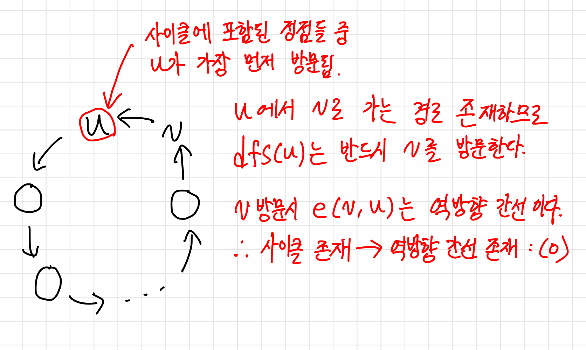
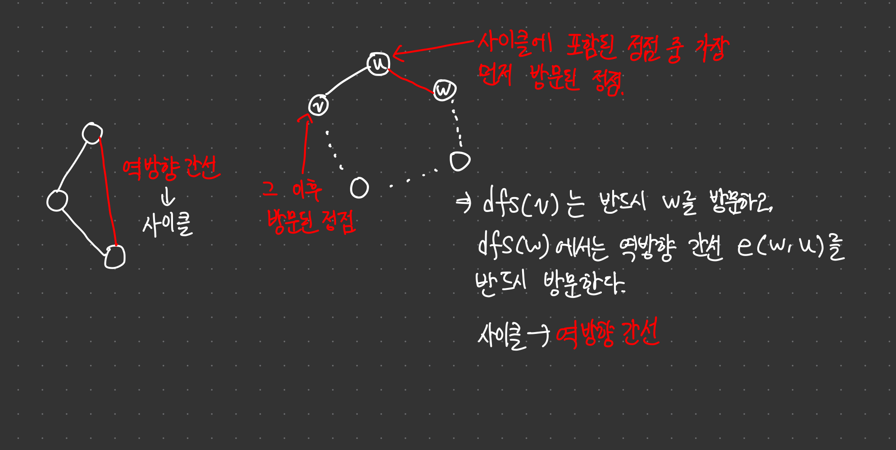
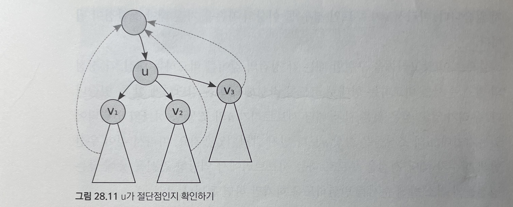
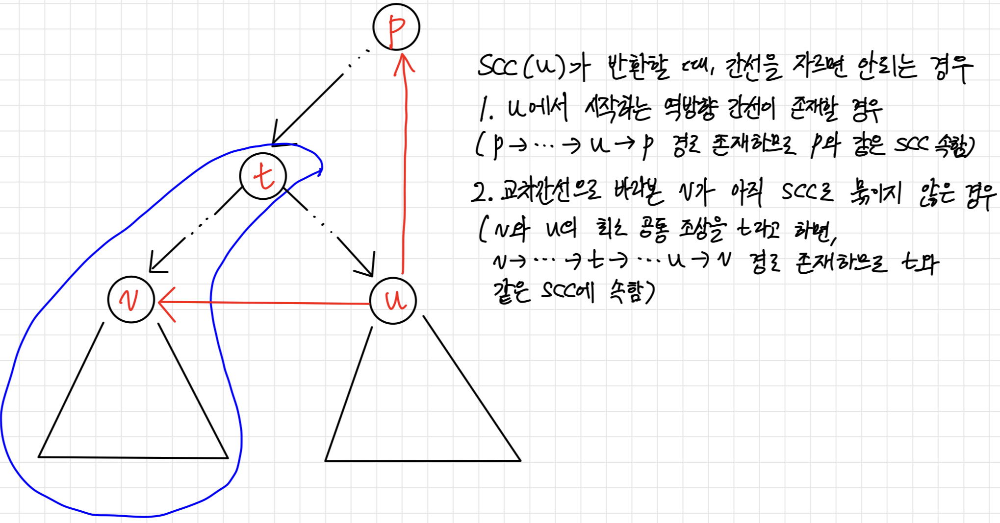

# 깊이 우선 탐색

***

## 도입

현재 정점과 인접한 간선들을 하나씩 검사하다가, 아직 방문하지 않은 정점으로 향하는 간선이 있다면 그 간선을 무조건 따라가는 방식이다.

이 과정에서 더 이상 갈 곳이 없는 막힌 정점에 도달하면, 마지막에 따라왔던 간선을 따라 뒤로 돌아간다.


```cpp
vector<vector<int>> adj;
vector<bool> visited;

void dfs(int here) {
	visited[here] = true;
    for(int i = 0; i < adj[here].size(); i++) {
    	int there = adj[here][i];
        if(!visited[there])
        	dfs(there);
    }
}

void dfsAll() {
	visited = vector<bool>(adj.size(), false);
	for(int i = 0; i < adj.size(); i++)
    	if(!visited[i])
        	dfs(i);
}
```

인접 리스트를 사용할 경우 시간복잡도는 $O(V+E)$가 되고, 인접 행렬을 사용하는 경우에 시간복잡도는 $O(V^2)$가 된다.

***

## 두 정점이 서로 연결되어 있는가 확인하기

어떤 정점 $u$에 대해 $dfs(u)$를 수행하면, $u$에서부터 간선들을 통해 갈 수 있는 모든 정점을 다 방문하게 된다.

$dfs(u)$를 수행하고 $visited[]$를 참조하면 $u$로부터 각 정점에 갈 수 있는지를 쉽게 확인할 수 있다.

**증명**

정점 $u$와 정점 $v$가 그래프 상에서 서로 연결되어 있는데, $dfs(u)$를 실행했을 때 $v$가 방문되지 않는다고 가정. 

이 경로를 $u-k_0-k_1-\cdots-k_n-v$라고 하자.

어떤 정점에서 $dfs$를 실행하면, 해당 정점과 간선으로 연결되고 아직 방문되지 않은 모든 정점에 대해 $dfs$를 호출한다.

$v$가 방문되지 않았으므로, 만약 $k_n$이 방문되었다면 $v$도 방문되므로 $k_n$또한 방문되지 않는다.

위와 같은 논리로, $k_n$이 방문되지 않았다면 $k_{n-1}$도 방문되지 않아야 하고,
$k_{n-1}$이 방문되지 않았으므로 $k_{n-2}$도 방문되지 않아야 하고, $\cdots$, $u$가지 방문되지 않아야 하는데, 이는 모순이다.

따라서 어떤 정점에서 $dfs$를 호출하면, 해당 정점과 간선을 통해 도달할 수 있는 모든 정점을 방문한다는 것을 알 수 있다.

이를 이용하면, $dfsAll()$에서 $dfs()$를 호출하는 횟수를 세어 그래프가 몇 개의 컴포넌트로 나뉘어 있는지 쉽게 확인할 수 있다.

***

## 위상 정렬

DAG (사이클이 없는 방향 그래프) 가 있을 때, 모든 간선이 왼쪽에서 오른쪽으로 향하도록 정점을 배열하는 것을 위상 정렬(topological sort)라고 한다.

dfsAll() 을 수행하며, dfs() 가 종료될 때마다 현재 정점의 번호를 기록하고, dfsAll 이 종료된 후에 기록된 순서를 뒤집으면 위상 정렬 결과를 얻을 수 있다.

### 증명1

위 과정을 통해 정점들을 늘어놓았을 때, 아래의 ($u,v$)간선이 있다고 가정하자.
$\overleftarrow{v \cdots x \cdots u}$

종료 역순으로 정점들이 늘어져 있으므로, $dfs(u)$가 종료된 후 $dfs(v)$가 종료된다.

$dfs(u)$는 종료되기 전에 $dfs(v)$를 검사했을 것이다.

이 때 $visited[v]$가 $false$라면 $dfs(v)$가 먼저 끝나게 되므로 $false$일 수 없다.

$visited[v]$가 $true$라면, $dfs(v)$는 실행중이어야 한다.

이렇게 되기 위해서는 $dfs(v)$에서 재귀 호출을 거쳐 $dfs(u)$가 호출되었다는 소리인데, 이는 $DAG$라는 가정에 모순이다.

따라서 앞쪽을 향하는 간선 $(u,v)$는 존재할 수 없다.

### 증명2

위 과정을 통해 정점들을 늘어놓았을 때, 아래의 ($u,v$)간선이 있다고 가정하자.
$\overleftarrow{v \cdots x \cdots u}$

종료 역순으로 정점들이 늘어져 있으므로, $dfs(u)$가 종료된 후 $dfs(v)$가 종료된다.

1. $e(u,v)$가 트리 간선 : $dfs(v)$가 먼저 종료됨. (X)
2. $e(u,v)$가 순방향 간선: $dfs(v)$가 먼저 종료됨. (X)
3. $e(u,v)$가 역방향 간선: 사이클 존재. $DAG$ 모순 (X)
4. $e(u,v)$가 교차 간선: $dfs(v)$가 먼저 종료됨. (X)

$\therefore$ $e(u,v)$ 는존재할 수 없다.

***

## 오일러 서킷


그래프의 모든 간선을 정확히 한 번씩 지나서 시작점으로 돌아오는 경로를 **오일러 서킷** 이라고 한다.

무향 그래프에서의 오일러 서킷에 대해 알아보자.

한 정점에 인접한 간선의 수를 해당 정점의 **차수(degree)** 라고 한다.

차수가 짝수인 정점을 짝수점, 차수가 홀수인 정점을 홀수점이라고 부른다.

시작을 나간 경로가 있다면, 반드시 들어오는 경로도 있어야 하므로 시작점은 짝수점이어야 한다.

시작점 이외의 정점은 들어오는 경로가 있다면, 반드시 나가는 경로도 있어야 하므로 시작점 외의 점도 짝수여야 한다.

따라서 오일러 서킷이 존재하기 위해서는 모든 정점이 짝수점이어야 한다는 것을 알 수 있다.

모든 정점이 짝수점이면서, 연결 그래프라면 항상 오일러 서킷을 찾아내는 알고리즘을 만들어 낼 수 있다.

이는 오일러 서킷의 존재성에 대한 **구성적 증명** 이 된다.

임의의 정점 u에서 시작해 아직 사용되지 않은 간선 중 하나를 따라가며 임의의 경로를 만들다, 더이상 따라갈 간선이 없을때 종료하는 함수 findRandomCircuit(u) 를 생각해보자.

그래프의 모든 정점이 짝수점이므로, findRandomCircuit이 찾아내는 경로는 서킷이 된다.

운 좋게 이 서킷이 이미 모든 간선을 지나쳤다면 오일러 서킷을 찾은 셈이니 곧장 종료할 수 있다.

만약 아니라면, 서킷의 각 정점들을 하나하나 돌아보며, 아직 따라가지 않은 간선과 인접해 있는 정점을 찾는다.

이 정점을 v라고 하면, 처음에 찾은 경로가 v를 지나가며 짝수개의 간선을 사용했기 때문에 짝수개의 간선이 남게 된다.

따라서 v에서 시작하도록 findRandomCircuit을 수행하면, 새로운 하나의 서킷을 얻게 되고 이 서킷을 처음에 찾았던 서킷에 끼워넣으면 하나의 큰 서킷을 만들 수 있다.

이 일을 서킷이 모든 간선을 다 포함할 때까지 반복하면 오일러 서킷을 쉽게 찾을 수 있다.

```cpp
// adj = 그래프의 인접 행렬
// adj[i][j] = i와 j 사이의 간선의 수
vector<vector<int>> adj; 

void getEulerCircuit(int here, vector<int>& circuit) {
    for(int there = 0; there < adj[here].size(); ++there) {
        if(adj[here][there]) {
            --adj[here][there];
            --adj[there][here];
            getEulerCircuit(there, circuit);
        }
    }
    circuit.push_back(here);
}
```

getEuLerCircuit() 함수가 어떤 정점 u에서 시작해서 더이상 따라갈 간선이 없는 상태인 정점 u에 도달하는 상황은 

findRandomCircuit() 함수가 임의의 서킷 하나를 찾는 과정과 동일하다.

이후 서킷의 각 정점들을 하나하나 돌아보며, 사용되지 않은 간선과 인접해 있는 정점에서 다시 서킷을 찾아 서킷에 끼워넣는 것은 

재귀호출이 반환되며 이전 정점으로 돌아가다 사용 가능한 간선에 대해 getEulerCircuit 함수를 호출하는 과정과 동일하다.

만약 방향 그래프라면 결과적으로 얻은 서킷은 역순으로 만들어졌기 때문에 뒤집어야 한다.

각 간선을 따라갈 때마다 getEulerCircuit() 함수를 호출하고, 그 내부에서는 $O(|V|)$ 의 반복문을 수행하기 때문에, 이 알고리즘의 전체 시간 복잡도는 $O(|V||E|)$ 가 된다.

***

## 오일러 트레일

모든 간선을 정확히 한 번씩 지나지만, 시작점과 끝 점이 다른 경로를 오일러 트레일이라고 부른다.

오일러 트레일이 존재할 조건은 시작점과 끝 점이 홀수점이고, 나머지 점들은 모두 짝수점이어야 한다는 것이다.

이 때 시작점에서 시작한 경로는 끝점에서 끝날 수 밖에 없으므로 오일러 서킷 알고리즘을 동일하게 적용할 수 있다.

***

## 방향 그래프에서의 오일러 서킷과 오일러 트레일

방향 그래프에서 오일러 서킷이 존재하기 위해서는 각 정점에 들어오는 간선 수(indegree)와 나가는 간선 수(outdegree) 가 같아야 한다.

오일러 트레일이 존재하기 위해서는 시작점에서 나가는 간선이 들어오는 간선보다 하나 많고, 끝 점에서는 들어오는 정점이 나가는 정점보다 하나 많아야 한다.

이외의 모든 정점은 들어오는 간선과 나가는 간선의 수가 같아야 한다.

***

## 깊이 우선 탐색과 간선의 분류

깊이 우선 탐색을 수행하면 그 과정에서 그래프의 모든 간선을 한 번씩은 만나게 된다.

그중 일부 간선은 처음 발견한 정점으로 연결되어 있어 따라가고, 나머지는 무시하게 된다.

이 간선들을 무시하지 않고 이들에 대한 정보를 수집하면 그래프의 구조에 대해 많은 것을 알 수 있다.

어떤 그래프를 깊이 우선 탐색했을 때, 탐색이 따라가는 간선들만을 모아 보면 트리 형태를 띠게 된다.

이런 트리를 주어진 그래프의 DFS 스패닝 트리 라고 부른다.

그래프의 DFS 스패팅 트리를 생성하고 나면 그래프의 모든 간선을 네 가지 중 하나로 분류할 수 있다.

### 방향 그래프에서 dfs 수행 후 간선 분류

- 트리 간선(tree edge) : 스패닝 트리에 포함된 간선이다.

- 순방향 간선(forward edge) : 스패팅 트리의 선조에서 자손으로 연결되지만 트리 간선이 아닌 간선

- 역방향 간선(back edge) : 스패닝 트리의 자손에서 선조로 연결되는 간선

- 교차 간선(cross edge) : 이 세 가지 분류를 제외한 나머지 간선. 트리에서 선조와 자손 관계가 아닌 정점들간에 연결된 간선

간선 (u, v) 구분하기

- (u, v) 검사시 v가 방문되지 않음 : 트리 간선

- (u, v) 검사시 v가 방문됨 : 순방향 / 역방향 / 교차 간선

   - dfs(v)가 종료되지 않음 : 역방향 간선

   - dfs(v)가 종료됨 : 순방향 / 교차 간선

      - u가 먼저 방문됨 : 순방향 간선

      - u가 나중에 방문됨 : 교차 간선

```cpp
vector<vector<int>> adj;
vector<int> discovered, finished;
int counter;

void dfs(int here) {
    discovered[here] = counter++;
    for(int i = 0; i < adj[here].size(); ++i) {
        int there = adj[here][i];
        if(discovered[there] == -1) {
            cout << "tree edge" << endl;
            dfs(there);
        } else if(discovered[here] < discovered[there])
            cout << "forward edge" << endl;
        else if(!finished[there])
            cout << "back edge" << endl;
        else
            cout << "cross edge" << endl;
    }
    finished[here] = true;
}
```

***

### 무향 그래프에서 dfs 수행 후 간선 분류

- 트리 간선(tree edge) : 스패닝 트리에 포함된 간선

- 역방향 간선 (bace edge) : 순방향 간선과 역방향 간선의 구분은 없지만, 발견 방향은 항상 자손 $\rightarrow$ 선조 이므로 역방향 간선이라고 부른다.

> 간선 (u, v) 가 트리 간선이 아니고, 선조(u)와 자손(v)을 잇는 간선이라면 반드시 v에서 먼저 발견된다.

- 교차 간선은 존재할 수 없다. 간선 (u, v) 가 교차간선이라고 한다면, 정점 u 또는 v가 발견되었을 때, 상대방 정점이 이미 방문이 되었고 dfs가 종료된 상태이어야 한다.

   그러나 상대방 정점 시 해당 간선을 타고 들어오지 않고 종료하는 것은 모순이기 때문에 교차 간선은 존재하지 않는다.

***

## 그래프에서 사이클 존재 여부 확인하기

방향 그래프와 무향 그래프 모두 사이클의 존재 여부는 역방향 간선의 존재 여부와 동치이다.

방향 그래프에서 역방향 간선 존재 $\rightarrow$ 사이클 존재





***

## 그래프가 루트 없는 트리인지 확인하기

- 그래프에 정확히 V - 1개의 간선이 있다.

- 사이클이 존재하지 않는다.

- 두 정점 사이를 연결하는 단순 경로(경로 중 한 정점을 최대 한 번만 지나는 경로)가 정확히 하나 있다.

위 세 조건들은 모두 동치로, 한 조건이 성립할 경우 다른 조건들이 모두 성립한다.

***

## 절단점 찾기 알고리즘

어떤 무향 그래프의 **절단점** 이란 이 점과 인접한 간선들을 모두 지웠을 때 해당 컴포넌트가 두 개 이상으로 나뉘어지는 정점을 말한다.

한번의 깊이 우선 탐색으로 그래프의 모든 절단점을 찾아낼 수 있다.

임의의 정점에서부터 깊이 우선 탐색을 수행해 DFS 스패닝 트리를 만든다.

어떤 정점 u가 절단점인지를 어떻게 알 수 있을까?

무향 그래프의 스패닝트리에는 교차 간선이 없으므로, u와 연결된 정점들은 u의 선조이거나 자손이다.

이 때 u의 자식을 루트로 하는 서브트리들은 서로 연결되어 있지 않다. (무향 그래프에서는 교차 간선이 없다.)

따라서 u를 지웠을 때 그래프가 쪼개지지 않는 유일한 경우는 u의 선조와 자손들이 전부 역방향 간선으로 연결되어 있을 뿐이다.



u가 스패닝 트리의 루트라면 자손이 없거나 하나밖에 없다면 절단점이 아니고, 두개 이상이라면 절단점이 된다.

```cpp
vector<vector<int>> adj;
vector<int> discovered;
vector<bool> isCutVertex;
int counter = 0;

inf findCutVertex(int here, bool isRoot) {
    discovered[here] = counter++;
    int ret = discovered[here];
    int children = 0;
    for(int i = 0; i < adj[here].size(); ++i) {
        int there = adj[here][i];
        if(discovered[there] == -1) {
            ++children;
            int subTree = findCutVertex(there, false);
            if(!isRoot && discovered[here] <= subTree)
                isCutVertex[here] = true;
            ret = min(ret, subTree);
        } else
            ret = min(ret, discovered[there]);
    }
    if(isRoot) isCutVertex = (children >= 2);
    return ret;
}
```

무향 그래프에서 절단점을 포함하지 않는 서브그래프를 이중 결합 컴포넌트(biconnected component) 라고 부른다.

이중 결합 컴포넌트 내에서는 임의의 한 정점을 그래프에서 지우더라도 정점간의 연결 관계가 유지된다.

***

## 강결합 컴포넌트 분리

**SCC(string connected components)** : 방향 그래프에서 정의되는 개념으로 두 정점 u와 v에 대해 양방향으로 가는 경로가 모두 있을 때 두 정점은 같은 SCC에 속해 있다고 말한다.

SCC를 정점으로 생각하고, 각 SCC 사이를 연결하는 간선들을 모으면 DAG를 만들 수 있다.
<br>(SCC들로 구성된 사이클이 있다고 하면 그 사이클은 하나의 SCC가 되므로 사이클이 존재할 수 없다.)

원 그래프의 정점들을 SCC별로 분리하고, 각 SCC를 표현하는 정점들을 갖는 새로운 그래프를 만드는 과정을 그래프의 압축이라고 부른다.

### 타잔 알고리즘

어떤 그래프의 DFS 스패닝 트리를 적절히 자르기만 해도 정점들을 SCC로 분리할 수 있다.

dfs가 SCC를 처음 방문했을 때의 정점을 x라고 하면, SCC에 속한 두 정점 사이는 항상 경로가 있기 때문에 dfs(x) 는 SCC에 속한 모든 정점을 방문하게 된댜.

이 때 스패닝 트리를 잘라서 SCC로 분리할 수 없는 경우는 SCC에 속한 정점인 x와 y 사이에 SCC가 아닌 정점 z가 껴있는 경우인데, 이러면 z도 반드시 SCC이므로 모순이 된다.

타잔의 알고리즘은 깊이 우선 탐색을 수행하면서 각 정점을 SCC로 묶는다.

이를 위해 간선을 따라 재귀 호출이 반환될 때마다 이 간선을 자를지 여부를 결정한다.

트리 간선(u, v)을 자른다는것은 v에서 u로 갈 수 있는 경로가 없다는 뜻이다.

또한 재귀호출을 통해 v를 루트로 하는 서브트리는 모두 탐색한 후이므로, 어느 간선을 잘라야 하는지 파악이 완료된 상태이다.

만약 v에서 u로 가는 경로가 존재하면 해당 간선을 자를 수 없는데, 이는 두 가지 경우가 존재한다.

1. v를 루트로 하는 서브트리에서의 역방향 간선이 u 혹은 그보다 높이 있는 정점과 닿은 경우.

2. v를 루트로 하는 서브트리에서의 교차 간선으로 닿는 정점이 아직 SCC로 묶이지 않은 경우.

   교차 간선이 (a, b) 라고 한다면, b가 아직 SCC로 묶이지 않았으므로 정점 a와 정점 b의 최소 공통 조상과 a는 하나의 SCC내에 속하게 된다.

   이 최소 공통 조상으로부터 a까지의 경로와 교차 간선 (a, b)를 고려하면 v를 루트로 하는 서브트리는 a와 b의 최소공통조상과 하나의 SCC로 묶여있으므로, 간선(u, v)를 끊어서는 안된다.



```cpp
vector<vector<int>> adj;
vector<int> sccId;
vector<int> discovered;
stack<int> st;
int sccCounter, vertexCounter;

// here을 루트로 하는 서브트리에서 역방향 간선이나 교차 간선을 통해 갈 수 있는 정점 중
// 최소 발견 순서를 반환한다.
// 이미 SCC로 묶인 정점으로 연결된 교차 간선은 무시한다.
int scc(int here) {
    int ret = discovered[here] = vertexCounter++;
    st.push(here);
    for(int i = 0; i < adj[here].size(); ++i) {
        int there = adj[here][i];
        if(discovered[there] == -1)
            ret = min(ret, scc(there));
        else if(sccId[there] == -1)
            ret = min(ret, discovered[there]);
    }
    if(ret == discovered[here]) {
        while(true) {
            int t = st.top();
            st.pop();
            sccId[here] = sccCounter;
            if(t == here) break;
        }
        ++sccCounter;
    }
    return ret;
}

vector<int> tarjanSCC() {
    sccId = discovered = vector<int>(adj.size(), -1);
    sccCounter = vertexCounter = 0;
    for(int i = 0; i < adj.size(); ++i)
        if(discovered[i] == -1) scc(i);
    return sccId;
}
```

scc() 내부의 while 문의 총 수행 횟수는 $O(|V|)$ 이므로, 이 알고리즘의 시간복잡도는 $O(|V| + |E|)$ 가 된다.

또한 새 SCC가 생거나는 시점은 항상 scc함수가 종료하기 직전이다. 

따라서 각 SCC는 위상 정렬의 역순으로 번호가 매겨진다. 

이와 같은 속성을 이용하면 그래프의 압축을 구현할 필요 없이 간단히 문제를 풀 수 있는 경우가 종종 있다.

***

## 2-SAT

SAT 문제는 불린 값 변수들의 참 형태와 거짓 형태들로 구성된 식이 주어질 때, 이 식의 값을 참으로 하는 변수의 조합이 있는지 찾는 것이다.

예를 들어 a && (!b || !a) && (c && (!a || b)) 와 같은 식에서 주어진 식의 값을 참으로 하는 a, b, c 값의 조합을 찾는 문제이다.

괄호로 묶인 수식들을 절이라고 한다.

논리합 절들이 논리 곱으로 연결되어 있는 논리식을 논리곱 정규형이라고 한다.

예를 들면 (A || B) && (!B || C) && (!D || E || F) 와 같은 형태를 말한다.

이 때 각 절에 최대 두 개의 변수만이 존재하는 경우, 이 SAT 문제를 특별히 2-SAT 문제라고 한다.

2-SAT 문제는 그래프를 이용해 다항 시간 내에 해결할 수 있다.

***

### 변수 함의 그래프

문제를 그래프로 푸는 첫 단계는 문제를 그래프로 표현하는 것이다.

논리식이 참이 되기 위해서는 모든 절이 참이어야 된다.

(A || B) 절이 존재한다고 하면, 이 절은 !A $\rightarrow$ B 와 !B $\rightarrow$ A 두 관계로 표현할 수 있다.

즉 논리식의 변수 A에 대해, 각각 A와 !A를 표현하는 두 개의 정점을 포함하는 방향 그래프를 만들고, 각 절마다 위의 표기에 따라 방향 간선을 추가하면 논리곱 정규형을 그래프로 옮길 수 있다.

정점 P에서 Q로 가는 경로는 P가 표현하는 식이 참일 경우 Q가 표현하는 식 또한 반드시 참이어야 함을 나타낸다.

이와 같이 논리식에 포함된 변수들의 값에 대한 요구조건을 표현한 그래프를 함의 그래프라고 한다.

***

### 함의 그래프를 이용해 2-SAT 풀기

2-SAT 문제를 푸는 것은, 함의 그래프에서 다음과 같은 두 가지 조건을 만족하도록 그래프의 정점을 분류하는 것과 같다.

1. 각 정점 쌍 A와 !A중 하나는 참 정점, 하나는 거짓 정점으로 분류한다.

2. 이 때 참 정점에서 거짓 정점으로 가는 경로는 없도록 한다.

만약 한 변수를 표현하는 두 정점(A, !A)이 하나의 사이클에 포함되어 있는 경우에는 반드시 참 정점 $\rightarrow$ 거짓 정점으로 가는 경로가 생길 수 밖에 없다.

그렇다면 반대로 어떤 변수에 대해서도 그를 표현하는 두 정점이 한 사이클에 속해 있지 않은 경우는 어떨까?

이 경우 항상 답을 찾아내는 알고리즘을 설계함으로써 답의 존재성을 증명할 수 있다.

***

### 강결합 컴포넌트 이용하기

한 SCC에 속하는 정점들은 모두 참이거나, 모두 거짓이어야 함을 깨달을 수 있다.

따라서 이제 정점이 아니라 SCC 단위로 문제를 풀 수 있다.

이 때 (A || B) 절이 있을 때, !A $\rightarrow$ B 와 !B $\rightarrow$ A 두 개의 간선으로 표시했으므로, 한 SCC를 이루는 정점들의 반대 정점들을 모아보면 이들도 방향은 반대인 하나의 SCC를 이루고 있다는 것을 알 수 있다.

따라서 함의 그래프에 X $\rightarrow$ Y $\rightarrow$ Z $\rightarrow$ X 형태의 사이클이 있으면, !X $\rightarrow$ !Z $\rightarrow$ !Y $\rightarrow$ !X 형태의 사이클도 반드시 존재하게 된다.

그러무로 SCC들간에도 원래의 함의 그래프와 같이 1:1 대응이 존재하게 되고, 한 SCC가 참이라면 그의 반대 SCC는 항상 거짓임을 알 수 있다.

결과적으로 원래 그래프의 정점들을 SCC별로 압축한 그래프를 또 하나의 함의 그래프로 보고 문제를 풀어도 된다는 것이다.

이 압축된 함의 그래프는 큰 장점이 있는데, 바로 DAG라는 것이다.

***

### DAG인 함의 그래프에 대해 2-SAT 문제 푸는 알고리즘

DAG인 함의그래프에 대해 2-SAT 문제를 푸는 알고리즘은 아주 간단하다.

먼저 들어오는 간선이 하나도 없는 정점을 고른다.

이후 이 정점의 값이 거짓이 되도록 변수의 값을 할당하고, 이 정점을 그래프에서 지워버린다.

그리고 모든 정점이 분류될 때까지 이 과정을 반복한다.

물론 들어오는 간선이 이미 참 정점으로 분류되어 있다면, 아무것도 하지 않고 그 정점을 지운다.

> 이 알고리즘을 수행했는데 참 정점 X에서 거짓 정점 Y로 가는 간선이 있다고 가정하자.
>
> 함의 그래프의 속성에 의해, X->Y 가 있다면 간선 !Y->!X도 존재한다.
>
> X는 참, Y는 거짓이니 !Y는 참, !X는 거짓이 된다.
>
> 알고리즘은 한 쌍의 정점 중 항상 거짓 정점을 먼저 지운다.
>
> 그럼 X, Y, !Y, !X 의 지워진 순서를 생각해보면 우선 X->Y 이므로 X가 Y보다 먼저 지워진다.
>
> X는 참이므로, !X가 먼저 거짓 정점으로 분류되고 지워졌을 것이다.
>
> !Y->!X 이므로 !Y는 !X보다 먼저 지워질 것이다.
>
> 그렇다면 지금까지 얻은 정보로는 !Y->!X->X->Y 순서로 지워져야 하는데, !Y이 참이므로 !Y는 Y보다 늦게 지워져야 하고 이는 모순이다.
>
> 따라서 위 알고리즘 수행 이후 참->거짓으로 가는 간선은 존재하지 않는다.

***

## 예제

### 고대어 사전 (DICTIONARY)

> https://www.algospot.com/judge/problem/read/DICTIONARY

```cpp
#include <cstdio>
#include <cstring>

int N;
char words[1000][21];
bool adj[26][26];

int pathIdx;
char path[26];
bool visited[26];
bool finished[26];

void calcAdj(int i, int j) {
    char* a = words[i];
    char* b = words[j];

    int idx;
    for(idx = 0; a[idx] == b[idx]; ++idx);

    if(a[idx] && b[idx])
        adj[a[idx] - 'a'][b[idx] - 'a'] = true;
}

void init() {
    memset(adj, false, sizeof(adj));
    scanf("%d", &N);
    for(int i = 0; i < N; ++i)
        scanf("%s", words[i]);
    for(int i = 0; i < N - 1; ++i)
        calcAdj(i, i + 1);
}

bool dfs(int here) {
    visited[here] = true;
    for(int there = 0; there < 26; ++there) {
        if(!adj[here][there]) continue;
        if(!visited[there] && !dfs(there)) return false;
        else if(!finished[there]) return false;
    }
    path[pathIdx++] = ('a' + here);
    finished[here] = true;
    return true;
}

bool tpSort() {
    memset(visited, false, sizeof(visited));
    memset(finished, false, sizeof(finished));
    pathIdx = 0;
    for(int i = 0; i < 26; ++i)
        if(!visited[i] && !dfs(i)) return false;
    return true;
}

int main() {
    int C;
    scanf("%d", &C);
    while(C--) {
        init();
        if(!tpSort()) puts("INVALID HYPOTHESIS");
        else {
            for(int i = 25; i >= 0; --i)
                putchar(path[i]);
            putchar('\n');
        }
    }

    return 0;
}
```

***

### 단어 제한 끝말잇기 (WORDCHAIN)

> https://www.algospot.com/judge/problem/read/WORDCHAIN

```cpp
#include <iostream>
#include <string>
#include <vector>
using namespace std;

int N, inDegree[26], outDegree[26];
int adj[26][26];
vector<string> words[26][26];

void init() {
    for(int i = 0; i < 26; ++i) {
        inDegree[i] = outDegree[i] = 0;
        for(int j = 0; j < 26; ++j) {
            words[i][j].clear();
            adj[i][j] = 0;
        }
    }

    cin >> N;
    for(int i = 0; i < N; ++i) {
        string word;
        cin >> word;
        int from = word[0] - 'a', to = word[word.size() - 1] - 'a';
        ++adj[from][to];
        words[from][to].push_back(word);
        ++outDegree[from]; ++inDegree[to];
    }

}

bool hasPath() {
    int plus1 = 0, minus1 = 0;
    for(int i = 0; i < 26; ++i) {
        int diff = outDegree[i] - inDegree[i];
        if(diff < -1 || diff > 1) return false;
        if(diff == 1) ++plus1;
        else if(diff == -1) ++minus1;
    }

    if(plus1 == 0 && minus1 == 0) return true;
    if(plus1 == 1 && minus1 == 1) return true;
    return false;
}

void traverse(int here, vector<int>& path) {
    for(int there = 0; there < 26; ++there) {
        if(adj[here][there]) {
            --adj[here][there];
            traverse(there, path);
        }
    }
    path.push_back(here);
}

vector<int> getPath() {
    vector<int> path;
    for(int i = 0; i < 26; ++i)
        if(outDegree[i] - inDegree[i] == 1) {
            traverse(i, path);
            return path;
        }
    for(int i = 0; i < 26; ++i)
        if(outDegree[i]) {
            traverse(i, path);
            return path;
        }
    return path;
}

void solve() {
    vector<int> path = getPath();
    if(path.size() != N + 1) {
        puts("IMPOSSIBLE");
        return;
    }
    for(int i = N; i >= 1; --i) {
        cout << words[path[i]][path[i - 1]].back() << ' ';
        words[path[i]][path[i - 1]].pop_back();
    }
    cout << '\n';
}

int main() {
    ios_base::sync_with_stdio(false);
    cin.tie(NULL);

    int C;
    cin >> C;
    while(C--) {
        init();
        if(!hasPath()) {
            puts("IMPOSSIBLE");
            continue;
        }
        solve();
    }
    return 0;
}

```

모든 정점을 정확히 한 번씩 지나는 경로를 해밀토니안 경로라고 부른다.

해밀토니안 경로를 빠르게 찾는 방법은 아직 고안되지 않아서, 모든 정점의 순열을 하나하나 시도해봐야 한다.

즉 n!개의 후보를 만들어봐야 한다.

따라서 입력에 주어진 단어를 정점이https://www.algospot.com/judge/problem/read/GALLERY 아니락 간선으로 갖는 방향 그래프를 만들고 오일러 트레일을 찾는 방식으로 문제를 해결해야 한다.

***

### 감시 카메라 설치 (GALLERY)

> https://www.algospot.com/judge/problem/read/GALLERY

```cpp
#include <cstdio>
#include <vector>
using namespace std;

int G, H;
vector<vector<int>> adj;
vector<bool> visited;
int installed;

void init() {
    adj.clear();
    visited.clear();
    installed = 0;

    scanf("%d %d", &G, &H);
    adj = vector<vector<int>>(G);
    visited = vector<bool>(G, false);

    for(int i = 0; i < H; ++i) {
        int a, b;
        scanf("%d %d", &a, &b);
        adj[a].push_back(b);
        adj[b].push_back(a);
    }
}

#define WATCHED 0
#define INSTALLED 1
#define UNWATCHED 2

int dfs(int here) {
    visited[here] = true;
    int children[3] = {0, 0, 0};
    for(int i = 0; i < adj[here].size(); ++i) {
        int there = adj[here][i];
        if(!visited[there])
            ++children[dfs(there)];
    }
    if(children[UNWATCHED]) { ++installed; return INSTALLED; }
    else if(children[INSTALLED]) return WATCHED;
    else return UNWATCHED;
}

int solve() {
    for(int i = 0; i < G; ++i)
        if(!visited[i] && dfs(i) == UNWATCHED) ++installed;
    return installed;
}

int main() {
    int C;
    scanf("%d", &C);
    while(C--) {
        init();
        printf("%d\n", solve());
    }

    return 0;
}
```

"미술관은 한 번 관람한 갤러리를 다시 가기 위해서는 이전에 지나왔던 복도를 반드시 한 번 지나야 하는 구조로 설계되어 있으며" 

라는 말은 그래프에 사이클이 존재하지 않는다는 의미이다.

사이클이 존재하지 않는 그래프는 "루트 없는 트리" 가 된다.

> 무향그래프에서 dfs 스패닝 트리가 만들어 졌을 때, 간선은 트리간선 이거나 역방향 간선으로 구분할 수 있다.
>
> 사이클이 없다고 했으므로, 역방향 간선은 존재하지 않는다. 즉 트리 간선만 남게 된다.
>
> 따라서 사이클이 존재하지 않는 그래프는 루트 없는 트리임을 알 수 있다.

***

### 회의실 배정 (MEETINGROOM)

> https://www.algospot.com/judge/problem/read/MEETINGROOM

```cpp
#include <cstdio>
#include <stack>
#include <vector>
using namespace std;

int N;
int meetingTime[200][2];
vector<vector<int>> adj;

void init() {
    adj.clear();
    scanf("%d", &N);
    adj.resize(4 * N);
    for(int i = 0; i < N; ++i)
        scanf("%d %d %d %d", &meetingTime[2 * i][0], &meetingTime[2 * i][1], &meetingTime[2 * i + 1][0], &meetingTime[2 * i + 1][1]);
}

bool isOverlap(int i, int j) {
    if(meetingTime[i][1] <= meetingTime[j][0] || meetingTime[j][1] <= meetingTime[i][0]) return false;
    return true;
}

void makeGraph() {
    for(int i = 0; i < N; ++i) {
        adj[4 * i + 0].push_back(4 * i + 3);
        adj[4 * i + 2].push_back(4 * i + 1);
        adj[4 * i + 1].push_back(4 * i + 2);
        adj[4 * i + 3].push_back(4 * i + 0);
    }
    for(int i = 0; i < 2 * N; ++i)
        for(int j = (i % 2 ? i + 1 : i + 2); j < 2 * N; ++j)
            if(isOverlap(i, j)) {
                adj[2 * i + 0].push_back(2 * j + 1);
                adj[2 * j + 0].push_back(2 * i + 1);
            }
}

stack<int> st;
int sccCounter, vertexCounter;
vector<int> discovered, sccId;
vector<int> tpSort;
int scc(int here) {
    int ret = discovered[here] = vertexCounter++;
    st.push(here);
    for(int i = 0; i < adj[here].size(); ++i) {
        int there = adj[here][i];
        if(discovered[there] == -1)
            ret = min(ret, scc(there));
        else if(sccId[there] == -1)
            ret = min(ret, discovered[there]);
    }
    if(ret == discovered[here]) {
        while(true) {
            int t = st.top();
            st.pop();
            tpSort.push_back(t);
            sccId[t] = sccCounter;
            if(t == here) break;
        }
        ++sccCounter;
    }
    return ret;
}

void tarjanSCC() {
    sccCounter = vertexCounter = 0;
    discovered = sccId = vector<int>(adj.size(), -1);
    tpSort.clear();
    for(int i = 0; i < adj.size(); ++i)
        if(discovered[i] == -1)
            scc(i);
}

bool isPossible() {
    for(int i = 0; i < 4 * N; i += 2)
        if(sccId[i] == sccId[i + 1])
            return false;
    return true;
}

vector<int> value;
void solve() {
    value = vector<int>(2 * N, -1);
    int sccNow = sccCounter - 1;
    for(int i = tpSort.size() - 1; i >= 0; --i) {
        int idx = tpSort[i];
        if(value[idx / 2] == -1) {
            if(idx % 2) value[idx / 2] = 1;
            else value[idx / 2] = 0;
        }
    }
    puts("POSSIBLE");
    for(int i = 0; i < 2 * N; i += 2)
        if(value[i]) printf("%d %d\n", meetingTime[i][0], meetingTime[i][1]);
        else printf("%d %d\n", meetingTime[i + 1][0], meetingTime[i + 1][1]);
}

int main() {
    int C;
    scanf("%d", &C);
    while(C--) {
        init();
        makeGraph();
        tarjanSCC();
        if(!isPossible()) {
            puts("IMPOSSIBLE");
            continue;
        }
        solve();
    }
}
```
