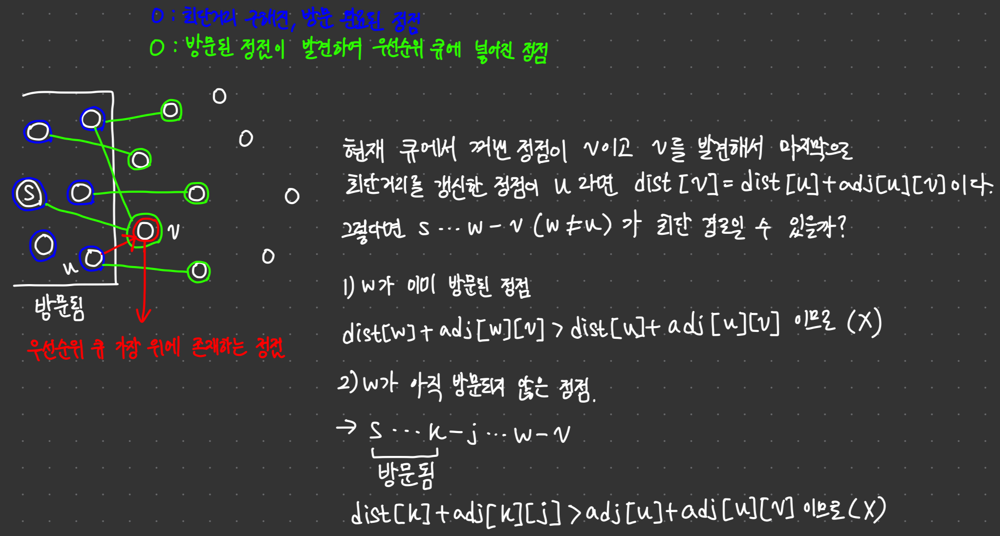
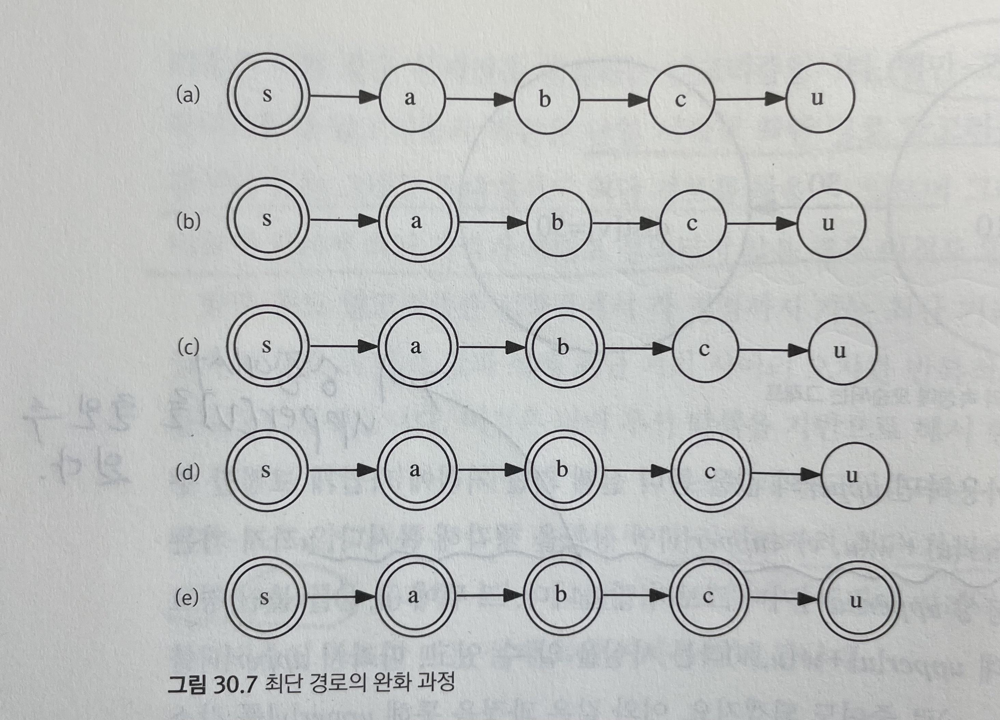
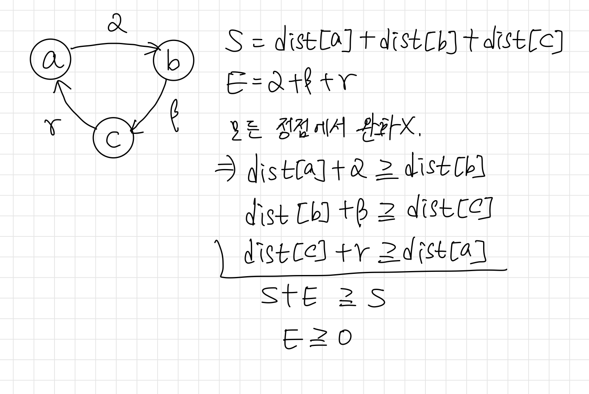
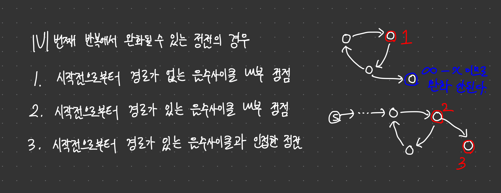

# 최단 경로

## 도입

최단 경로 문제란 주어진 그래프에서 주어진 두 정점을 연결하는 가장 짧은 경로의 길이를 찾는 문제로, 그래프의 응용 문제 가운데 가장 유용하고 널리 사용된다.

가중치가 없는 그래프에 대한 최단 경로는 너비 우선 탐색으로 찾을 수 있기 때문에, 이 절에서는 가중치가 있는 그래프 위에서의 최단 경로를 찾는 알고리즘들을 다룬다.

***

## 음수 간선

음수 간선이 존재한다면 음수 사이클 여부를 확인해야 한다. 음수 사이클이 존재하면, 해당 사이클을 계속해서 돌면 경로의 길이가 음의 무한대까지 발산할 수 있기 때문에 최단 경로 문제가 제대로 정의되지 않는다.

***

## 방향 그래프와 무방향 그래프

이 절에서 다루는 최단 거리 알고리즘들은 모두 방향 그래프를 기준으로 동작한다.

따라서 무방향 그래프 위에서의 최단 경로를 찾기 위해서는 각각의 양방향 간선을 두 개의 일방 통행 간선으로 쪼개서 방향 그래프로 만들어야 한다.

그러나 음수 가중치가 있는 무방향 그래프는, 음수 간선을 두개로 쪼개면 음수 사이클이 만들어진다는 것을 생각해야한다.

***

## 다익스트라의 최단 경로 알고리즘

```cpp
int V;
vector<pair<int, int>> adj[MAX_V];
vector<int> dijkstra(int src) {
    vector<int> dist(V, INF);
    dist[src] = 0;
    priority_queue<pair<int, int>> pq;
    pq.push({0, src});
    while(!pq.empty()) {
        int cost = -pq.top().first;
        int here = pq.top().second;
        pq.pop();
        if(dist[here] < cost) continue;
        for(int i = 0; i < adj[here].size(); ++i) {
            int there = adj[here][i].first;
            int nextDist = cost + adj[here][i].second;
            if(dist[there] > nextDist) {
                dist[there] = nextDist;
                pq.push({-nextDist, there});
            }
        }
    }
    return dist;
}
```

***

### 정당성 증명

지금까지 다익스트라 알고리즘이 방문한 정점들에 대해 모두 최단거리가 정확히 계산되었다고 가정하자.

이 상황에서 다익스트라 알고리즘이 새로운 정점을 방문했을 때, 이 정점에 대해서도 최단거리가 정확하게 계산된다면 수학적 귀납법에 의해 모든 정점을 방문한 후에는 모든 정점에 대한 최단거리가 계산될 것이다.

어떤 새로운 정점을 방문하기 전, 우선순위큐에는 지금까지 방문된 정점에 의해 발견된 정점들과 자신을 발견한 정점을 통해 자신으로 오는 최단거리가 저장되어 있을 것이다.

다익스트라 알고리즘은 우선순위 큐 가장 위 원소를 꺼내어, 이미 방문된 정점이라면 최단경로는 구해진 상태이므로 무시하고 방문되지 않은 정점이라면 방문할 것이다.

이후 이 정점의 최단 거리가 갱신될 수 있을지 생각해보자.



위 증명에 따라 어떤 정점이 방문되었을 때의 dist[] 값이 최단거리임을 알 수 있으므로, 모든 정점 방문 이후에 최단거리가 전부 구해진다는 것을 알 수 있다.

한 가지 유의할 점은 이 알고리즘은 모든 간선의 가중치가 0 이상이라고 가정하고 있다는 것이다.

음수 가중치가 있다면, 아직 방문되지 않은 정점을 지나는 경로가 더 짧을 수 있기 때문이다.

***

### 시간복잡도

각 정점은 정확히 한 번씩 방문되고, 방문될 때마다 자신과 인접한 간선들을 검사하므로 간선 검사에는 O(|E|)의 시간이 걸린다.

또한 최악의 경우 간선을 검사할 때마다 우선순위 큐에 원소를 넣는 작업이 이뤄질 수 있기 때문에 총 시간복잡도는 O(|E|log|E|) 가 된다.

***

### 우선순위 큐를 사용하지 않는 다익스트라 알고리즘

우선순위 큐를 사용하지 않고 다익스트라 알고리즘을 구현하면 O(|V|^2 + |E|) 에 구현할 수 있다.

정점을 방문하기 전 반복문을 이용해 반복하지 않은 정점 중 dist[] 값이 가장 작은 값을 찾는 것이다.

만약 간선이 매우 많은 그래프, 즉 |V|^2 과 |E| 가 거의 동일한 그래프라면 O(|E|log|E|) = O(|V^2|log|V|) 을 O(|V^2|) 으로 줄일 수 있다.

```cpp

vector<int> dijkstra2(int src) {
    vector<int> dist(V, INF);
    vector<bool> visited(V, false);
    dist[src] = 0; visited[src] = true;
    while(true) {
        int closest = INF, here;
        for(int i = 0; i < V; ++i)
            if(!visited[i] && dist[i] < closest)
                here = i, closest = dist[i];
        if(closest == INF) break;
        visited[here] = true;
        for(int i = 0; i < adj[here].size(); ++i) {
            int there = adj[here][i].first;
            int cost = adj[here][i].second;
            if(dist[here] + cost < dist[there])
                dist[there] = dist[here] + cost;
        }
    }
    return dist;
}

```

***

## 벨만-포드의 최단 경로 알고리즘

벨만 포드 알고리즘은 다익스트라 알고리즘과 똑같은 단일 시작점 최단 경로 알고리즘이지만, 음수 간선이 있는 그래프에 대해서도 최단 경로를 찾을 수 있으며, 그래프에 음수 사이클이 있어서 최단 거리가 제대로 정의되지 않을 경우 이것도 알려준다.



벨만-포드 알고리즘은 매 반복마다 모든 간선에 대해 최단거리를 갱신한다. (이 과정을 완화한다고 한다.)

위 그림을 보면, dist[u] 의 경로는 s - a - b - c - u 임을 알 수 있다.

s까지의 최단 거리는 0이므로 처음부터 알 수 있고, 이후 한 번 반복할 때마다 최단 경로에 포함된 정점의 최단거리가 하나씩 갱신됨을 알 수 있다.

따라서 |V| - 1 번 반복하면 모든 최단 거리를 찾을 수 있다.

다익스트라 알고리즘과 다르게 벨만-포드 알고리즘에 증명에서는 각 간선이 음수가 아님을 가정하지 않으므로, 음수 간선이 존재하는 경우에도 최단 거리를 올바르게 계산할 수 있다.

음수 사이클의 존재 여부를 판정하려면, |V|번 완화를 시도하면 된다.

음수 사이클이 없다면, 마지막 반복에서는 이미 모든 최단거리를 구했으므로 모든 완화가 실패할 것이다.

반면 음수 사이클이 있다면 |V| 번째 반복에서 항상 완화가 한 번은 성공한다.

> 음수 사이클이 존재하더라도 음수 사이클까지 가는 경로가 존재하지 않다면 상관 없다는 것을 잊지 말자.



```cpp
int V;
vector<vector<pair<int, int>>> adj;
vector<int> bellmanFord(int src) {
    vector<int> uppder(V, INF);
    upper[src] = 0;
    bool updated;
    for(int iter = 0; iter < V; ++iter) {
        updated = false;
        for(int here = 0; here < V; ++here) {
            if(upper[here] == INF) continue; // 추가하면 아직 도달되지 않은 정점에서의 완화 방지한다.
            for(int i = 0; i < adj[here].size(); ++i) {
                int there = adj[here][i].first;
                int cost = adj[here][i].second;
                if(upper[there] > upper[here] + cost) {
                    upper[there] = upper[here] + cost;
                    updated = true;
                }
            }
        }
        if(!updated) break;
    }
    if(updated) upper.clear();
    return upper;
}
```

전체 시간복잡도는 O(|V||E|) 임을 알 수 있다.



***

## SPFA 알고리즘

음의 가중치가 있는 그래프에 대해 최단 경로를 구하는 알고리즘인 벨만 포드 알고리즘을 개선한 알고리즘.

벨만 포드는 모든 간선에 대해 업데이트를 진행하지만, SPFA는 바뀐 정점과 연결된 간선에 대해서만 업데이트를 진행한다.

따라서 시간복잡도는 $O(V \times E)$이지만, 평균적으로는 $O(V + E)$에 동작한다고 알려져있다.

```cpp
#include <cstdio>
#include <vector>
#include <algorithm>
#include <queue>
using namespace std;

const int MAX_V = 500;
const int INF = 987654321;

int V, dist[MAX_V], cycle[MAX_V];
bool inQ[MAX_V];

vector<pair<int, int>> adj[MAX_V];

bool spfa(int src) {
    queue<int> q;
    dist[src] = 0;
    q.push(src);
    inQ[src] = true;
    cycle[src]++;

    while(!q.empty()) {
        int here = q.front();
        q.pop();
        inQ[here] = false;
        for(int i = 0; i < adj[here].size(); i++) {
            int next = adj[here][i].first;
            int cost = adj[here][i].second;
            if(dist[next] > dist[here] + cost) {
                dist[next] = dist[here] + cost;
                if(!inQ[next]) {
                    cycle[next]++;
                    if(cycle[next] >= V)
                        return false;
                    q.push(next);
                    inQ[next] = true;
                }
            }
        }
    }
    return true;
}
```

spfa알고리즘의 정당성도 벨만 포드 알고리즘과 비슷한 방법으로 증명할 수 있다.

src와 임의의 정점 사이의 최단 거리가 x개 정점을 거쳐 지나간다고 하면, src가 큐에서 꺼내진 후 1번째 정점의 최단거리를 갱신 후 큐에 넣고, 1번째 정점이 큐에서 꺼내진 후 2번째 정점의 최단거리를 갱신 후 큐에 없다면 큐에 넣고, $\cdots$, x-1번째 정점이 큐에서 꺼내진 후 x번째 정점의 최단거리를 갱신 후 큐에 없다면 큐에 넣고 하는 방식으로 차례로 최단거리가 저장되므로 정당성이 증명된다.

> 이미 큐에 들어가있는 정점에 대한 최단거리를 완화하면 큐에 또 넣을 필요가 없다.

spfa 알고리즘에서는 어떤 정점이 큐에 V번 이상 들어갔을 때 음수 사이클이 있다고 판별한다.

**증명**
정점들은 너비 우선 탐색을 기본으로 하여 큐에 넣어지게 된다.
어떤 정점이 큐에 넣어질 때, 지금까지 구한 최단거리의 경유 간선을 생각해보자.
소스에 인접한 정점으로 큐에 넣어질 때의 경유 간선은 1이다.

큐에 넣어진 정점 A가 있다고 하자.

이 정점이 다시 큐에 넣어지기 위해서는 그 후에 방문된 정점(B)의 간선으로 갱신되어 넣어져야 한다. 

A를 큐에 넣을 때 A까지의 최단경로의 경유 간선 수가 x라고 하면, 정점 B에 의해 갱신되는 최단경로의 경유 간선 수는 x+1 이상이다. 

따라서 큐에 넣어질 때마다 경유 간선이 최소 1씩 늘어나게 되므로 방문할 수 있는 최댓값은 V-1번이 된다.

정점 u와 정점 v가 음수 사이클을 이룬다고 가정하자.

정점 u가 방문되면, v가 큐에 있다면 넣지 않고, 없다면 넣으므로 반드시 이후 v도 방문된다.

이후에 정점 v가 방문되면, u가 큐에 있다면 넣지 않고, 없다면 넣으므로 정점 u도 방문된다.

이렇게 무한히 서로 방문되고, 방문되면서 큐에 없다면 서로 넣어주므로 무한히 큐에 넣어진다는것 또한 알 수 있다.

***

## 플로이드의 모든 쌍 최단 거리 알고리즘

경로가 거쳐가는 정점들을 경유점이라고 하자.

S에 포함된 정점만을 경유점으로 사용해 u에서 v로 가는 최단 경로를 $D_S(u, v)$ 라고 하자.

S중에 정점을 하나 골라 x라고 하면, $D_S(u, v)$는 

1. x를 경유하지 않는 경우 $D_{S-x}(u, v)$

2. x를 경유하는 경우 $D_{S-x}(u, x) + D_{S-x}(x, v)$

두 값중 작은 값이 됨을 알 수 있다.

$S_k = {0, 1, 2, \cdots , k}$ 라고 하고, $C_k = D_{S_k}$ 라고 한다면 최단 거리 문제를 동적 계획법으로 풀 수 있게 된다.

$C_k(u, v) = min(C_{k-1}(u,k)+C_{k-1}(k,v),\ C_{k-1}(u,v))$

$\rightarrow C_k(\bigcirc,\square)$를 계산하기 위해서는 $C_{k-1}(\bigcirc, k)$와 $C_{k-1}(k,\square)$의 형태의 값과 $C_{k-1}(u,v)$만 있으면 계산할 수 있다.

$C_k(\bigcirc,k)=min(C_{k-1}(\bigcirc,k)+C_{k-1}(k,k),C_{k-1}(\bigcirc,k)) = C_{k-1}(\bigcirc,k)$

$C_k(k,\square)=min(C_{k-1}(k,k)+C_{k-1}(k,\square),C_{k-1}(k,\square)) = C_{k-1}(k,\square)$

$\rightarrow C_k(\bigcirc,\square)$를 계산하기 위한 값인 $C_{k-1}(\bigcirc, k)$와 $C_{k-1}(k,\square)$는 $C_k$에서와 동일한 값을 갖는다.

플로이드 알고리즘을 3차원 배열에 값을 채워넣는 방식으로 구현한 아래 코드를 보자.
```cpp
int V;
int adj[MAX_V][MAX_V];
int C[MAX_V][MAX_V][MAX_V];
void floyd() {
    for(int i = 0; i < V; ++i)
        for(int j = 0; j < V; ++j)
            if(i != j) C[0][i][j] = min(adj[i][j], adj[i][0] + adj[0][j]);
            else C[0][i][j] = 0;
    for(int k = 1; k < V; ++k)
        for(int i = 0; i < v; ++i)
            for(int j = 0; j < v; ++j)
                C[k][i][j] = min(C[k - 1][i][j], C[k - 1][i][k] + C[k - 1][k][j]);
}
```
이 과정을 2차원 배열 안에서 수행할 수 있을까?

$C_{k-1}$의 값이 2차원 배열에 저장되어 있다고 할 때, $C_k$값이 2차원 배열 안에서 정확하게 계산될 수 있는지를 보이면 된다.

$C_k(\bigcirc,v)$를 계산하기 위한 값인 $C_{k-1}(\bigcirc, k)$와 $C_{k-1}(k,\square)$는 $C_k$에서와 동일한 값을 갖는다. 따라서 새로운 값으로 덮어씌워지는 일이 발생하지 않으므로 2차원 배열을 사용하여도 문제 없다.

$C_{k}(u,v)$를 계산하기 위한 값인 $C_{k-1}(u,v)$는 2차원 배열을 사용하면 해당 자리에 그대로 존재하고 있게 된다.

따라서 위 코드를 아래와 같이 변경 가능하다.

```cpp
int V;
// adj[u][v] = u에서 v로 가는 간선의 가중치. 간선이 없으면 아주 큰 값을 넣는다.
int adj[MAX_V][MAX_V];
void floyd() {
    for(int i = 0; i < V; i++) adj[i][i] = 0;
    for(int k = 0; k < V; k++)
    	for(int i = 0; i < V; i++) {
            if(adj[i][k] == 0) continue;
        	for(int j = 0; j < V; j++)
            	adj[i][j] = min(adj[i][j], adj[i][k] + adj[k][j]);
        }
}
```

시간복잡도는 $O(V^3)$이다.

아래의 코드는 플로이드 알고리즘을 통해 실제 최단 경로를 계산하는 함수의 구현이다.

```cpp
int via[MAX_V][MAX_V]; // -1로 초기화

void floyd2() {
    for(int k = 0; k < V; k++)
        for(int i = 0; i < V; i++)
            for(int j = 0; j < V; j++)
                if(adj[i][j] > adj[i][k] + adj[k][j]) {
                    via[i][j] = k;
                    adj[i][j] = adj[i][k] + adj[k][j];
                }
}

void reconstruct(int u, int v, vector<int> &parh) {
    if(via[u][v] == -1) {
        path.push_back(u);
        if(u != v)
            path.push_back(v);
    } else {
        int w = via[u][v];
        reconstruct(u, w, path);
        path.pop_back();
        reconstruct(w, v, path);
    }
}
```

> 플로이드 알고리즘의 덧셈 연산은 and로, 최소치를 구하는 연산은 or로 하면 각 정점간의 도달 가능성 여부도 계산할 수 있다.

***

## 예제

***

### 신호 라우팅 (ROUTING)

> https://www.algospot.com/judge/problem/read/ROUTING

```cpp
#include <cstdio>
#include <cmath>
#include <queue>
#include <vector>
using namespace std;

int n, m;
vector<vector<pair<int, double>>> adj;

void init() {
    int a, b;
    double c;
    scanf("%d %d", &n, &m);
    adj.clear();
    adj.resize(n);
    while(m--) {
        scanf("%d %d %lf", &a, &b, &c);
        adj[a].push_back({b, log(c)});
        adj[b].push_back({a, log(c)});
    }
}

double solve() {
    vector<double> dist(n, 1e300);
    priority_queue<pair<double, int>> pq;
    dist[0] = 0.0;
    pq.push({0, 0});
    while(!pq.empty()) {
        int here = pq.top().second;
        double cost = -pq.top().first;
        pq.pop();
        if(dist[here] < cost) continue;
        for(int i = 0; i < adj[here].size(); ++i) {
            int there = adj[here][i].first;
            double nextCost = cost + adj[here][i].second; 
            if(nextCost < dist[there]) {
                dist[there] = nextCost;
                pq.push({-dist[there], there});
            }
        }
    }
    return exp(dist[n - 1]);
}

int main() {
    int C;
    scanf("%d", &C);
    while(C--) {
        init();
        printf("%.10lf\n", solve());
    }
    return 0;
}
```

***

### 소방차 (FIRETRUCKS)

> https://www.algospot.com/judge/problem/read/FIRETRUCKS

```cpp
#include <cstdio>
#include <vector>
#include <queue>
using namespace std;

vector<vector<pair<int, int>>> adj;
vector<int> fire;
int v, e, n, m;

void init() {
    int a, b, t;
    scanf("%d %d %d %d", &v, &e, &n, &m);
    fire.clear(); fire.resize(v + 1);
    adj.clear(); adj.resize(v + 1);
    while(e--) {
        scanf("%d %d %d", &a, &b, &t);
        adj[a].push_back({b, t});
        adj[b].push_back({a, t});
    }
    for(int i = 0; i < n; ++i)
        scanf("%d", &fire[i]);
    for(int i = 0; i < m; ++i) {
        int w; scanf("%d", &w);
        adj[0].push_back({w, 0});
    }
}

int solve() {
    vector<int> dist(v + 1, 987654321);
    priority_queue<pair<int, int>> pq;
    
    dist[0] = 0;
    pq.push({-0, 0});
    while(!pq.empty()) {
        int here = pq.top().second;
        int cost = -pq.top().first;
        pq.pop();
        if(dist[here] < cost) continue;
        for(int i = 0; i < adj[here].size(); ++i) {
            int there = adj[here][i].first;
            int nextCost = cost + adj[here][i].second;
            if(nextCost < dist[there]) {
                dist[there] = nextCost;
                pq.push({-nextCost, there});
            }
        }
    }

    int ret = 0;
    for(int i = 0; i < fire.size(); ++i)
        ret += dist[fire[i]];
    return ret;
}

int main() {
    int C;
    scanf("%d", &C);
    while(C--) {
        init();
        printf("%d\n", solve());
    }
    return 0;
}
```

***

### 철인 N종 경기 (NTHLON)

> https://www.algospot.com/judge/problem/read/NTHLON

```cpp
#include <cstdio>
#include <vector>
#include <queue>
using namespace std;

#define INF 987654321

int m, A[500], gap[500];

void init() {
    int B;
    scanf("%d", &m);
    for(int i = 0; i < m; ++i) {
        scanf("%d %d", &A[i], &B);
        gap[i] = A[i] - B;
    }
}

void solve() {
    vector<int> dist(400, INF);
    priority_queue<pair<int, int>> pq;
    
    for(int i = 0; i < m; ++i) {
        int there = gap[i];
        if(there < 0 || there >= 400) continue;
        if(A[i] < dist[there]) {
            dist[there] = A[i];
            pq.push({-dist[there], there});
        }
    }
    while(!pq.empty()) {
        int here = pq.top().second;
        int cost = -pq.top().first;
        pq.pop();
        if(dist[here] < cost) continue;
        if(here == 0) { printf("%d\n", cost); return; }
        for(int i = 0; i < m; ++i) {
            int there = here + gap[i];
            int nextCost = dist[here] + A[i];
            if(there < 0 || there >= 400) continue;
            if(nextCost < dist[there]) {
                dist[there] = nextCost;
                pq.push({-nextCost, there});
            }
        }
    }
    puts("IMPOSSIBLE");
}

int main() {
    int C;
    scanf("%d", &C);
    while(C--) {
        init();
        solve();
    }
}
```

***

### 시간여행 (TIMETRIP)

> https://www.algospot.com/judge/problem/read/TIMETRIP

```cpp
#include <cstdio>
#include <vector>
#include <cstring>
using namespace std;

int v, w;
bool canReach[100][100];
vector<vector<pair<int, int>>> adj;
const int INF = 987654321;

void init() {
    adj.clear();
    memset(canReach, false, sizeof(canReach));
    
    int a, b, d;
    scanf("%d %d", &v, &w);
    adj.resize(v);
    for(int i = 0; i < w; ++i) {
        scanf("%d %d %d", &a, &b, &d);
        adj[a].push_back({b, d});
        canReach[a][b] = true;
    }

    for(int k = 0; k < v; ++k)
        for(int i = 0; i < v; ++i)
            for(int j = 0; j < v; ++j)
                canReach[i][j] = canReach[i][j] || (canReach[i][k] && canReach[k][j]);
}

void solve() {
    vector<int> upper(v, INF);
    upper[0] = 0;
    for(int iter = 0; iter < v - 1; ++iter) {
        for(int here = 0; here < v; ++here) {
            if(upper[here] == INF) continue;
            for(int i = 0; i < adj[here].size(); ++i) {
                int there = adj[here][i].first;
                int cost = adj[here][i].second;
                if(upper[there] > upper[here] + cost)
                    upper[there] = upper[here] + cost;
            }
        }
    }

    bool inf = false;
    for(int here = 0; here < v; ++here) {
        if(upper[here] == INF) continue;
        for(int i = 0; i < adj[here].size(); ++i) {
            int there = adj[here][i].first;
            int cost = adj[here][i].second;
            if(upper[there] > upper[here] + cost && canReach[here][1]) {
                inf = true;
                break;
            }
        }
        if(inf) break;
    }
    if(upper[1] == INF) { puts("UNREACHABLE"); return; }
    if(inf) printf("INFINITY ");
    else printf("%d ", upper[1]);

    upper = vector<int>(v, INF);
    upper[0] = 0;
    for(int iter = 0; iter < v - 1; ++iter) {
        for(int here = 0; here < v; ++here) {
            if(upper[here] == INF) continue;
            for(int i = 0; i < adj[here].size(); ++i) {
                int there = adj[here][i].first;
                int cost = -adj[here][i].second;
                if(upper[there] > upper[here] + cost)
                    upper[there] = upper[here] + cost;
            }
        }
    }

    inf = false;
    for(int here = 0; here < v; ++here) {
        if(upper[here] == INF) continue;
        for(int i = 0; i < adj[here].size(); ++i) {
            int there = adj[here][i].first;
            int cost = -adj[here][i].second;
            if(upper[there] > upper[here] + cost && canReach[here][1]) {
                inf = true;
                break;
            }
        }
        if(inf) break;
    }
    if(inf) printf("INFINITY\n");
    else printf("%d\n", -upper[1]);
}

int main() {
    int C;
    scanf("%d", &C);
    while(C--) {
        init();
        solve();
    }
    return 0;
}
```

***

### 음주 운전 단속

> https://www.algospot.com/judge/problem/read/DRUNKEN

```cpp
#include <algorithm>
#include <cstdio>
#include <vector>
using namespace std;

const int INF = 987654321;
int v, e;
int adj1[500][500], adj2[500][500];
int delay[500];

void init() {
    scanf("%d %d", &v, &e);
    for(int i = 0; i < v; ++i)
        for(int j = 0; j < v; ++j) {
            if(i == j) adj1[i][j] = adj2[i][j] = 0;
            else adj1[i][j] = adj2[i][j] = INF;
        }
    for(int i = 0; i < v; ++i)
        scanf("%d", &delay[i]);
    for(int i = 0; i < e; ++i) {
        int a, b, c;
        scanf("%d %d %d", &a, &b, &c);
        --a; --b;
        adj1[a][b] = adj1[b][a] = c;
        adj2[a][b] = adj2[b][a] = c;
    }
}

int main() {
    init();

    vector<int> S;
    for(int i = 0; i < v; ++i) S.push_back(i);
    sort(S.begin(), S.end(), [](int a, int b) { return delay[a] < delay[b]; });
    for(int k = 0; k < v; ++k)
        for(int i = 0; i < v; ++i)
            for(int j = 0; j < v; ++j) {
                adj1[i][j] = min(adj1[i][j], adj1[i][S[k]] + adj1[S[k]][j]);
                adj2[i][j] = min(adj2[i][j], adj1[i][S[k]] + adj1[S[k]][j] + delay[S[k]]);
            }

    int T;
    scanf("%d", &T);
    while(T--) {
        int a, b;
        scanf("%d %d", &a, &b);
        printf("%d\n", adj2[--a][--b]);
    }
    return 0;
}
```

***

### 선거 공약 (PROMISES)

> https://www.algospot.com/judge/problem/read/PROMISES

```cpp
#include <algorithm>
#include <cstdio>
#include <algorithm>
using namespace std;
#define INF 987654321

int v, m, n;
int adj[2][200][200];

void init() {
    scanf("%d %d %d", &v, &m, &n);
    for(int i = 0; i < v; ++i)
        for(int j = 0; j < v; ++j) {
            if(i == j) adj[1][i][j] = 0;
            else adj[1][i][j] = INF;
        }
    for(int i = 0; i < m; ++i) {
        int a, b, c;
        scanf("%d %d %d", &a, &b, &c);
        adj[1][a][b] = adj[1][b][a] = min(adj[1][a][b], c);
    }
    for(int k = 0; k < v; ++k)
        for(int i = 0; i < v; ++i)
            for(int j = 0; j < v; ++j) {
                adj[k%2][i][j] = adj[(k+1)%2][i][j];
                adj[k%2][i][j] = min(adj[k%2][i][j], adj[(k+1)%2][i][k] + adj[(k+1)%2][k][j]);
            }
}

int solve() {
    int a, b, c, ret = 0;
    for(int k = v; k < v + n; ++k) {
        scanf("%d %d %d", &a, &b, &c);
        bool change = false;
        for(int i = 0; i < v; ++i)
            for(int j = 0; j < v; ++j) {
                adj[k%2][i][j] = adj[(k+1)%2][i][j];
                int cand = min(adj[(k+1)%2][i][a] + c + adj[(k+1)%2][b][j], adj[(k+1)%2][i][b] + c + adj[(k+1)%2][a][j]);
                if(adj[k%2][i][j] > cand) {
                    change = true;
                    adj[k%2][i][j] = cand;
                }
            }
        if(!change) ++ret;
    }
    return ret;
}

int main() {
    int C;
    scanf("%d", &C);
    while(C--) {
        init();
        printf("%d\n", solve());
    }
    return 0;
}
```
