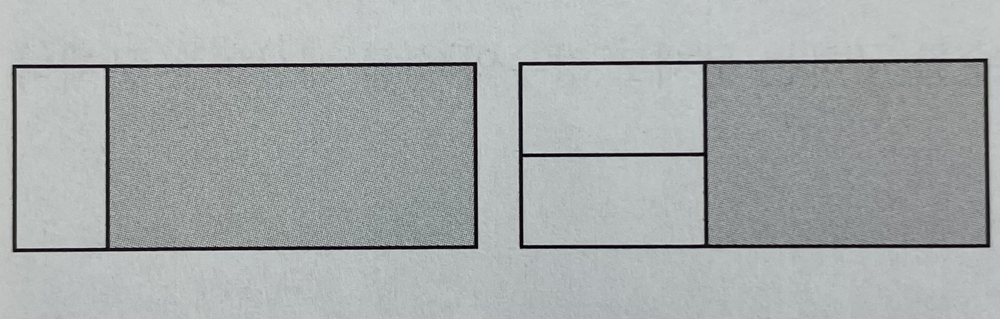
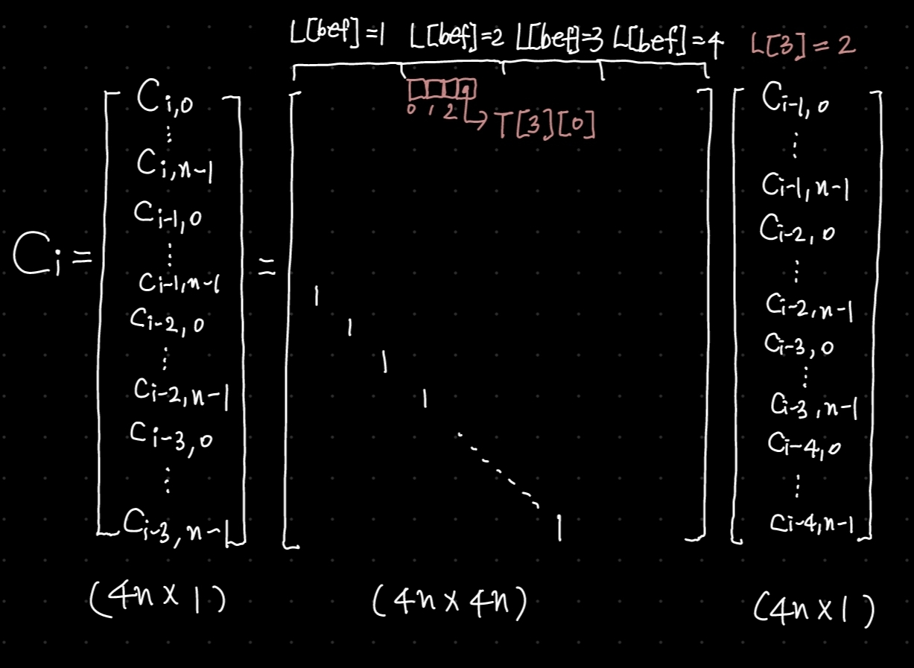

# 동적 계획법

## 도입


동적계획법은 큰 의미에서 분할 정복과 같은 접근방식을 갖는다.

주어진 문제를 더 작은 문제들로 나눈 뒤 각 조각의 답을 계산하고, 이 답들로부터 원래 문제에 대한 답을 계산해 내기 때문이다.

동적 계획법에서는 두 개 이상의 문제를 푸는 데 사용되는 부분문제의 계산 결과를 재활용함으로써 속도의 향상을 꾀한다.

이미 계산한 값을 저장해 두는 메모리의 장소를 캐시(cache) 라고 부르며, 두 번 이상 계산되는 부분문제를 중복되는 부분 문제(overlapping subproblems) 라고 부른다.

함수의 결과를 저장하는 장소를 마련해두고, 한 번 계산한 값을 저장해 뒀다 재활용하는 최적화 기법을 메모이제이션 이라고 부른다.

이와 같이 두 번 이상 반복 계산되는 부분 문제들의 답을 미리 저장함으로써 속도의 향상을 꾀하는 알고리즘 설계 기법을 동적 계획법이라고 한다.

***

## 메모이제이션의 시간 복잡도 분석

메모이제이션을 사용하는 알고리즘의 시간 복잡도를 간단하게 계산할 수 있는 방법이 있다.

(존재하는 부분 문제의 수) X (한 부분 문제를 풀 때 필요한 반복문의 수행 횟수)

반복문은 맨 처음 해당 부분문제를 해결할때만 수행되므로, 알고리즘의 수행시간 상한이 위와 같이 된다는 것을 알 수 있다.

물론 존재할 수 있는 모든 부분 문제 중 일부분만을 계산해도 답을 찾을 수 있는 경우에는 실제 수행시간이 이 식보다 훨씬 작다.

***

## 동적 계획법 레시피

1. 주어진 문제를 완전 탐색을 이용해 해결한다.
2. 중복된 부분문제를 한 번만 계산하도록 메모이제이션을 적용한다.

동적 계획법에서는 함수를 잘 정의하는 것이 굉장히 중요하다.

부분문제를 한 번만 계산하기 때문에, 최대한 겹치는 부분 문제를 많이 만들어야 성능상 유리하기 때문이다.

따라서 전체에 대한 내용을 반환하는 것이 아닌 일부만 반환하도록 하고, 이전 선택에 대한 정보가 필요 없다면 함수의 정의에 이러한 내용을 없애야 한다.

***

## 경우의 수 세기

동적 계획법은 경우의 수를 세는 문제에서도 많이 활용된다.

2 x n 크기의 사각형을 2 x 1 크기의 타일로 채우는 방법의 수를 계산하는 문제를 생각해보자.



2 x n 크기의 사각형을 채우는 방법은 위 그림과 같이 두 가지 경우로 나눌 수 있다.

이 때 다음의 조건이 성립한다.

1. 이 두 가지 분류는 타일링하는 방법을 모두 포함한다.
2. 두 가지 분류에 모두 포함되는 타일링 방법은 없다.

모든 경우의 수를 세는 문제는 위와 같은 두 조건을 모두 만족해야 한다.

1번 조건을 통해 모든 경우의 수를 빠지지 않고 센다는 것을 알 수 있고,
<br>2번 조건을 통해 중복되어 세는 경우의 수가 없다는 것을 알 수 있다.

> 경우의 수를 제대로 세기 위해서는 재귀 호출의 각 단계에서 고르는 각 선택지의 다음과 같은 속성이 성립해야 함.
> 1. 모든 경우는 이 선택지들에 포함됨.
> 2. 어떤 경우도 두 개 이상의 선택지에 포함되지 않음.

***

## 최적화 문제의 실제 답 계산하기

최적화문제를 푸는 과정에서 최적해의 점수가 아닌, 실제 최적해를 찾는 문제에서는 각 부분 문제마다 어떤 선택지를 택했을 때 최적해를 얻는지 기록해두고, 별도의 재귀함수를 이용해 각 조각에서 한 선택을 되짚어가며 최적해를 생성해내면 된다.

***LIS 수열 실제로 계산하기***

```cpp
int n;
int cache[101], S[100], choices[101];

int lis(int start) {
    int& ret = cache[start + 1];
    if(ret != -1) return ret;
    ret = 1;
    int bestNext = -1;
    for(int next = start + 1; next < n; next++)
        if(start == -1 || S[start] < S[next]) {
            int cand = 1 + lis(next);
            if(cand > ret) {
                ret = cand;
                bestNext = next;
            }
        }
    choices[start + 1] = bestNext;
    return ret;
}

// start에서 시작하는 lis를 seq 맨 뒤에 저장한다.
void reconstruct(int start, vector<int>& seq) {
    if(start != -1) seq.push_back(start);
    int next = choices[start + 1];
    if(next != -1) reconstruct(next, seq);
}

```

***

## k번째 답을 구하는 문제

> 1. 답의 수를 세는 문제를 푼다.
> 2. 답의 수를 기반으로 답안을 재구성한다.
> 3. k번째 답을 구하는 재귀함수를 설계하는데, 함수 내부에서 선택할 수 있는 조각들의 값을 하나씩 고려하면서 이 값을 선택했을 때 만들어지는 답의 개수(M)와 k 값을 비교한다. 
<br> a) M >= k: M개의 답 중에 원하는 값이 있으므로, 이 값을 선택하여 답에 추가하고 재귀호출로 답의 나머지 부분을 만든다. 
<br> b. M < k: M개의 답은 원하는 답보다 앞에 있으므로 건너뛰면서 k에서 M만큼을 빼준다. 

## 불린 값의 배열을 메모이제이션 해야하는 경우

여행하는 외판원문제에서 shortestPath(here, visited) = 현재 위치가 here이고, 각 도시 방문 여부가 visited 배열로 주어질 때, here에서 시작해 나머지 도시를 방문하는 부분 경로의 최소 길이 반환

위와 같이 함수를 정의했다고 가정하자.

이 때 visited 배열을 길이가 n인 2진수로 본다면 쉽게 메모이제이션을 적용할 수 있다.

```cpp
int n, dist[MAX][MAX];
double cache[MAX][1 << MAX];

double shortestPath(int here, int visited) {
    if(visited == (1 << n) - 1) return dist[here][0];
    double& ret = cache[here][visited];
    if(ret >= 0) return ret;
    ret = INF;
    for(int next = 0; next < n; next++) {
        if(visited & (1 << next)) continue;
        double cand = dist[here][next] + shortestPath(next, visited + (1 << next));
        ret = min(ret, cand);
    }
    return ret;
}
```

***

## 반복적 동적 계획법

지금까지는 동적 계획법을 재귀 호출과 메모이제이션으로 구현했지만, 반복문을 통해 구현하는 방법도 있다.

부분 문제간의 의존성을 파악하기 쉬운 경우에는 재귀 함수가 아니라 반복문을 이용해서 동적 계획법을 구현할 수도 있다.

이러한 기법을 반복적 동적 계획법이라고 한다.

삼각형 위의 최대 경로 문제를 통해 반복적 동적 계획법을 이해해보자.

path(y, x) = (y, x) 부터 바닥까지 도달하는데 드는 최대 경로 길이.

path(y, x) = triangle[y, x] + max(path(y + 1, x), path(y + 1, x + 1))

path(y, x)를 계산하기 위해서는 path(y + 1, x), path(y + 1, x + 1) 이 필요한데, 이들은 둘 다 한 줄 아래에서 시작하는 부분 문제이다.

따라서 맨 아랫줄 부터 path의 값을 계산하며 올라가면 path값을 구하기 위해 필요한 모든 값을 항상 가지고 있게 되고, 결과적으로 재귀호출을 쓰지 않고 답을 계산할 수 있게 된다.

```cpp
int n, triangle[MAX_N][MAX_N];
int C[MAX_N][MAX_N];
int iterative() {
    // 기저 사례
    for(int x = 0; x < n; x++)
        C[n - 1][x] = triangle[n - 1][x];

    // 반복적으로 계산
    for(int y = n - 2; y >= 0; --y)
        for(int x = 0; x < n; ++x)
            C[y][x] = triangle[y][x] + max(C[y + 1][x], C[y + 1][x + 1]);

    return C[0][0];
}
```

***

### 슬라이딩 윈도를 이용한 공간 복잡도 줄이기

반복적 동적 계획법의 유용한 사용처 중 하나는 경우에 따라 공간 복잡도를 줄이는 데 쓸 수 있다는 것이다.

위 삼각형 위의 최대 경로 문제에서 C[i][?] 는 C[i + 1][?] 만 필요할 뿐 나머지 부분은 필요하지 않는다.

따라서 메모리에 $O(n^2)$ 크기의 배열을 저장할 필요 없이, 항상 두 줄만 저장하면 된다.

아래는 슬라이딩 윈도를 이용해 코드를 다시 구현한 것이다.

```cpp
int C[2][MAX_N], triangle[MAX_N][MAX_N];
int iterative2() {
    for(int x = 0; x < n; x++)
        C[(n - 1) % 2][x] = triangle[n - 1][x];

    for(int y = n - 2; y >= 0; --y)
        for(int x = 0; x < n; ++x)
            C[y % 2][x] = triangle[y][x] + max(C[(y + 1) % 2][x] + C[(y + 1) % 2][x + 1]);

    return C[0 % 2][0];
}
```

## 행렬 거듭제곱을 이용한 동적 계획법

굉장히 한정된 경우에 쓸 수 있지만 매우 유용한 트릭으로, 선형 변환 형태의 점화식을 행렬을 이용해 빠르게 푸는 기법이 있다.

피보나치 수열의 특정 항을 구하는 문제로 예를 들어 보이겠다.

피보나치 수열은 첫 두 자리 숫자가 각각 0과 1이고, 다음부터는 이전 두 수의 합으로 정의되는 무한 수열이다. 

다음과 같은 점화식으로 정의할 수 있다.

$fib(n) = fib(n - 1) + fib(n - 2)$

```cpp
int fib(n) {
    if(n <= 1) return n;
    int seq[3];
    seq[0] = 0;
    seq[1] = 1;
    for(int i = 2; i <= n; i++)
        seq[i % 3] = seq[(i - 1) % 3] + seq[(i - 2) % 3];
    return seq[n % 3];
}
```

위 코드는 $O(n)$의 시간 복잡도를 기지고 메모리는 $O(1)$만큼 사용한다.

이보다 더 빨리 계산하는 방법은 행렬 제곱 알고리즘을 이용하는 것이다.

```math
C_i =
\begin{pmatrix}
  fib(i - 1) \\
  fib(i)
\end{pmatrix},\ \ 
C_{i + 1} = 
\begin{pmatrix}
  fib(i)\\
  fib(i + 1) = fib(i - 1) + fib(i)
\end{pmatrix} = 
\begin{pmatrix}
  0 & 1 \\
  1 & 1
\end{pmatrix} C_i
```

$\ \ \ \ \ \ \ \ \ \ \ \ \ \ \ \ \ \ C_n = WC_{n-1} = W^2C_{n-2} = \cdots W^{n-1}C_1$

$$
\begin{pmatrix}
  fib(n - 1) \\
  fib(n)
\end{pmatrix}
= W^{n-1}
\begin{pmatrix}
  0 \\ 
  1 \\
\end{pmatrix},\ \ fib(n) = W^{n-1}[1][1]
$$

여기서 $W^{n-1}$은 $lgn$만의 행렬 곱셈에 풀 수 있으므로 $O(n)$ 보다 빨리 해결할 수 있음을 알 수 있다.

```cpp
Matrix pow(const Matrix& A, int n);
int fib(int n) {
    if(n == 0) return 0;
    Matrix W(2);
    W[0][0] = 0;
    W[0][1] = W[1][0] = W[1][1] = 1;
    return pow(W, n - 1)[1][1];
}
```

이 과정을 일반화해서 설명하면 다음과 같다.

$C(i, j)$와 같이 두 개의 인자를 받는 2차원 점화식으로 정의되는 동적 계획법 알고리즘이 있다고 하자.

이 때 $[C(i, 0), C(i, 1), \cdots, C(i, m - 1)]$ 의 열 벡터를 $C_i$ 라고 표기하기로 하자.

문제에 따라 $C(i, j)$를 다음과 같이 $C_{i - 1}$의 가중치 합, 곧 선형 결합으로 쓸 수 있는 경우가 있다.

$$C(i, j) = \sum_{k=0}^{m-1} w_{j, k}C(i - 1, k)$$

이 때 가중치 $w_{j, k}$는 $i$와 상관 없이 일정하다.

그러면 $C_i$를 다음과 같이 $C_{i - 1}$에 행렬을 곱한 것으로 바꿔서 쓸 수 있다.

$$
C_i = 
\begin{pmatrix}
w_{0, 0}, w_{0, 1}, \cdots, w_{0, m-1} \\
w_{1, 0}, w_{1, 1}, \cdots, w_{1, m-1} \\
\vdots\ \ \ \ \ \ \vdots \ \ \ \ \ \ \ \ \ \ \ \ \ \ \ \ \ \ \ \ \ \vdots \\
w_{m-1, 0}, w_{m - 1, 1}, \cdots, w_{m - 1, m - 1}
\end{pmatrix}C_{i - 1}
$$

가운데 큰 행렬을 $W$로 바꿔 쓰면 

$C_{n-1} = W^{n - 1}C_0$ 이 되고, 행렬의 빠른 제곱을 이용하면 $W^{n-1}$을 $O(m^3lgn)$ 시간에 계산할 수 있다.

$C(i, j)$ 를 모두 반복적 동적 계획법으로 계산하려면 $O(nm)$개의 값을 각각 $O(m)$ 개의 시간이 걸려서 계산하니 $O(nm^2)$의 시간이 걸린다.

보통의 문제는 m값보다 n값이 훨씬 더 큰 경우가 대부분이므로 이와 같은 기법은 시간복잡도 측면에서 큰 성능 향상을 이끌 수 있다.

***

## 예제

### 외발 뛰기 (JUMPGAME)

> https://www.algospot.com/judge/problem/read/JUMPGAME

```cpp
#include <cstdio>
#include <cstring>
using namespace std;

int n;
char board[100][100];
char cache[100][100];

bool canReach(int r, int c) {
    if(r >= n || c >= n) return false;
    if(r == n - 1 && c == n - 1) return true;
    char& ret = cache[r][c];
    if(ret != -1) return ret;
    ret = canReach(r + board[r][c], c) || canReach(r, c + board[r][c]);
    return ret;
}

int main() {
    int C;
    scanf("%d", &C);
    while(C--) {
        scanf("%d", &n);
        for(int i = 0; i < n; i++)
            for(int j = 0; j < n; j++)
                scanf("%hhd", &board[i][j]);
        memset(cache, -1, sizeof(cache));
        printf("%s\n", canReach(0, 0) ? "YES" : "NO");
    }
    return 0;
}
```

***

### 와일드카드 (WILDCARD) 

> https://www.algospot.com/judge/problem/read/WILDCARD 

```cpp
#include <string>
#include <algorithm>
using namespace std;

vector<string> strs;
char isMatched[101][101];
string wild;
string str;

bool check(int w, int s) {
    if(w == wild.size()) {
        if(s == str.size()) return true;
        else return false;
    }
    if(s == str.size()) {
        if(wild[w] != '*') return false;
        else return check(w + 1, s);
    }
    char& ret = isMatched[w][s];
    if(ret != -1) return isMatched[w][s];

    if(wild[w] == '?') {
        return ret = check(w + 1, s + 1);
    } else if(wild[w] == '*') {
        return ret = check(w, s + 1) || check(w + 1, s);
    } else {
        if(wild[w] == str[s])
            return ret = check(w + 1, s + 1);
        else return ret = 0;
    }
}

bool cmp(int i1, int i2) {
    return strs[i1] < strs[i2];
}

int main() {
    ios_base::sync_with_stdio(false);
    cin.tie(NULL);
    int C, N;
    strs.resize(50);
    cin >> C;
    while(C--) {
        cin >> wild;
        cin >> N;
        for(int i = 0; i < N; i++)
            cin >> strs[i];
        vector<int> matched;
        for(int i = 0; i < N; i++) {
            memset(isMatched, -1, sizeof(isMatched));
            str = strs[i];
            if(check(0, 0)) matched.push_back(i);
        }
        sort(matched.begin(), matched.end(), cmp);
        for(int i = 0; i < matched.size(); i++)
            cout << strs[matched[i]] << '\n';
    }
    return 0;
}
```

$check(w, s) : wild[w:]$ 과 $str[s:]$가 매칭된다면 $true$, 매칭되지 않는다면 $false$ 반환. 이 때 ?는 아무 문자와, $*$는 0개 이상의 문자와 대응된다.

가장 헷갈리는 경우인 $wild[w] ==$ '$*$' 를 따져보자.

1. $*$가 아무 문자와도 대응되지 않는 경우
<br> return check(w + 1, s);
2. $*$가 한개 이상의 문자와 대응되는 경우
<br> check(w, s + 1)는 wild[w:]와 str[s+1: ]가 매칭된다면 true를, 매칭되지 않는다면 false를 반환한다.
<br> 즉 $*$가 0이상의 문자와 대응되는 경우를 찾는 것이다.
<br> 따라서 check(w, s + 1) 을 반환한다면 $*$가 하나 이상 (1 + 0 이상)의 문자와 대응되는 경우를 나타낼 수 있다.

> 헷갈릴 때에는 위와 같이 경우를 나누어 생각하면 편하다.

***

### 합친 LIS (JLIS)

> https://www.algospot.com/judge/problem/read/JLIS

```cpp
#include <cstdio>
#include <cstring>
#include <vector>
#include <algorithm>
using namespace std;

typedef long long ll;

int n, m, cache[101][101];
vector<ll> A, B;

// A[a], B[b] 로 시작하는 jlis 길이 반환
int jlis(int a, int b) {
    int& ret = cache[a][b];
    if(ret != -1) return ret;
    ret = 2;
    ll max_val = max(A[a], B[b]);
    for(int i = a + 1; i <= n; i++)
        if(max_val < A[i])
            ret = max(ret, 1 + jlis(i, b));
    for(int i = b + 1; i <= m; i++)
        if(max_val < B[i])
            ret = max(ret, 1 + jlis(a, i));
    return ret;
}

int main() {
    int c;
    A.resize(101);
    B.resize(101);
    A[0] = B[0] = -(ll)1e10;
    scanf("%d", &c);
    while(c--) {
        memset(cache, -1, sizeof(cache));
        scanf("%d %d", &n, &m);
        for(int i = 1; i <= n; i++)
            scanf("%lld", &A[i]);
        for(int i = 1; i <= m; i++)
            scanf("%lld", &B[i]);
        printf("%d\n", jlis(0, 0) - 2);
    }
    return 0;
}
```

A[a] > B[b] 라고 가정. (A[a] < B[b] 의 경우에는 반대로 증명)

1. max_val(A[a]) < A[i] 
<br> ret = max(ret, 1 + jlis(i, b));
<br> A[i]와 B[b]로 시작하는 jlis를 구하면 B[b], A[i], $\cdots$ 형태이다. B[b]와 A[i] 사이에 A[a]가 들어가면, 길이가 1 더 긴 jlis가 된다.
2. max_val(A[a]) < B[i]
<br> ret = max(ret, 1 + jlis(a, i));
<br> A[a]와 B[i]로 시작하는 jlis를 구하면 A[a], B[i], $\cdots$ 형태이다. B[b]가 맨 앞으로 들어가면, 길이가 1 더 긴 jlis가 된다.

***

### 원주율 외우기

> https://www.algospot.com/judge/problem/read/PI

```cpp
#include <cstdio>
#include <cstring>
#include <algorithm>
using namespace std;

char str[10001];
int cache[10000], len;

int getLevel(int from, int to) {
    bool check = true;
    char first = str[from];
    char second = str[from + 1];
    for(int i = from + 1; i <= to; ++i)
        if(str[i] != first) {
            check = false;
            break;
        }
    if(check) return 1;
    check = true;
    for(int i = from + 1; i < to; ++i)
        if(str[i] - str[i + 1] != first - second) {
            check = false;
            break;
        }
    if(check) {
        if(first - second == 1 || first - second == -1) return 2;
        else return 5;
    }
    check = true;
    for(int i = from + 2; i <= to; i+=2)
        if(str[i] != first) {
            check = false;
            break;
        }
    for(int i = from + 3; i <= to; i+=2)
        if(str[i] != second) {
            check = false;
            break;
        }
    if(check) return 4;
    return 10;
}

int minLevel(int from) {
    if(from == len) return 0;
    int& ret = cache[from];
    if(ret != -1) return ret;
    ret = 987654321;
    for(int to = from + 2; to <= from + 4; ++to) {
        if(to >= len) break;
        ret = min(ret, getLevel(from, to) + minLevel(to + 1));
    }
    return ret;
}

int main() {
    int C;
    scanf("%d", &C);
    while(C--) {
        memset(cache, -1, sizeof(cache));
        scanf("%s", str);
        len = strlen(str);
        printf("%d\n", minLevel(0));
    }
}
```

***

### Quantization (QUANTIZE)

> https://www.algospot.com/judge/problem/read/QUANTIZE

```cpp
#include <iostream>
#include <cstring>
#include <algorithm>
using namespace std;

int N, S;
int arr[101];
int psum[101];
int psum2[101];
int cache[101][10];

int getAverage(int l, int r) {
    int ret = psum[r] - psum[l - 1];
    ret = (double)ret / (r - l + 1) + 0.5;
    return ret;
}

int getQuantization(int l, int r) {
    int k = getAverage(l, r);
    int ret = psum2[r] - psum2[l - 1];
    ret += (r - l + 1) * k * k;
    ret -= 2 * k * (psum[r] - psum[l - 1]);
    return ret;
}

int dp(int from, int n) {
    if(from == N + 1) return 0;
    int& ret = cache[from][n - 1];
    if(ret != -1) return ret;
    if(n == 1)
        return ret = getQuantization(from, N);
    ret = 987654321;
    for(int to = from; to <= N; to++)
        ret = min(ret, getQuantization(from, to) + dp(to + 1, n - 1));
    return ret;
}

int main() {
    ios_base::sync_with_stdio(false);
    cin.tie(NULL);
    psum[0] = psum2[0] = 0;

    int C;
    cin >> C;
    while(C--) {
        cin >> N >> S;
        for(int i = 1; i <= N; i++)
            cin >> arr[i];
        sort(arr + 1, arr + N + 1);
        for(int i = 1; i <= N; i++) {
            psum[i] = psum[i - 1] + arr[i];
            psum2[i] = psum2[i - 1] + arr[i] * arr[i];
        }
        memset(cache, -1, sizeof(cache));
        cout << dp(1, S) << '\n';
    }
}
```

***

### 비대칭 타일링 (ASYMTILING)

> https://www.algospot.com/judge/problem/read/ASYMTILING

```cpp
#include <cstdio>
#include <cstring>
#define MOD 1000000007

int n;
int cache[100];

int dp(int i) {
    if(i <= 1) return 1;
    int& ret = cache[i - 1];
    if(ret != -1) return ret;
    return ret = (dp(i - 1) + dp(i - 2)) % MOD;
}

int main() {
    int C;
    memset(cache, -1, sizeof(cache));
    scanf("%d", &C);
    while(C--) {
        scanf("%d", &n);
        if(n % 2)
            printf("%d\n", (dp(n) + MOD - dp(n / 2)) % MOD);
        else
            printf("%d\n", (((dp(n) + MOD - dp(n / 2)) % MOD) + MOD - dp(n / 2 - 1)) % MOD);
    }
}
```

***

### 폴리노미오 (POLY)

> https://www.algospot.com/judge/problem/read/POLY

```cpp
#include <cstdio>
#include <cstring>

#define MOD 10000000

int cache[100][100];

// 맨 위가 up개이고, 아래는 down개 일때 폴리오미노 만드는 경우의 수
int poly(int up, int down) {
    if(down == 0) return 1;
    int& ret = cache[up - 1][down - 1];
    if(ret != -1) return ret;
    ret = 0;
    for(int nextup = 1; nextup <= down; nextup++)
        ret = (ret + (up + nextup - 1) * poly(nextup, down - nextup)) % MOD;
    return ret;
}

int main() {
    memset(cache, -1, sizeof(cache));
    int C;
    scanf("%d", &C);
    while(C--) {
        int n, ret = 0;
        scanf("%d", &n);
        for(int i = 1; i <= n; i++)
            ret = (ret + poly(i, n - i)) % MOD;
        printf("%d\n", ret);
    }
}
```

***

### 두니발 박사의 탈옥 (NUMB3RS)

> https://www.algospot.com/judge/problem/read/NUMB3RS

```cpp
#include <cstdio>
#include <cstring>
using namespace std;

char adj[50][50];
int numOfAdj[50];
double cache[100][50];
int n, d, p, t;

// day일 후에 v마을에 있을 확률
double dp(int day, int v) {
    if(day == 0) return v == p;
    double& ret = cache[day - 1][v];
    if(ret > -0.5) return ret;
    ret = 0.0;
    for(int bv = 0; bv < n; bv++)
        if(adj[bv][v])
            ret += dp(day - 1, bv) / numOfAdj[bv];
    return ret; 
}

int main() {
    int c;
    scanf("%d", &c);
    while(c--) {
        scanf("%d %d %d", &n, &d, &p);
        for(int i = 0; i < d; i++)
            for(int j = 0; j < n; j++)
                cache[i][j] = -1;
        memset(numOfAdj, 0, sizeof(numOfAdj));
        for(int i = 0; i < n; i++)
            for(int j = 0; j < n; j++) {
                scanf("%hhd", adj[i]+j);
                if(adj[i][j])
                    numOfAdj[i]++;
            }
        scanf("%d", &t);
        int village;
        for(int i = 0; i < t; i++) {
            scanf("%d", &village);
            printf("%.8lf ", dp(d, village));
        }
        printf("\n"); 
    }
}
```

***

### 여행 짐 싸기 (PACKING)

> https://www.algospot.com/judge/problem/read/PACKING

```cpp
#include <iostream>
#include <string>
#include <cstring>
#include <vector>
#include <algorithm>
using namespace std;

int N, W;
int volume[100], need[100];
string name[100];

// 용량w를 idx부터 N-1 까지 채울때의 최대 절박도
int cache[1001][100];

int dp(int w, int idx) {
    if(idx == N) return 0;
    int& ret = cache[w][idx];
    if(ret != -1) return ret;
    ret = dp(w, idx + 1);
    if(volume[idx] <= w)
        ret = max(ret, need[idx] + dp(w - volume[idx], idx + 1));
    return ret;
}

void printResult(int w, int idx, vector<int>& path) {
    if(idx == N) {
        cout << path.size() << '\n';
        for_each(path.begin(), path.end(), [](const int& i) { cout << name[i] << '\n'; });
        return;
    }
    /*int ret = dp(w, idx + 1);*/
    /*int ret2 = volume[idx] <= w ? need[idx] + dp(w - volume[idx], idx + 1) : -1;*/
    /*if(ret2 == -1 || ret > ret2) printResult(w, idx + 1, path);*/
    /*else {*/
    /*    path.push_back(idx);*/
    /*    printResult(w - volume[idx], idx + 1, path);*/
    /*}*/
    if(dp(w, idx) == dp(w, idx + 1))
        printResult(w, idx + 1, path);
    else {
        path.push_back(idx);
        printResult(w - volume[idx], idx + 1, path);
    }
}

int main() {
    ios_base::sync_with_stdio(false);
    cin.tie(NULL);

    int C;
    cin >> C;

    while(C--) {
        memset(cache, -1, sizeof(cache));
        cin >> N >> W;
        for(int i = 0; i < N; i++)
            cin >> name[i] >> volume[i] >> need[i];
        cout << dp(W, 0) << ' ';
        vector<int> v;
        printResult(W, 0, v);
    }
}

```

이 문제는 각 부분문제에 선택지가 두개뿐이기 때문에 따로 선택을 저장하지 않고도 답을 역추적할 수 있다.

***

### 광학 문자 인식 (OCR)

> https://www.algospot.com/judge/problem/read/OCR

```cpp
#include <iostream>
#include <cmath>
#include <string>
#include <map>
using namespace std;

int m, q, n;

map<string, int> wordToIdx;
map<int, string> idxToWord;
double nextWord[501][501];
double prob[501][501];
int sentence[100];
double cache[501][501];
int choice[501][501];

// 이전 단어가 bef일때, idx번째 단어~ n-1 번째 단어까지의 최대 확률을 갖는 문장의 확률의 로그값
double dp(int bef, int idx) {
    if(idx == n) return 1.0;
    double& ret = cache[bef][idx];
    if(ret != 1.0) return ret;
    ret = -1e300;
    int here = sentence[idx];
    for(int real = 1; real <= m; real++) {
        double tmp = nextWord[bef][real] + prob[real][here] + dp(real, idx + 1);
        if(ret < tmp) {
            ret = tmp;
            choice[bef][idx] = real;
        }
    }
    return ret;
}

void findPath(int bef, int idx) {
    if(idx == n) {
        cout << '\n';
        return;
    }
    int real = choice[bef][idx];
    cout << idxToWord[real] << ' ';
    findPath(real, idx + 1);
}

void init() {
for(int i = 0; i < 501; i++)
    for(int j = 0; j < 501; j++)
        cache[i][j] = 1.0;
}

int main() {
    ios_base::sync_with_stdio(false);
    cin.tie(NULL);

    cin >> m >> q;
    for(int i = 1; i <= m; i++) {
        string s;
        cin >> s;
        wordToIdx[s] = i;
        idxToWord[i] = s;
    }
    for(int i = 1; i <= m; i++) {
        cin >> nextWord[0][i];
        nextWord[0][i] = log(nextWord[0][i]);
    }
    for(int i = 1; i <= m; i++)
        for(int j = 1; j <= m; j++) {
            cin >> nextWord[i][j];
            nextWord[i][j] = log(nextWord[i][j]);
        }
    for(int i = 1; i <= m; i++)
        for(int j = 1; j <= m; j++) {
            cin >> prob[i][j];
            prob[i][j] = log(prob[i][j]);
        }

    for(int i = 0; i < q; i++) {
        cin >> n;
        string s;
        init();
        for(int i = 0; i < n; i++) {
            cin >> s;
            sentence[i] = wordToIdx[s];
        }
        dp(0, 0);
        findPath(0, 0);
    }
}

```

이 문제는 각 부분문제에서의 선택지가 m개이기 때문에 선택들을 따로 저장해주어야 한다.

k 이 문제처럼 확률을 계속해서 곱하는 문제는 계속해서 곱해지는 과정에서 확률값이 너무 작아져 언더플로가 생길 가능성이 있다.
> <br>따라서 확률값을 그대로 곱하면서 계산하는것이 아니라, 전체 확률의 로그값을 구하도록 문제를 바꾸면 각 확률의 로그값을 더하면 되기 때문에 오차를 줄일 수 있다.

***

### 모스 부호 사전 (MORSE)

> https://www.algospot.com/judge/problem/read/MORSE

```cpp
#include <iostream>
#include <string>
#include <cstring>
using namespace std;

int cache[101][101];

// n개의 장점과 m개의 단점으로 만들 수 있는 신호 수
int dp(int n, int m) {
    if(n == 0 || m == 0) return 1;
    int& ret = cache[n][m];
    if(ret != -1) return ret;
    ret = dp(n - 1, m);
    ret += dp(n, m - 1);
    if(ret > 1e9)
        ret = 1e9;
    return ret;
}

// n개의 장점과 m개의 단점으로 만들 수 있는 신호중 k번째 신호 출력 
void print_kth(int n, int m, int k) {
    if(n == 0) {
        cout << string(m, 'o') << '\n';
        return;
    } else if(m == 0) {
        cout << string(n, '-') << '\n';
        return;
    }
    if(dp(n - 1, m) >= k) {
        cout << '-';
        print_kth(n - 1, m, k);
    }
    else {
        cout << 'o';
        print_kth(n, m - 1, k - dp(n - 1, m));
    }
}

int main() {
    ios_base::sync_with_stdio(false);
    cin.tie(NULL);

    int C;
    cin >> C;
    while(C--) {
        memset(cache, -1, sizeof(cache));
        int n, m, k;
        cin >> n >> m >> k;
        print_kth(n, m, k);
    }
}
```

***

### k번째 최대 증가 부분 수열 (KLIS)

> https://www.algospot.com/judge/problem/read/KLIS

```cpp
#include <iostream>
#include <algorithm>
#include <limits>
#include <vector>
#include <cstring>
using namespace std;

int arr[501];
int cache[501];
int cache2[501];
int N, K;

// nextCand[here] : arr[here]에서 시작하는 lis의 다음 가능한 next 사전순
vector<int> nextCand[501];

// arr[here] 에서 시작하는 lis 길이
int dp(int here) {
    int& ret = cache[here];
    if(ret != -1) return ret;
    ret = 1;

    vector<int> nextIdx;
    for(int next = here + 1; next <= N; ++next)
        if(arr[here] < arr[next])
            nextIdx.push_back(next);
    sort(nextIdx.begin(), nextIdx.end(), [](int& a, int& b) { return arr[a] < arr[b]; });

    nextCand[here].clear();
    for(int i = 0; i < nextIdx.size(); ++i) {
        int cand = 1 + dp(nextIdx[i]);
        if(ret < cand) {
            nextCand[here].clear();
            nextCand[here].push_back(nextIdx[i]);
            ret = cand;
        } else if(ret == cand)
            nextCand[here].push_back(nextIdx[i]);
    }

    return ret;
}

// arr[here] 에서 시작하는 lis 개수
long long count(int here) {
    int& ret = cache2[here];
    if(ret != -1) return ret;
    
    long long tmpRet = 0;

    for(int i = 0; i < nextCand[here].size(); i++)
        tmpRet += count(nextCand[here][i]);

    if(tmpRet == 0) tmpRet = 1;
    else if(tmpRet > numeric_limits<int>::max())
        tmpRet = numeric_limits<int>::max();

    return ret = tmpRet;
}

// arr[here] 에서 시작하는 lis중 k번째 출력
void printKth(int here, int k) {
    if(nextCand[here].size() == 0) {
        cout << '\n';
        return;
    }

    for(int i = 0; i < nextCand[here].size(); i++) {
        int next = nextCand[here][i];
        if(count(next) >= k) {
            cout << arr[next] << ' ';
            printKth(next, k);
            return;
        } else {
            k -= count(next);
        }
    }
}

int main() {
    ios_base::sync_with_stdio(false);
    cin.tie(NULL);
    int C;
    cin >> C;
    while(C--) {
        memset(cache, -1, sizeof(cache));
        memset(cache2, -1, sizeof(cache2));
        cin >> N >> K;
        for(int i = 1; i <= N; i++)
            cin >> arr[i];
        cout << dp(0) - 1 << '\n';
        printKth(0, K);
    }
}
```

***

### 드래곤 커브 (DRAGON)

> https://www.algospot.com/judge/problem/read/DRAGON

```cpp
#include <iostream>
#include <string>
using namespace std;

int n, p, l;

// X or Y 가 i 레벨 업 했을때의 길이
int levelUp[51];

// s를 up만큼 레벨 업 했을때의 k번째 문자
void printKth(const string& s, int up, int k) {
    if(up == 0) {
        cout << s[k - 1];
        return;
    }

    for(int i = 0; i < s.size(); i++) {
        char ch = s[i];
        if(ch == 'X') {
            if(levelUp[up] >= k) {
                printKth("X+YF", up - 1, k);
                return;
            } else
                k -= levelUp[up];
        } else if(ch == 'Y') {
            if(levelUp[up] >= k) {
                printKth("FX-Y", up - 1, k);
                return;
            } else
                k -= levelUp[up];
        } else {
            if(k == 1) {
                cout << ch;
                return;
            } else
                --k;
        }
    }
}

void init() {
    ios_base::sync_with_stdio(false);
    cin.tie(NULL);

    levelUp[0] = 1;
    for(int i = 1; i <= 50; i++) {
        levelUp[i] = 2 * levelUp[i - 1] + 2;
        if(levelUp[i] > 1e9)
            levelUp[i] = 1e9;
    }
}

int main() {
    init();
    int c;
    cin >> c;
    while(c--) {
        cin >> n >> p >> l;
        for(int k = p; k < p + l; ++k) {
            printKth("FX", n, k);
        }
        cout << '\n';
    }
}
```

p는 최대 1e9 이다.

답을 구하는 과정에서 levelUp[idx] >= k 인 모든 상황을 떠올려보자.

이 상황에서 1e9보다 큰 levelUp[idx] 를 1e9로 낮춘다고 하더라고 levelUp[idx] > 1e9 >= k 이므로 답에는 변화를 주지 않는다.

또한 levelUp[idx] < k 인 상황에서는 levelUp[idx] 값이 변하지 않았으므로 답에 변화를 주지 않는다.

이러한 방식으로 오버플로를 막을 수 있다.

***

### 웨브바짐 (ZIMBABMWE)

> https://www.algospot.com/judge/problem/read/ZIMBABWE

```cpp
#include <cstdio>
#include <algorithm>
#include <cstring>
using namespace std;

#define MOD 1000000007

char original[16];
char num[16];
int n, m;
int cache[2][20][1 << 15];

// 지금껏 만든 수가 이전 가격보다 적은지 여부가 less로 주어지고, 현재 mask에 해당하는 숫자를 사용했고, 이전까지의 나머지가 bef일 때, idx ~ n-1 마저 채우면서 가능한 계란 가격의 수
int dp(bool less, int bef, int mask, int idx) {
    if(idx == n)
        return (bef == 0) && less;

    int& ret = cache[less][bef][mask];
    if(ret != -1) return ret;
    ret = 0;
    for(int here = 0; here < n; ++here) {
        if(mask & (1 << here)) continue;
        if(here > 0 && num[here - 1] == num[here] && (mask & (1 << (here - 1))) == 0) continue;
        if(!less && (num[here] > original[idx])) break;
        ret = (ret + dp(less || (num[here] < original[idx]), (bef * 10 + num[here]) % m, mask + (1 << here), idx + 1)) % MOD;
    }
    return ret;
}

int main() {
    int c;
    scanf("%d", &c);
    while(c--) {
        memset(cache, -1, sizeof(cache));
        scanf("%s %d", original, &m);
        n = strlen(original);
        strcpy(num, original);
        sort(num, num + n);
        for_each(num, num + n, [](char &c) { c -= '0'; });
        for_each(original, original + n, [](char &c) { c -= '0'; });
        printf("%d\n", dp(false, 0, 0, 0));
    }
}
```

dp(less, bef, mask, idx) 에서 less, bef, mask는 정확히 한 idx 값에 대응된다.

같은 less, bef, mask 값을 가지면서 서로 다른 idx 값을 가질 수는 없다.

메모이제이션은 less, bef, mask 값만을 가지고 할 수 있다는 것을 알 수 있다.

간단하게 생각하면 idx는 mask값에 포함된 1의 개수와 같기 때문에 mask만 메모이제이션에 포함해도 된다.

***

### 실험 데이터 복구하기 (RESTORE)

> https://www.algospot.com/judge/problem/read/RESTORE

```cpp
#include <iostream>
#include <vector>
#include <string>
#include <cstring>
using namespace std;

#define MAX 987654321

int k;
vector<string> str;
int overlap[16][16]; // overlap[i][j] = i 다음 j가 올 때, 겹치는 글자 수

int cache[16][1 << 16];
int choice[16][1 << 16];

// 이전에 사용된 문자가 str[bef]이고, 지금껏 사용된 문자가 mask일 때, 현재 문자부터 나머지 문자까지 모두 이어붙여 만들수 있는 가장 짧은 문자열 길이
int dp(int bef, int mask) {
    if(mask == (1 << (k + 1)) - 1) return 0;
    int& ret = cache[bef][mask];
    if(ret != -1) return ret;
    ret = MAX;
    for(int here = 1; here <= k; ++here) {
        if(mask & (1 << here)) continue;
        int cand = str[here].size() - overlap[bef][here] + dp(here, mask + (1 << here));
        if(cand < ret) {
            ret = cand;
            choice[bef][mask] = here;
        }
    }
    return ret;
}

void printResult(int bef, int mask) {
    if(mask == (1 << (k + 1)) - 1) {
        cout << '\n';
        return;
    }
    int here = choice[bef][mask];
    cout << str[here].substr(overlap[bef][here]);
    printResult(here, mask + (1 << here));
}

void calcOverlap() {
    // 다른 문자열에 포함되어 있는 문자열 제거
    for(int i = 1; i < k; ++i)
        for(int j = i + 1; j <= k; ++j) {
            if(str[i].find(str[j]) != string::npos) {
                str.erase(str.begin() + j);
                k--;
                j--;
            } else if(str[j].find(str[i]) != string::npos) {
                str.erase(str.begin() + i);
                i--;
                k--;
                break;
            }
        }
    for(int i = 1; i <= k; i++)
        for(int j = 1; j <= k; j++) {
            if(i == j) continue;
            int b = str[i].size() - 1;
            int f = 0;
            int maxOverlap = 0;
            while(b >= 0 && f < str[j].size()) {
                if(str[i].substr(b).find(str[j].substr(0, f + 1)) != string::npos)
                    maxOverlap = f + 1;
                b--; f++;
            }
            overlap[i][j] = maxOverlap;
        }
}

int main() {
    ios_base::sync_with_stdio(false);
    cin.tie(NULL);
    int C;
    cin >> C;
    while(C--) {
        memset(cache, -1, sizeof(cache));
        cin >> k;
        str.resize(k + 1);
        for(int i = 1; i <= k; ++i)
            cin >> str[i];
        calcOverlap();
        dp(0, 1);
        printResult(0, 1);
    }
}
```

이 문제를 풀기 위해 두가지 가정을 수행하였다.

1. 어느 한 문자열이 다른 문자열에 완전히 포함된다면, 해당 문자열은 빼고 생각해도 된다.
<br> - 다른 문자열에 완전히 포함되는 문자열 S가 있다고 가정하자.
<br> - 해당 문자열이 다른 문자열에 완전히 포함되는 해를 $A$라고 하자.
<br> - 이 때 $A^c \rightarrow A$ 는 본전이거나 이득이다.
<br> - 따라서 $A^c$에 최적해가 있다면 $A$도 최적해이다.
<br> - 따라서 S가 다른 문자열에 완전히 포함되는 경우에서도 최적해를 찾을 수 있으므로 빼버려도 된다.

2. 문자열들이 나열되었을 때, 두 인접한 문자열은 최대한으로 겹쳐야 최적해를 찾을 수 있다.
<br> - 두 인접한 문자열을 최대한으로 겹치게 만든 해를 $A$라고 하자.
<br> - $A^c \rightarrow A$ 는 이득이다.
<br> - 따라서 $A^c$ 중에서는 최적해가 없으므로, $A$ 인 경우에서 최적해를 찾으면 된다.

따라서 위 알고리즘의 설계는 $A$ 인 경우에서의 최적해를 찾도록 고안하였다.

```cpp
    for(int i = 1; i < k; ++i)
        for(int j = i + 1; j <= k; ++j) {
            if(str[i].find(str[j]) != string::npos) {
                str.erase(str.begin() + j);
                k--;
                j--;
            } else if(str[j].find(str[i]) != string::npos) {
                str.erase(str.begin() + i);
                i--;
                k--;
                break;
            }
        }
```

위 코드는 다른 문자열에 완전히 포함된 문자열을 삭제하는 알고리즘이다.

로직을 익히자.

> 결과 문자열 길이 = 모든 문자열의 길이 합 - overlap 길이 합 이므로 아래와 같이 overlap의 최대 길이를 찾는 방식으로 바꿀수도 있다.

```cpp
// 이전에 사용된 문자가 str[bef]이고, 지금껏 사용된 문자가 mask일 때, 현재 문자부터 나머지 문자까지 모두 이어붙여 만들수 있는 문자열의 가장 긴 overlap 합
int dp(int bef, int mask) {
    if(mask == (1 << (k + 1)) - 1) return 0;
    int& ret = cache[bef][mask];
    if(ret != -1) return ret;
    for(int here = 1; here <= k; ++here) {
        if(mask & (1 << here)) continue;
        int cand = overlap[bef][here] + dp(here, mask + (1 << here));
        if(cand > ret) {
            ret = cand;
            choice[bef][mask] = here;
        }
    }
    return ret;
}
```

> 이 때 ret = 0 이라고 초기화하지 않도록 주의해야한다.
> ret = 0 이라고 초기화할시에, 재귀호출한 모든 부분문제가 0을 반환할 때 choice 배열에 값을 넣지 않는 오류가 발생할 수 있다.

***

### 틱택토 (TICTATOE)

> https://www.algospot.com/judge/problem/read/TICTACTOE

```cpp
#include <algorithm>
#include <cstring>
using namespace std;

int cache[19683];

int convert(vector<string>& state) {
    int ret = 0;
    int digit = 1;
    for(int i = 0; i < 3; i++) 
        for(int j = 0; j < 3; j++) {
            if(state[i][j] == 'x') ret += digit;
            else if(state[i][j] == 'o') ret += 2 * digit;
            digit *= 3;
        }
    return ret;
}

bool isWin(vector<string>& state) {
    for(int i = 0; i < 3; i++) {
        if(state[i][0] != '.' && state[i][0] == state[i][1] && state[i][0] == state[i][2]) return true;
        if(state[0][i] != '.' && state[0][i] == state[1][i] && state[0][i] == state[2][i]) return true;
    }
    if(state[0][0] != '.' && state[0][0] == state[1][1] && state[0][0] == state[2][2]) return true;
    if(state[0][2] != '.' && state[0][2] == state[1][1] && state[0][2] == state[2][0]) return true;
    return false;
}

// 0: 비김, 1: 이김, 2: 짐 
int dp(vector<string>& state, bool xTurn, int put) {
    if(isWin(state)) return 2;
    if(put == 9) return 0;
    int& ret = cache[convert(state)];
    if(ret != -1)
        return ret;
    ret = 1;
    for(int i = 0; i < 3; i++)
        for(int j = 0; j < 3; j++)
            if(state[i][j] == '.') {
                if(xTurn) {
                    state[i][j] = 'x';
                    int result = dp(state, !xTurn, put + 1);
                    ret = min(ret , result);
                    state[i][j] = '.';
                    if(result == 2) return ret = 1;
                } else {
                    state[i][j] = 'o';
                    int result = dp(state, !xTurn, put + 1);
                    ret = min(ret, result);
                    state[i][j] = '.';
                    if(result == 2) return ret = 1;
                }
            }
    if(ret == 0) return 0;
    else return ret = 2;
}

int main() {
    ios_base::sync_with_stdio(false);
    cin.tie(NULL);

    int C;
    vector<string> state(3);
    cin >> C;
    memset(cache, -1, sizeof(cache));
    while(C--) {
        for(int i = 0; i < 3; i++)
            cin >> state[i];
        int cnt_o = 0;
        int cnt_x = 0;
        for(int i = 0; i < 3; i++) {
            cnt_o += count(state[i].begin(), state[i].end(), 'o');
            cnt_x += count(state[i].begin(), state[i].end(), 'x');
        }
        if(cnt_x == cnt_o) {
            int ret = dp(state, true, cnt_x + cnt_o);
            switch(ret) {
            case 0: cout << "TIE\n"; break;
            case 1: cout << "x\n"; break;
            case 2: cout << "o\n"; break;
            }
        } else {
            int ret = dp(state, false, cnt_x + cnt_o);
            switch(ret) {
            case 0: cout << "TIE\n"; break;
            case 1: cout << "o\n"; break;
            case 2: cout << "x\n"; break;
            }
        }
    }
    return 0;
}

```

dp(vector<string>& state, bool xTurn, int put) 함수 내에서 메모이제이션을 하는 코드를 보자.

함수의 매개변수로는 사용하기 편한 vector를 전달한다.

함수 내에서 메모이제이션을 하는 부분에서는 1대1 대응 함수(convert)를 사용한것을 볼 수 있다.

***

### 숫자 게임 (NUMBERGAME)

> https://www.algospot.com/judge/problem/read/NUMBERGAME

```cpp
#include <iostream>
#include <algorithm>
#include <cstring>
using namespace std;

#define EMPTY -987654321

int n;
int board[50];
int cache[50][50];

// 현재 게임판이 board[l] ~ board[r] 까지 남았을 때, 지금부터 마지막까지 플레이해서 얻을 수 있는
// 현재 순서의 플레이어 점수 - 상대방 점수의 최댓값.
int dp(int l, int r) {
    if(l > r) return 0;
    int& ret = cache[l][r];
    if(ret != EMPTY) return ret;
    ret = board[l] - dp(l + 1, r);
    ret = max(ret, board[r] - dp(l, r - 1));
    if(r - l >= 1) {
        ret = max(ret, -dp(l + 2, r));
        ret = max(ret, -dp(l, r - 2));
    }
    return ret;
}

int main() {
    ios_base::sync_with_stdio(false);
    cin.tie(NULL);
    
    int C;
    cin >> C;

    while(C--) {
        for(int i = 0; i < 50; i++)
            for(int j = 0; j < 50; j++)
                cache[i][j] = EMPTY;
        cin >> n;
        for(int i = 0; i < n; i++)
            cin >> board[i];
        cout << dp(0, n - 1) << '\n';
    }
}
```

***

### 블록 게임 (BLOCKGAME)

> https://www.algospot.com/judge/problem/read/BLOCKGAME

```cpp
#include <iostream>
#include <string>
#include <cstring>
#include <vector>
using namespace std;

inline int cell(int y, int x) { return (1 << (5 * y + x)); }

vector<int> blocks;

char cache[1 << 25];
// 보드 상태가 state일 때, 이번 차례의 참가자가 이길 수 있다면 1, 없다면 0 반환
char dp(int state) {
    char& ret = cache[state];
    if(ret != -1) return ret;
    ret = 0;
    for(int i = 0; i < blocks.size(); i++)
        if((state & blocks[i]) == 0) {
            char cand = dp(state + blocks[i]);
            if(cand == 0) {
                ret = 1;
                break;
            }
        }
    return ret;
}

void makeBlocks() {
    for(int i = 0; i < 5; ++i)
        for(int j = 0; j < 4; ++j) {
            blocks.push_back(cell(i, j) + cell(i, j + 1));
            blocks.push_back(cell(j, i) + cell(j + 1, i));
        }
    for(int r = 0; r < 4; ++r)
        for(int c = 0; c < 4; ++c) {
            int part[4] = {cell(r, c), cell(r, c + 1), cell(r + 1, c), cell(r + 1, c + 1)};
            int square = part[0] + part[1] + part[2] + part[3];
            for(int i = 0; i < 4; ++i)
                blocks.push_back(square - part[i]);
        }
}

int main() {
    ios_base::sync_with_stdio(false);
    cin.tie(NULL);
    memset(cache, -1, sizeof(cache));
    makeBlocks();

    int C;
    cin >> C;

    while(C--) {
        int board = 0;
        for(int i = 0; i < 5; i++) {
            string s;
            cin >> s;
            for(int j = 0; j < 5; j++)
                if(s[j] == '#') board += (1 << (5 * i + j));
        }
        cout << (dp(board) ? "WINNING\n" : "LOSING\n");
    }
}
```

inline int cell(int y, int x) { return (1 << (5 * y + x)); }

위 함수는 2차원 배열의 한 원소를 두개의 인덱스로 표현하는 방식이 주어질 때, 해당 원소를 비트마스크로 일대일 대응시켜주는 함수이다.

위 함수는 함수의 코드가 매우 짧고 단순하며 자주 호출하므로, 인라인 함수를 사용하여 함수 호출에 따른 오버헤드를 줄일 수 있다.

( #define 매크로는 컴파일러 이전에 전처리기가, 인라인 함수는 컴파일러가 소스 코드를 대체한다. )

> 배열이 5x5 밖에 되지 않는다고, 위의 cell 같은 함수를 사용하지 않고 직접 하드코딩하면 '절대$!!!!!!!!!!!!!!!!$' 안된다.
> <br> 어차피 인라인 함수를 사용하면 속도측면에서도 손해보지 않고 실수를 줄일 수 있으므로 반드시 위와 같은 함수를 사용하도록 하자.

***

### 회전초밥

> https://www.algospot.com/judge/problem/read/SUSHI

```cpp
#include <iostream>
#include <cstring>
#include <algorithm>
using namespace std;

int n, m;
int price[20], want[20];

// C[money][idx] = idx ~ n-1 까지의 초밥을 money원으로 살 때의 최대 선호도 합
int cache[201][21];

void dp() {
    // C[money][idx] = max(
    // C[money][idx+1], 
    // want[idx] + C[money - price[idx]][idx])
    for(int money = 1; money <= m; ++money)
        for(int idx = n - 1; idx >= 0; --idx) {
            cache[money % 201][idx] = cache[money % 201][idx + 1];
            if(money >= price[idx])
                cache[money % 201][idx] = max(cache[money % 201][idx], want[idx] + cache[(money - price[idx]) % 201][idx]);
        }
}

int main() {
    ios_base::sync_with_stdio(false);
    cin.tie(NULL);

    int c;
    cin >> c;

    while(c--) {
        memset(cache, 0, sizeof(cache));
        cin >> n >> m;
        m /= 100;
        for(int i = 0; i < n; i++) {
            cin >> price[i] >> want[i];
            price[i] /= 100;
        }
        dp();
        cout << cache[m % 201][0] << '\n';
    }
}
```

***

### 지니어스 (GENIUS)

> https://www.algospot.com/judge/problem/read/GENIUS

```cpp
#include <iostream>
#include <vector>
using namespace std;

using Matrix = vector<vector<double>>;
Matrix operator*(const Matrix& A, const Matrix& B);
Matrix pow(const Matrix& m, int n);

int main() {
    ios_base::sync_with_stdio(false);
    cin.tie(NULL);
    cout << fixed;
    cout.precision(8);

    int C;
    int N, K, M;
    int L[50];
    double T[50][50];

    cin >> C;
    while(C--) {
        cin >> N >> K >> M;
        for(int i = 0; i < N; ++i)
            cin >> L[i];
        for(int i = 0; i < N; ++i)
            for(int j = 0; j < N; ++j)
                cin >> T[i][j];

        Matrix W(4 * N, vector<double>(4 * N, 0));
        for(int i = N; i < 4 * N; i++)
            W[i][i - N] = 1.0;
        
        for(int bef = 0; bef < N; bef++) {
            const int pos = (L[bef] - 1) * N + bef;
            for(int here = 0; here < N; here++)
                W[here][pos] = T[bef][here];
        }

        const Matrix& Wk = pow(W, K);

        while(M--) {
            int q; cin >> q;
            double ret = 0;
            for(int m = K; m >= K - L[q] + 1; --m)
                ret += Wk[(K - m) * N + q][0];
            cout << ret << ' ';
        }
        cout << '\n';
    }
    return 0;
}

Matrix operator*(const Matrix& A, const Matrix& B) {
    Matrix C(A.size(), vector<double>(B[0].size(), 0.0));
    for(int r = 0; r < C.size(); r++)
        for(int k = 0; k < A[0].size(); k++)
            for(int c = 0; c < C[0].size(); c++)
                C[r][c] += A[r][k] * B[k][c];
    return C;
}

Matrix pow(const Matrix& m, int n) {
    if(n == 1) return m;
    if(n % 2) return m * pow(m * m, n / 2);
    return pow(m * m, n / 2);
}
```


$C[i][j] = i$분에 $j$ 음악이 시작될 확률 

$C_i = WC_{i-1} = W^2C_{i-2} = \cdots W^iC_0$

$C_0$에서 0번 음악부터 듣기 시작했으므로 $C[0][0] = 1.0$ 이고, 나머지는 모두 0이다.

따라서 $C_i[j] = W^i[j][0]$ 임을 알 수 있다.

```cpp
const Matrix& Wk = pow(W, K);
```
> pow 는 값을 반환한다. 이 값을 참조형으로 저장하면 임시객체가 생성되고, 참조형 변수는 이 임시객체를 가리킨다.
> 
> 임시객체는 수정 불가능하므로 참조형 변수는 const 선언을 해야 한다.


#### 행렬 곱 알고리즘

```cpp
Matrix operator*(const Matrix& A, const Matrix& B) {
    Matrix C(A.size(), vector<double>(B[0].size(), 0.0));
    for(int r = 0; r < C.size(); r++)
        for(int c = 0; c < C[r].size(); ++c)
            for(int k = 0; k < B.size(); ++k)
                C[r][c] += A[r][k] * B[k][c];
    return C;
}
```

보통 일반적으로 손으로 행렬 곱을 푸는 과정을 코드로 옮긴다면 위와 같을 것이다.

그러나 이렇게 되면 $B[k][c]$ 를 가져오는 과정에서 계속해서 캐시 미스가 날 확률이 높아진다.

여기서 아래와 같이 계산 순서를 바꿔주기만 한다면 캐시 미스 확률을 매우 낮춤으로써 꽤 큰 속도 향상을 얻을 수 있다.

```cpp
Matrix operator*(const Matrix& A, const Matrix& B) {
    Matrix C(A.size(), vector<double>(B[0].size(), 0.0));
    for(int r = 0; r < C.size(); r++)
        for(int k = 0; k < B.size(); ++k)
            for(int c = 0; c < C[r].size(); ++c)
                C[r][c] += A[r][k] * B[k][c];
    return C;
}
```

위 코드는 가장 안쪽 반복문에서 연속된 메모리 공간을 참조하며 계산하므로 캐시 효율이 이전 코드에 비해 훨씬 올라간다

***
