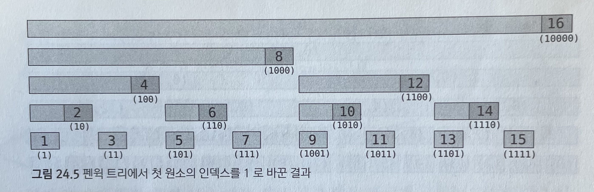

# 구간 트리

***

## 도입

구간 트리는 일차원 배열의 특정 구간에 대한 질문을 빠르게 대답하는데 사용한다.

배열을 전처리해 구간 트리를 생성하면, 구간에 대한 질문은 $O(lgn)$의 시간 복잡도에 수행할 수 있다.

구간 트리의 기본적인 아이디어는 주어진 배열의 구간들을 표현하는 이진 트리를 만드는 것이다.

이 때 구간 트리의 루트는 배열의 전체 구간 [0, n - 1]을 표현하고, 한 트리의 왼쪽 자식과 오른쪽 자식은 각각 해당 구간의 왼쪽 반과 오른쪽 반을 표현한다.

길이가 1인 구간을 표현하는 노드들은 구간 트리의 리프가 된다.

구간 트리는 해당 구간에 대한 계산 결과를 저장해 둔다.

이런 전처리 과정을 수행해두면, 어떤 구간이 주어지더라도 이 구간을 구간 트리의 노드에 포함된 구간들의 합집합으로 표현할 수 있다.

## 구현

```cpp
struct segmentTree {
    int n;
    vector<int> tree;
    segmentTree(const vector<int>& array) {
        n = array.size();
        int h = (int)ceil(log2(n));
        tree.resize(1 << (h + 1));
        init(array, 1, 0, n - 1);
    }
    void init(const vector<int>& array, int node, int nl, int nr) {
        if(nl == nr) tree[node] = array[nl];
        else {
            int m = (nl + nr) / 2;
            init(array, 2 * node, nl, m);
            init(array, 2 * node + 1, m + 1, nr);
            tree[node] = min(tree[node * 2], tree[node * 2 + 1]);
        }
    }
    int query(int l, int r, int node, int nl, int nr) {
        if(r < nl || nr < l) return INF;
        if(l <= nl && nr <= r) return tree[node];
        int m = (l + r) / 2;
        return min(query(l, r, node * 2, nl, m), query(l, r, node * 2 + 1, m + 1, nr));
    }
    int query(int l, int r) {
        return query(l, r, 1, 0, n - 1);
    }
    void update(int idx, int v, int node, int nl, int nr) {
        if(idx < nl || nr < idx) return tree[node];
        if(nl == nr) return tree[node] = v;
        int m = (nl + nr) / 2;
        update(idx, v, node * 2, nl, m);
        update(idx, v, node * 2 + 1, m + 1, nr);
        tree[node] = min(tree[node * 2], tree[node * 2 + 1]);
    }
    int update(int idx, int v) {
        return update(idx, v, 1, 0, n - 1);
    }
};
```

## Lazy Propagation

위 방식을 그대로 사용하면 길이 L인 구간에 대한 값을 update 하면 시간복잡도가 $O(LlogN)$ 이 된다.

아래 링크의 방식을 이용하면 구간에 대한 값 갱신을 $O(logN)$으로 개선할 수 있다.

> https://book.acmicpc.net/ds/segment-tree-lazy-propagation

핵심은 update시에 query를 할 때와 동일한 노드만 방문하도록 하는 것이다.

```cpp
// 구간 합을 구하는 구간트리
struct segmentTree {
    int n;
    vector<int> tree;
    vector<int> lazy;
    segmentTree(const vector<int>& array) {
        int n = array.size();
        int h = (int)ceil(log2(n));
        tree.resize(1 << (h + 1));
        lazy.resize(4 * n, 0);
        init(array, 1, 0, n - 1);
    }
    void update_lazy(int node, int nl, int nr) {
        if(lazy[node] == 0) return;
        tree[node] += (nr - nl + 1) * lazy[node];
        if(nl != nr) {
            lazy[node * 2] += lazy[node];
            lazy[node * 2 + 1] += lazy[node];
        }
        lazy[node] = 0;
    }
    void init(const vector<int>& array, int node, int nl, int nr) {
        if(nl == nr) tree[node] = array[nl];
        else {
            int m = (nl + nr) / 2;
            init(array, node * 2, nl, m);
            init(array, node * 2 + 1, m + 1, nr);
            tree[node] = tree[node * 2] + tree[node * 2 + 1];
        }
    }
    int query(int l, int r, int node, int nl, int nr) {
        update_lazy(node, nl, nr);
        if(nr < l || r < nl) return 0;
        if(l <= nl && nr <= r) return tree[node];
        int m = (nl + nr) / 2;
        return query(l, r, node * 2, nl, m) + query(l, r, node * 2 + 1, m + 1, nr);
    }
    int query(int l, int r) {
        return query(l, r, 1, 0, n - 1);
    }
    void update(int l, int r, int diff, int node, int nl, int nr) {
        update_lazy(node, nl, nr);
        if(nr < l || r < nl) return;
        if(l <= nl && nr <= r) {
            tree[node] += (nr - nl + 1) * diff;
            if(nl != nr) {
                lazy[node * 2] += diff;
                lazy[node * 2 + 1] += diff;
            }
        }
        int m = (nl + nr) / 2;
        update(l, r, diff, node * 2, nl, m);
        update(l, r, diff, node * 2 + 1, m + 1, nr);
        tree[node] = tree[node * 2] + tree[node * 2 + 1];
    }
    void update(int l, int r, int diff) {
        return update(l, r, diff, 1, 0, n - 1);
    }
}
```
***

## 펜윅 트리: 빠르고 간단한 구간 합

펜윅트리는 부분 합을 빠르게 계산할 수 있는 자료구조로, 부분 합을 통해 구간 합을 계산할 수 있다.

계속 변하는 배열의 구간 합을 구할때 자주 사용된다.



```cpp
struct FenwickTree {
    vector<int> tree;
    FenwickTree(int n) : tree(n + 1) {}
    int sum(int pos) {
        ++pos;
        int ret = 0;
        while(pos > 0) {
            ret += tree[pos];
            pos &= (pos - 1);
        }
        return ret;
    }
    void add(int pos, int val) {
        ++pos;
        while(pos < tree.size()) {
            tree[pos] += val;
            pos += (pos & -pos);
        }
    }
};
```

두 연산의 시간 복잡도는 모두 $O(lgn)$ 이다.

***

## 예제

### 등산로 (MORDOR)

> https://www.algospot.com/judge/problem/read/MORDOR

```cpp
#include <iostream>
#include <vector>
#include <algorithm>
using namespace std;

#define INF 2100000000

int N, Q;
vector<int> h;
vector<int> m_h;

void init() {
    cin >> N >> Q;
    h.resize(N);
    m_h.resize(N);
    for(int i = 0; i < N; ++i) {
        cin >> h[i];
        m_h[i] = -h[i];
    }
}

struct segmentTree {
    int n;
    vector<int> tree;
    segmentTree(const vector<int>& array) : n(array.size()) {
        tree.resize(4 * n);
        init(array, 1, 0, n - 1);
    }
    void init(const vector<int>& array, int node, int nl, int nr) {
        if(nl == nr) tree[node] = array[nl];
        else {
            init(array, node * 2, nl, (nl + nr) / 2);
            init(array, node * 2 + 1, (nl + nr) / 2 + 1, nr);
            tree[node] = min(tree[node * 2], tree[node * 2 + 1]);
        }
    } 
    int query(int l, int r, int node, int nl, int nr) {
        if(nr < l || r < nl) return INF;
        if(l <= nl && nr <= r) return tree[node];
        int m = (nl + nr) / 2;
        return min(query(l, r, node * 2, nl, m), query(l, r, node * 2 + 1, m + 1, nr));
    }
    int query(int l, int r) {
        return query(l, r, 1, 0, n - 1);
    }
};

void solve() {
    segmentTree min_h(h);
    segmentTree max_h(m_h);
    
    int a, b;
    for(int i = 0; i < Q; ++i) {
        cin >> a >> b;
        cout << -max_h.query(a, b) - min_h.query(a, b) << '\n';
    }
}

int main() {
    ios_base::sync_with_stdio(false);
    cin.tie(NULL);

    int C; cin >> C;
    while(C--) {
        init();
        solve();
    }

    return 0;
}
```

***

### 족보 탐험 (FAMILYTREE)

> https://www.algospot.com/judge/problem/read/FAMILYTREE

```cpp
#include <iostream>
#include <vector>
using namespace std;

struct segmentTree {
    int n;
    vector<int> tree;
    segmentTree(const vector<int>& array) {
        n = array.size();
        tree.resize(4 * n);
        init(array, 1, 0, n - 1);
    }
    void init(const vector<int>& array, int node, int nl, int nr) {
        if(nl == nr) tree[node] = array[nl];
        else {
            init(array, node*2, nl, (nl+nr)/2);
            init(array, node*2+1, (nl+nr)/2+1, nr);
            tree[node] = min(tree[node*2], tree[node*2+1]);
        }
    }
    int query(int l, int r, int node, int nl, int nr) {
        if(nr < l || r < nl) return 987654321;
        if(l <= nl && nr <= r) return tree[node];
        return min(query(l, r, node*2, nl, (nl+nr)/2), query(l, r, node*2+1, (nl+nr)/2+1, nr));
    }
    int query(int l, int r) { return query(l, r, 1, 0, n - 1); }
};

int N, Q, depth[100000], path_idx[100000];
vector<vector<int>> children;
vector<int> path;

void traverse(int d, int root) {
    depth[root] = d;

    path_idx[root] = path.size();
    path.push_back(d);
    for(int i = 0; i < children[root].size(); ++i) {
        int c = children[root][i];
        traverse(d + 1, c);
        path.push_back(d);
    }
}

void init() {
    cin >> N >> Q;
    children = vector<vector<int>>(N);
    for(int c = 1; c < N; ++c) {
        int p; cin >> p;
        children[p].push_back(c);
    }
    path.clear();
    traverse(0, 0);
}

void solve() {
    segmentTree tree(path);
    while(Q--) {
        int a, b;
        cin >> a >> b;
        int a_idx = path_idx[a];
        int b_idx = path_idx[b];
        if(a_idx > b_idx) swap(a_idx, b_idx);
        cout << (depth[a] + depth[b] - 2 * tree.query(a_idx, b_idx)) << '\n';
    }
}

int main() {
    ios_base::sync_with_stdio(false);
    cin.tie(NULL);

    int C; cin >> C;
    while(C--) {
        init();
        solve();
    }

    return 0;
}
```

***

### 삽입 정렬 시간 재기 (MEASURETIME)

> https://www.algospot.com/judge/problem/read/MEASURETIME

```cpp
#include <cstdio>
#include <vector>
using namespace std;

struct FenwickTree {
    vector<int> tree;
    FenwickTree(int n) : tree(n + 1) {}
    int sum(int pos) {
        ++pos;
        int ret = 0;
        while(pos > 0) {
            ret += tree[pos];
            pos &= (pos - 1);
        }
        return ret;
    }
    void add(int pos, int val) {
        ++pos;
        while(pos < tree.size()) {
            tree[pos] += val;
            pos += (pos & -pos);
        }
    }
};

int main() {
    int C, N, A;
    scanf("%d", &C);
    while(C--) {
        scanf("%d", &N);
        int ret = 0;
        FenwickTree tree(1000001);
        for(int i = 0; i < N; ++i) {
            scanf("%d", &A);
            ret += i - tree.sum(A);
            tree.add(A, 1);
        }
        printf("%d\n", ret);
    }

    return 0;
}
```
