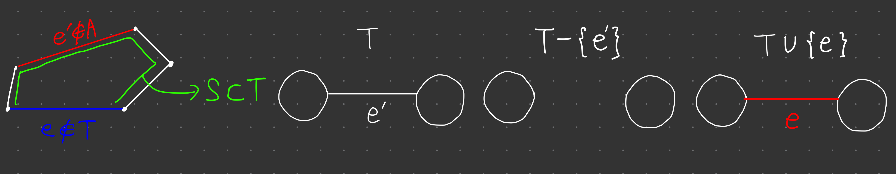
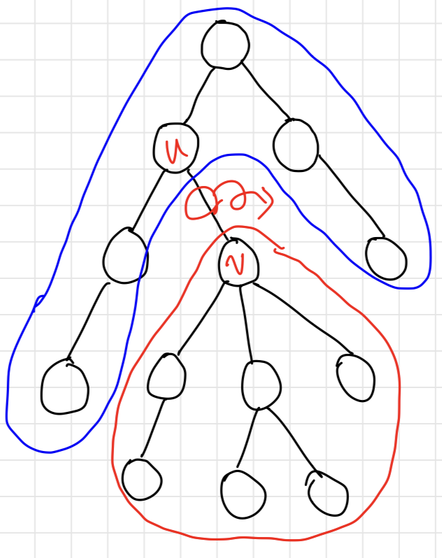
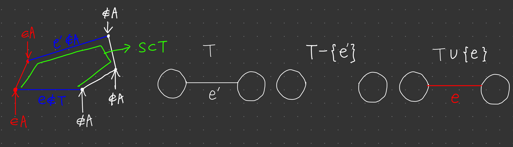

# 최소 스패닝 트리

## 도입

어떤 무향 그래프의 스패닝 트리 (spanning tree) : 원래 그래프의 정점 전부와 간선의 부분 집합으로 구성된 부분 그래프.

스패닝 트리에 포함된 간선들은 정점들을 트리 형태로, 즉 사이클 없이 전부 연결해야 한다.

가중치 그래프의 스패닝 트리 중 가중치의 합이 가장 작은 트리를 찾는 문제를 최소 스패닝 트리 문제라고 한다.

그래프의 연결성을 그대로 유지하는 가장 저렴한 그래프는 '트리' 형태임이 분명하다. 

사이클이 있다면 사이클에서 간선 하나를 제거해도 연결성이 유지되기 때문이다.

> 따라서 최소 스패닝 트리를 찾는 것은 그래프의 연결성을 그대로 유지하는 가장 '저렴한' 그래프를 찾는 것이다.

***

## 크루스칼의 최소 스패닝 트리 알고리즘

크루스칼의 알고리즘은 그래프의 모든 간선을 가중치의 오름차순으로 정렬한 뒤, 사이클이 생기지 않는 간선을 스패닝 트리에 하나씩 추가한다.

```cpp
struct DisjointSet {
    vector<int> parent, rank;
    DisjointSet(int n) :  parent(n), rank(n, 1) {
        for(int i = 0; i < n; ++i)
            parent[i] = i;
    }
    int find(int u) {
        if(u == parent[u]) return u;
        return parent[u] = find(parent[u]);
    }
    void merge(int u, int v) {
        u = find(u); v = find(v);
        if(u == v) return;
        if(rank[u] > rank[v]) swap(u, v);
        parent[u] = v;
        if(rank[u] == rank[v]) ++rank[v];
    }
}

const int MAX_V = 100;
int V;
vector<pair<int, int>> adj[MAX_V];

int kruskal(vector<pair<int, int>>& selected) {
    int ret = 0;
    selected.clear();
    vector<pair<int, pair<int, int>>> edges;
    for(int u = 0; u < V; ++u)
        for(int i = 0; i < adj[u].size(); ++i) {
            int v = adj[u][i].first, cost = adj[u][i].second;
            edges.push_back({cost, {u, v}});
        }
    sort(edges.begin(), edges.end());
    DisjointSet sets(V);
    for(int i = 0; i < edges.size(); ++i) {
        int cost = edges[i].first;
        int u = edges[i].second.first, v = edges[i].second.second;
        if(sets.find(u) == sets.find(v)) continue;
        sets.merge(u, v);
        selected.push_back({u, v});
        ret += cost;
    }
    return ret;
}
```

> 무향 그래프에서 인접리스트로 간선을 표현할 때 한 간선을 두 번 저장할 필요가 없다.

***

### 시간 복잡도

DisjointSet에 대해 하는 연산은 상수 시간이나 다를 바 없기 때문에, 트리를 만드는 for문의 시간복잡도는 O(|E|) 라고 봐도 좋다.

따라서 전체 시간복잡도는 간선 전체를 정렬하는데 걸리는 시간 O(|E|log|E|) 라고 할 수 있다.

***

### 정당성 증명

$A:$ 크루스칼 알고리즘이 지금까지 만든 $edge\ set$

$Invariant:\ A$는 $MST$에 포함된다.

$base:\ |A|=0 \rightarrow invariant$ 만족

$step: A$가 $invariant$ 만족할 때, 크루스칼 알고리즘이 선택하는 간선 $e$를 추가한 $A'(A\cup \{e\})$도 $invariant$를 만족하는지 증명한다.

$A$를 포함하는 $MST$를 $T$라고 하자.

$T$가 $e$를 포함한다면 $invariant$를 만족한다.

만약 $T$가 $e$를 포함하지 않는다면 $T$에는 $e$가 잇는 두 정점을 잇는 경로 $S$가 존재한다.

경로 $S$에는 $A$에 포함되지 않는 간선 $e'$이 존재한다.
<br>(전부 포함되었다면 크루스칼 알고리즘이 $e$를 추가하지 못한다.)

$w(e) < w(e') \rightarrow T - \{e'\} \cup \{e\}$은 $T$보다 가중치가 더 작은 스패닝트리이므로 $T$가 $MST$라는 것에 모순.





$w(e) > w(e') \rightarrow$ 알고리즘이 $A$를 만드는 과정에서 $e'$을 고려한다. $A \subset T$이고, $e' \in T$이므로 $A \cup \{e'\}$은 사이클이 존재하지 않으므로 알고리즘이 선택해야 하고, 이는 모순이다.

따라서 $w(e) = w(e')$이다. $T' = T - \{e'\} \cup \{e\}$라고 하면, $w(T')=w(T)$ 이므로 $T'$도 $MST$이고, $A' \subset T'$이므로 $A'$도 $invariant$를 만족한다.

***

## 프림의 최소 스패닝 트리 알고리즘

크루스칼 알고리즘에서는 여기저기서 산발적으로 만들어진 트리의 조각들을 합쳐 스패닝 트리를 만드는 반면, 프림 알고리즘에서는 하나의 시작점으로 구성된 트리에 간선을 하나씩 추가하며 스패닝 트리가 될 때까지 키워간다.

이 때 프림 알고리즘은 선택할 수 있는 간선들 중 가중치가 가장 작은 간선을 선택한다.

***

### $O(V^2)$ 알고리즘

프림 알고리즘은 지금까지 만들어진 트리와 각 정점을 연결하는 간선의 최소 가중치를 저장하는 배열 $minWeight[]$를 유지한다.

추가할 새 정점을 찾는 작업은 $O(V)$, 모든 간선은 두번씩 검사되므로 전체 시간 복잡도는 $O(V^2 + E)$이고, $V^2 \approx E$인 밀집그래프에서는 프림 알고리즘이 크루스칼 알고리즘보다 빠르게 동작한다.

```cpp
const int MAX_V = 100;
const int INF = 987654321;
int V;
vector<pair<int, int>> adj[MAX_V];

int prim(vector<pair<int, int>>& selected) {
    selected.clear();
    vector<bool> added(V, false);
    vector<int> minWeight(V, INF), parent(V, -1);
    int ret = 0;
    minWeight[0] = parent[0] = 0;
    for(int iter = 0; iter < V; ++iter) {
        int u = -1;
        for(int v = 0; v < V; ++v)
            if(!added[v] && (u == -1 || minWeight[u] > minWeight[v]))
                u = v;
        if(parent[u] != u)
            selected.push_back({parent[u], u});
        ret += minWeight[u];
        added[u] = true;
        for(int i = 0; i < adj[u].size(); ++i) {
            int v = adj[u][i].first, weight = adj[u][i].second;
            if(!added[v] && minWeight[v] > weight) {
                parent[v] = u;
                minWeight = weight;
            }
        }
    }
    return ret;
}
```

> 무향그래프에의 간선 추가에서 크루스칼 알고리즘과는 다르게 한 간선에 대해 두 번 추가해주어야 한다.

***

### $O(ElogE)$ 알고리즘

우선순위 큐를 이용하여 현재 만들어진 트리와 트리가 되지 않은 남은 정점을 잇는 간선 중 가중치가 가장 작은것을 구하여 트리에 추가하는 과정을 반복한다.

```cpp
const int MAX_V = 10000;
int V;
vector<pair<int, int>> adj[MAX_V];

int prim(vector<pair<int, int>>& selected) {
    selected.clear();
    vector<bool> added(V, false);
    priority_queue<pair<int, pair<int, int>>> pq;
    int ret = 0;
    added[0] = true;
    for(int i = 0; i < adj[0].size(); ++i) {
        int v = adj[0][i].first, w = adj[0][i].second;
        pq.push({-w, v});
    }
    while(!pq.empty()) {
        int weight = -pq.top().first;
        int u = pq.top().second.first, v = pq.top().second.second;
        if(added[v]) continue;
        ret += weight;
        selected.push_back({u, v});
        for(int i = 0; i < adj[v].size(); ++i) {
            int k = adj[v][i].first, w = adj[v][i].second;
            if(!added[k])
                pq.push({-w, {v, k}});
        }
    }
    return ret;
}
```

***

### 정당성 증명

$A:$ 프림 알고리즘이 지금까지 만든 $edge set$

$Invariant: A$는 $MST$에 포함된다.

$base: |A|=0 \rightarrow invariant$ 만족

$step: A$가 $invariant$ 만족할 때, 프림 알고리즘이 선택하는 간선 $e(u,v)$를 추가한 $A'(A \cup \{e\})$도 $invariant$를 만족하는지 증명한다. ($u \in A, v \notin A$)

$A$를 포함하는 $MST$를 $T$라고 하자.
$T$가 $e$를 포함한다면 $invariant$를 만족한다.
만약 $T$가 $e$를 포함하지 않는다면 $T$에는 $e$가 잇는 두 정점을 잇는 경로 $S$가 존재한다. 

경로 $S$에는 한쪽 끝은 $A$에 포함되고, 한쪽 끝은 $A$에 포함되지 않는 간선 $e'$이 반드시 존재한다. 

이 간선은 프림 알고리즘이 간선 $e$와 함께 고려한 간선이다.

$w(e) < w(e') \rightarrow T - \{e'\} \cup \{e\}$은 $T$보다 가중치가 더 작은 스패닝트리이므로 $T$가 $MST$라는 것에 모순.



$w(e) > w(e') \rightarrow$ 알고리즘이 $e$가 아닌 $e'$을 골랐어야 한다.

따라서 $w(e) = w(e')$이다. $T' = T - \{e'\} \cup \{e\}$라고 하면, $w(T')=w(T)$ 이므로 $T'$도 $MST$이고, $A' \subset T'$이므로 $A'$도 $invariant$를 만족한다.

***

## 예제

### 근거리 네트워크 (LAN)

> https://www.algospot.com/judge/problem/read/LAN

```cpp
#include <cstdio>
#include <vector>
#include <algorithm>
#include <cmath>
using namespace std;

struct DisjointSet {
    vector<int> parent, rank;
    DisjointSet(int n) : parent(n), rank(n, 1) {
        for(int i = 0; i < n; ++i)
            parent[i] = i;
    }
    int find(int u) {
        if(parent[u] == u) return u;
        return parent[u] = find(parent[u]);
    }
    void merge(int u, int v) {
        u = find(u); v = find(v);
        if(u == v) return;
        if(rank[u] > rank[v]) swap(u, v);
        parent[u] = v;
        if(rank[u] == rank[v]) ++rank[v];
    }
};

int n, m, x[500], y[500];
DisjointSet* sets;

void init() {
    scanf("%d %d", &n, &m);
    for(int i = 0; i < n; ++i)
        scanf("%d", &x[i]);
    for(int i = 0; i < n; ++i)
        scanf("%d", &y[i]);
    sets = new DisjointSet(n);
    for(int i = 0; i < m; ++i) {
        int a, b;
        scanf("%d %d", &a, &b);
        sets->merge(a, b);
    }
}

double getLen(int i, int j) {
    return sqrt(pow(x[i] - x[j], 2) + pow(y[i] - y[j], 2));
}

double solve() {
    vector<pair<double, pair<int, int>>> edges;
    for(int i = 0; i < n - 1; ++i)
        for(int j = i + 1; j < n; ++j)
            edges.push_back({getLen(i, j), {i, j}});
    sort(edges.begin(), edges.end());
    double ret = 0;
    for(int i = 0; i < edges.size(); ++i) {
        double w = edges[i].first;
        int u = edges[i].second.first, v = edges[i].second.second;
        if(sets->find(u) == sets->find(v)) continue;
        sets->merge(u, v);
        ret += w;
    }
    delete sets;
    return ret;
}

int main() {
    int C;
    scanf("%d", &C);
    while(C--) {
        init();
        printf("%.10lf\n", solve());
    }
}
```

***

### 여행 경로 정하기 (TPATH)

> https://www.algospot.com/judge/problem/read/TPATH

```cpp
#include <cstdio>
#include <vector>
#include <algorithm>
using namespace std;

struct DisjointSet {
    vector<int> parent, rank;
    DisjointSet(int n) : parent(n), rank(n, 1) {
        for(int i = 0; i < n; ++i)
            parent[i] = i;
    }
    int find(int u) {
        if(parent[u] == u) return u;
        return parent[u] = find(parent[u]);
    }
    void merge(int u, int v) {
        u = find(u); v = find(v);
        if(u == v) return;
        if(rank[u] > rank[v]) swap(u, v);
        parent[u] = v;
        if(rank[u] == rank[v]) ++rank[v];
    }
};

const int INF = 987654321;

int n, m;
vector<pair<int, pair<int, int>>> edges;

void init() {
    scanf("%d %d", &n, &m);
    edges.resize(m);
    for(int i = 0; i < m; ++i)
        scanf("%d %d %d", &edges[i].second.first, &edges[i].second.second, &edges[i].first);
    sort(edges.begin(), edges.end());
}

int minOfMaxSpeed(int lowerBound) {
    DisjointSet sets(n);
    for(int i = 0; i < edges.size(); ++i) {
        int u = edges[i].second.first, v = edges[i].second.second, w = edges[i].first;
        if(w < lowerBound) continue;
        if(sets.find(u) == sets.find(v)) continue;
        sets.merge(u, v);
        if(sets.find(0) == sets.find(n - 1)) return w;
    }
    return INF;
}

int solve() {
    int ret = INF;
    for(int i = 0; i < edges.size(); ++i)
        ret = min(ret, minOfMaxSpeed(edges[i].first) - edges[i].first);
    return ret;
}

int main() {
    int C;
    scanf("%d", &C);
    while(C--) {
        init();
        printf("%d\n", solve());
    }
    return 0;
}
```

#### 스위핑 알고리즘

```cpp
#include <cstdio>
#include <vector>
#include <algorithm>
using namespace std;

const int INF = 987654321;

int n, m;
vector<int> weights;
vector<vector<pair<int, int>>> adj;

void init() {
    scanf("%d %d", &n, &m);
    int a, b, c;
    adj.clear(); adj.resize(n);
    weights.clear();
    for(int i = 0; i < m; ++i) {
        scanf("%d %d %d", &a, &b, &c);
        adj[a].emplace_back(b, c);
        adj[b].emplace_back(a, c);
        weights.push_back(c);
    }
    sort(weights.begin(), weights.end());
}

int lower, upper;
vector<bool> visited;

void dfs(int here) {
    visited[here] = true;
    for(int i = 0; i < adj[here].size(); ++i) {
        int there = adj[here][i].first;
        int cost = adj[here][i].second;
        if(cost < lower || upper < cost) continue;
        if(!visited[there]) dfs(there);
    }
}

bool canReach(int l, int u) {
    visited = vector<bool>(n, false); 
    lower = weights[l]; upper = weights[u];
    dfs(0);
    return visited[n - 1];
}

int solve() {
    int ret = INF, lo = 0, hi = 0;
    while(lo < weights.size() && hi < weights.size()) {
        if(canReach(lo, hi)) {
            ret = min(ret, weights[hi] - weights[lo]);
            ++lo;
        } else ++hi;
    }
    return ret;
}

int main() {
    int C;
    scanf("%d", &C);
    while(C--) {
        init();
        printf("%d\n", solve());
    }
    return 0;
}
```

weights : 간선의 가중치를 오름차순 정렬한 배열

하한이 정해져 있을때, 최소 상한을 구하는 알고리즘.

하한을 weights[0] 부터 weights[m - 1] 까지 늘려가며 각 하한에서의 최소 상한을 구한다.

하한이 weights[lo]인 간선의 최소 상한이 weights[hi] 라면,

하한이 weights[lo + 1]인 간선의 최소 상한은 반드시 weights[hi] 보다 같거나 크다.

이를 이용하면 O(m^2) 만큼 상한을 구하는 과정을 O(m) 만큼만 구하도록 줄일 수 있다.

***
