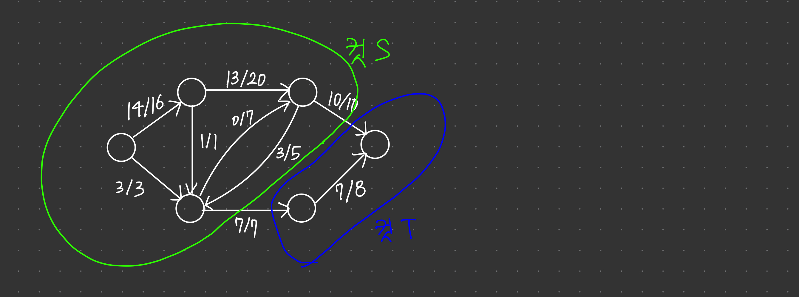
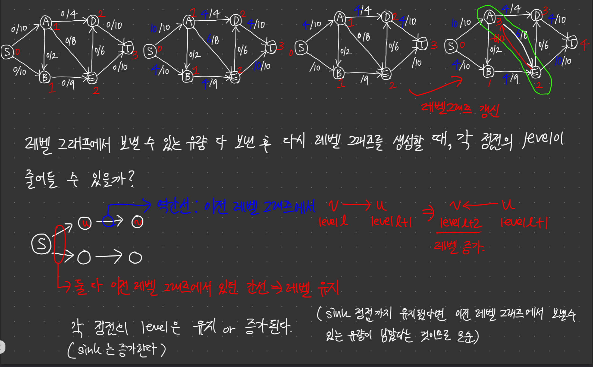
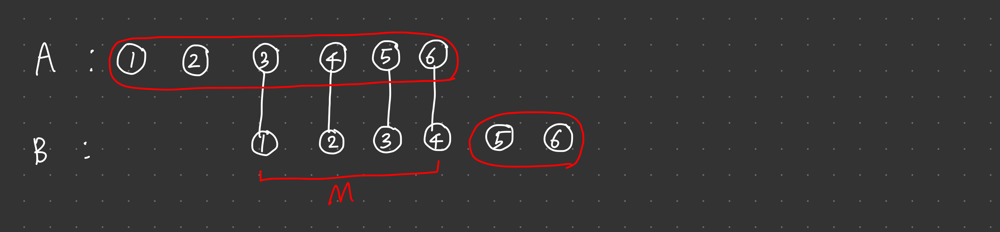
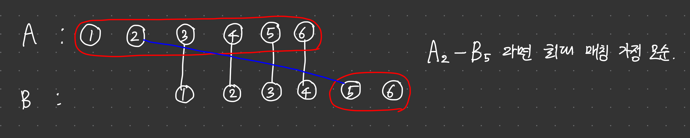
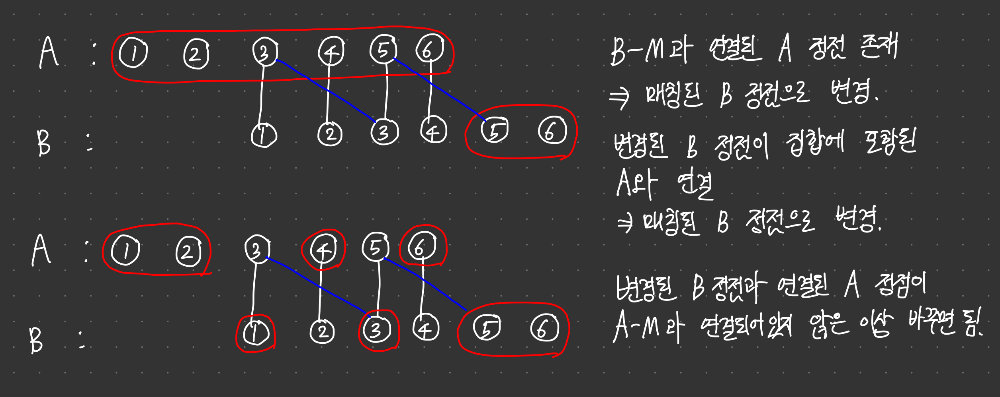
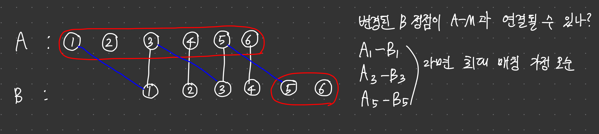
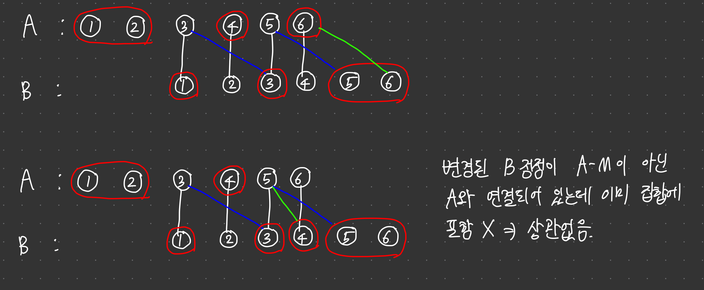
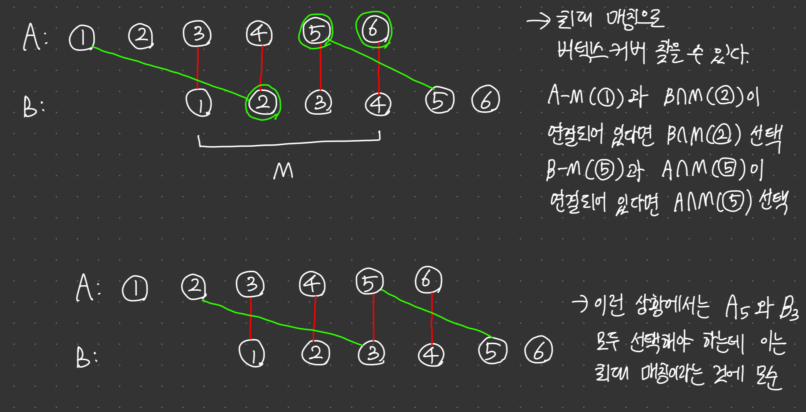
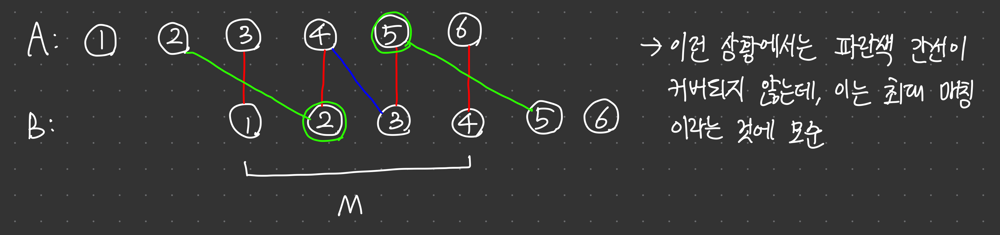

# 네트워크 유량

***

## 도입

유량 네트워크(flow network)란 각 간선에 용량(capacity) 이라는 추가 속성이 존재하는 방향 그래프를 말한다.

유량 네트워크에서 얼마나 많은 '흐름' 혹은 유량을 보낼 수 있는지를 계산하는 문제를 네트워크 유량 문제라고 한다.

정점 $u$에서 $v$로 가는 간선의 용량을 $c(u, v)$, 실제 흐르는 유량을 $f(u, v)$라고 쓸 때, 네트워크의 유량은 항상 다음 세 가지 속성을 만족해야 한다.

1. $f(u, v) <= c(u, v)$ : 각 간선의 유량은 용량을 초과할 수 없음. <용량 제한 속성>

2. $f(u, v) = -f(v, u)$ : $u$에서 $v$로 유량이 흘러올 경우, $v$의 입장에서는 $u$로 음수의 유량을 보내는 것이라고 생각. <유량의 대칭성>

   ***음수의 유량을 갖는 간선을 통해 유량을 보내는 것은 반대쪽에서 흘러오는 유량을 취소하는 것과 같은 효과를 갖는다.***

3. $\sum_{v \in V}f(u, v) = 0$ : 각 정점에 들어오는 유량과 나가는 유량의 양은 정확히 같다. 
유량의 대칭성에 의해 정점에 들어오는 유량은 음수로 표현되므로, 한 정점에서 다른 모든 정점에 보내는 유량의 합은 0이다. <유량의 보존>

   유량 네트워크에는 항상 특수한 두 정점 source와 sink가 존재한다. 소스는 유량이 시작되는 정점이며, 싱크는 유량이 도착하는 정점이다. 따라서 이 두 정점에서는 유량의 보존 속성이 성립하지 않는다.

***

## 포드-풀커슨 알고리즘

포드-풀커슨 알고리즘은 유량 네트워크의 모든 간선의 유량을 0으로 두고 시작해, 소스에서 싱크로 유량을 더 보낼 수 있는 경로를 찾아 유량을 보내기를 반복한다. 

이렇게 유량을 보내는 경로를 증가경로라고 부른다.

포드-풀커슨 알고리즘 중에서 증가경로를 bfs로 찾는 알고리즘을 에드몬드-카프 알고리즘이라고 한다.

경로를 따라 유량을 보낼 수 있으려면 각 간선에 이미 흐르고 있는 유량 외에 추가로 유량을 보낼 수 있는 잔여 용량이 있어야 한다.

잔여 용량(u, v) = 용량(u, v) - 유량(u, v)으로 정의한다.

증가 경로를 통해 흘려보낼 수 있는 유량의 최대량은 포함된 간선의 잔여 용량 중 가장 작은 값으로 결정된다.

에드몬드-카프 알고리즘은 증가 경로가 더이상 존재하지 않을 때까지 증가 경로를 찾고, 보낼 수 있는 최대 유량을 해당 경로를 따라 보내는 작업을 반복한다.

```cpp
const int INF = 987654321;
int V;
int capacity[MAX_V][MAX_V], flow[MAX_V][MAX_V];

int networkFlow(int source, int sink) {
    memset(flow, 0, sizeof(flow));
    int totalFlow = 0;
    while(true) {
        vector<int> parent(MAX_V, -1);
        queue<int> q;
        parent[source] = source;
        q.push(source);
        while(!q.empty() && parent[sink] == -1) {
            int here = q.front(); q.pop();
            for(int there = 0; there < V; ++there) {
                if(capacity[here][there] - flow[here][there] > 0 && parent[there] == -1) {
                    parent[there] = here;
                    q.push(there);
                }
            }
        }
        if(parent[sink] == -1) break;
        int amount = INF;
        for(int p = sink; p != source; p = parent[p])
            amount = min(amount, capacity[parent[p]][p] - flow[parent[p]][p]);
        for(int p = sink; p != source; p = parent[p]) {
            flow[parent[p]][p] += amount;
            flow[p][parent[p]] -= amount;
        }
        totalFlow += amount;
    }
    return totalFlow;
}
```

### 정당성의 증명과 최소 컷 최대 유량 정리

유량 네트워크의 컷 - 소스와 싱크가 각각 다른 컴포넌트에 속하도록 그래프의 정점들을 두 개의 집합으로 나눈 것.

이 때 소스가 속한 집합을 S, 싱크가 속한 집합을 T라고 쓴다.

S에서 T로 가는 간선들의 용량 합을 컷 S,T의 용량이라고 정의하고, S에서 T로 실제로 보내는 총 유량을 컷 S,T의 유량이라고 정의한다.

유량 네트워크의 모든 컷의 유량과 용량에는 두 속성이 항상 성립한다.

   1. 컷의 유량은 소스에서 싱크로 가는 총 유량과 같다. 네트워크의 모든 유량은 S에 포함된 소스에서 흘러나와 T에 포함된 싱크로 흘러들어가기 때문이다. 
      
      T에서 S로 흘러오는 유량은 음수로 계산되므로, 유량의 일부가 S와 T를 여러 번 오가는 경우에도 컷의 유량에는 한 번만 포함된다.

   2. 컷의 유량은 용량과 같거나 더 작을 것이다. 모든 간선에 대해 유량은 용량 이하의 값이기 때문이다.

다시 말하면 모든 컷의 유량은 같고, 어떤 컷에서라도 용량은 유량 이상의 값이라는 이야기다.

이 때 네트워크에서 용량이 가장 작은 컷을 찾아내는 문제를 최소 컷 문제라고 한다.

만약 네트워크에 용량과 유량이 같은 컷 S, T가 존재한다고 하자.

만약 컷 S, T보다 용량이 작은 컷이 존재한다면 해당 컷에 대해 유량이 용량보다 크므로 모순이고, 이보다 많은 유량을 보내는 방법이 있을 경우 컷S, T에 대해 유량이 용량보다 크므로 모순이다.

따라서 용량과 유량이 같은 컷이 있다면 해당 컷은 용량이 가장 작은 최소 컷이고, 최대 유량이다.

에드몬드-카프 알고리즘은 더 이상 증가 경로가 존재하지 않을 때 알고리즘을 종료하게 된다.

이 때 소스에서 잔여 용량이 있는 간선을 통해 갈 수 있는 정점들의 집합을 S라고 하고, 갈 수 없는 정점들의 집합을 T라고 한다면 이 컷은 용량과 유량이 같을 것이다.

따라서 이 컷 S, T는 모든 컷들 중에서 용량이 제일 작고, 이 때 S에서 T로 흐르는 유량은 최대이다.

따라서 에드몬드-카프 알고리즘이 찾아낸 유량은 네트워크의 최대 유량이라는 것을 알 수 있다.

달리 말하면 네트워크에 흘려 보낼 수 있는 최대 유량은 최소 컷의 용량 이하라는 것도 알 수 있다



***

### 시간 복잡도

에드몬드-카프 알고리즘은 모든 유량을 흘려 보낼 때까지 bfs를 통해 경로를 찾는다.

따라서 같은 최단거리로 유량을 보내는 경로들은 연속하여 bfs를 통해 찾아진다는 것을 알 수 있다.

최단 거리가 k인 상황에서 비포화 간선들로 level 그래프를 생성해보자.

한번 유량을 흘리면, level 그래프의 간선 중 하나가 포화 상태로 차버린다.

최단 거리가 k인 한, 생성된 level 그래프 내에서만 경로가 존재할 수 밖에 없다.
(간선이 포화상태로 차면서 그 역간선이 포화가 풀렸다고 해도, 그 역간선을 타고 가는 경로는 최단거리가 아니다.)

$O(E)$의 간선이 모두 포화되면 level그래프가 사라지므로, 최단거리 k에서의 level그래프에서는 최대 $O(E)$번 $bfs$가 수행된다.

최단 거리가 k인 level 그래프에서 유량을 흘려 보내면서 새롭게 생겨나는 경로들은 k보다 크므로, 최단 거리 k인 모든 경로들을 찾아 유량을 흘려 보냈다면 후에 생성하는 level 그래프의 최단 경로는 k보다 크다.

따라서 매 반복마다 가능한 최단거리는 커지게 되고, level 그래프는 $O(V)$번 생겨난다. 따라서 $O(VE)$번의 bfs가 수행되고 전체 시간복잡도는 $O(VE^2)$가 되게 된다.

> 너비 우선 탐색을 할 때마다 유량이 최소 1씩은 흐르므로, 최대 유량이 $f$라면 $O(Ef)$로 계산할 수 있다. 따라서 시간 복잡도는 $O(Ef)$와 $O(VE^2)$중 작은 것이 된다.

> 최단 거리가 k인 경로가 여러가지라고 한다면 이 경로들은 모두 같은 level 그래프 내에서 그릴 수 있는데, 에드몬드 카프 알고리즘은 매 반복마다 bfs를 실행하여 시간복잡도가 낭비된다.

>이를 보완할 수 있는 알고리즘이 "디닉 알고리즘"으로 디닉 알고리즘의 시간복잡도는 $O(V^2E)$이다.

***

## dinic algorithm

```cpp
struct Edge {
    int to, spare, rev;
    Edge(int to, int spare, int rev) : to(to), spare(spare), rev(rev) {}
};
vector<vector<Edge>> adj;
const int MAX_V = 100;
const int INF = 987654321;

void addEdge(int u, int v, int c) {
    adj[u].emplace_back(v, c, adj[v].size());
    adj[v].emplace_back(u, 0, adj[u].size() - 1);
}

int source, sink, level[MAX_V], work[MAX_V];
bool bfs() {
    memset(level, -1, sizeof(level));
    queue<int> q;
    level[source] = 0;
    q.push(source);
    while(!q.empty()) {
        int here = q.front(); q.pop();
        for(Edge& e : adj[here]) {
            if(level[e.to] == -1 && e.spare > 0) {
                level[e.to] = level[here] + 1;
                q.push(e.to);
            }
        }
    }
    return level[sink] != -1;
}

int dfs(int here, int flow) {
    if(here == sink) return flow;
    for(int& i = work[here]; i < adj[here].size(); ++i) {
        Edge& e = adj[here][i];
        if(level[e.to] == level[here] + 1 && e.spare > 0) {
            int ret = dfs(e.to, min(flow, e.spare));
            if(ret > 0) {
                e.spare -= ret;
                adj[e.to][e.rev].spare += ret;
                return ret;
            }
        }
    }
    return 0;
}

int dinic() {
    int totalFlow = 0;
    while(bfs()) {
        memset(work, 0, sizeof(work));
        while(true) {
            int flow = dfs(source, INF);
            if(flow == 0) break;
            totalFlow += flow;
        }
    }
    return totalFlow;
}
```

### 시간 복잡도

dfs의 실행에 걸리는 시간을 분석하면, 두 가지로 나눌 수 있다.

   1. 간선을 가리키는 참조형 변수의 증가 $\rightarrow$ 다음 간선으로 넘어갈 경우 그 전 간선은 더 이상 확인하지 않으므로 변수의 증가는 최대 $O(E)$번만 일어난다.
   2. 최단 거리는 $O(V)$이므로 변수의 증가에 해당하는 시간을 빼면 dinic() 내의 dfs()는 $O(V)$의 시간 복잡도를 갖는다.
   
따라서 $dfs$의 시간 복잡도를 $O(k(1) + V(2))$로 나타낼 수 있다. 

이 때 한번의 $dfs$가 일어나면 한개의 병목 간선이 생기므로, $dfs$는 최대 $O(E)$번까지만 실행된다.

이를 직접 나열해보면 
$O(k_1 + V),\ O(k_2 + V), \cdots,\ O(k_E + V)$ 이렇게 진행된다.

이 때 $O(\sum k_i) = O(E),\ \sum O(V) = O(VE)$ 이므로, 총 $dfs$에 걸리는 시간은 $O(VE)$이다.

$level$ 그래프의 최단거리는 계속해서 증가하므로, $level$그래프는 $O(V)$번 생길 수 있고, 각 $level$그래프마다 $O(VE)$의 시간복잡도가 소요되므로 전체 시간 복잡도는 $O(V^2E)$임을 알 수 있다.

bfs()는 총 $O(V)$ 번 수행되므로, $O(V^2 + VE)$ 이다.

따라서 총 시간복잡도는 $O(V^2E)$가 된다.



***

## 이분 매칭

모든 간선이 서로 다른 그룹의 정점들을 연결하도록 정점을 두 그룹으로 나눌 수 있는  그래프를 이분 그래프라고 한다.

이분 그래프에서 최대 매칭을 찾는 문제를 이분 매칭이라고 부른다.

유량 네트워크에서 최대 유량을 구하는 알고리즘으로 이분 매칭 문제를 쉽게 해결할 수 있다.

이 경우 최대 유량은 $O(V)$ 이므로, 시간복잡도는 $O(VE)$ 가 된다.

그러나 이분 그래프라는 단순한 형태를 이용하여 더 간단하게 구현할 수도 있다.

이 구현은 에드워드-카프 알고리즘처럼 증가 경로를 찾은 뒤 유량을 보내는 것을 반복한다.

```cpp
vector<vector<int>> adj;
vector<bool> visited;
vector<int> aMatch, bMatch;

bool dfs(int a) {
    if(visited[a]) return false;
    visited[a] = true;
    for(int i = 0; i < adj[a].size(); ++i) {
        int b = adj[a][i];
        if(bMatch[b] == -1 || dfs(bMatch[b])) {
            aMatch[a] = b;
            bMatch[b] = a;
            return true;
        }
    }
    return false;
}

int bipartiteMatch() {
    aMatch = vector<int>(n, -1);
    bMatch = vector<int>(m, -1);
    int size = 0;
    for(int a = 0; a < n; ++a) {
        visited = vector<bool>(n, false);
        if(dfs(a)) ++size;
    }
    return size;
}
```
a - b 가 매칭되어 있다고 하자.

dfs() 함수의 if문 내에서 visited[a] 가 true인 상황은 다른 어떤 정점c가 증가 경로를 찾다가 a->b 역간선을 타고 들어갔다는 의미이고 이는 a가 b와의 매칭을 c에게 넘겨주고, 새로운 증가경로를 찾고 있거나 결국 찾지 못한 두 상황중 하나이다.

a가 새로운 매칭을 찾고 있는 중이라면 다른 정점에서의 증가 경로가 a->b 의 역간선을 다시 한번 타고 넘어와도 이미 b는 c와 매칭되어야 하므로 종료되어야 한다.

만약 결국 찾지 못하고 종료된 상황이라고 하더라도 이미 a는 b를 양보한 후 다른 증가경로를 찾지 못한다는 것이므로 다시 볼 필요가 없다.

> start는 아직 아무 정점도 매칭되지 못했으므로 bMatch[x]가 start인 x가 없고, dfs 함수의 if문 내에서visited[start]가 true인 상황은 오지 않는다.

bipartiteMatch() 함수가 종료하면 더이상의 증가경로는 존재하지 않는다.

a와 매칭되는 점을 찾지 못했다고 했을때, 반복문이 진행되면 매칭되는 점이 늘어날 뿐 기존 매칭이 해제되는 경우는 없기 때문에 반복문이 진행되어도 찾지 못한다는 사실은 바뀌지 않기 때문이다.

따라서 bipartiteMatch()가 종료되면 더 이상의 증가 경로는 존재하지 않고, 최소 컷 최대 유량 정리에 의해 최대 유량이 구해진 것을 알 수 있다.

**시간복잡도**

$O(V + E)$ 의 dfs를 $O(V)$ 번 수행하므로, 총 시간 복잡도는 $O(V^2 + VE)$ 이다.

### 격자 그래프와 이분 그래프

격자 그래프는 항상 이분 그래프이다. 격자 그래프를 검흰검흰 으로 번갈아 채운다고 생각해보면, 인접한 두 정점은 반드시 색깔이 다르기 때문이다.

***

### 최대 독립 집합

그래프에서 정점들을 가능한 많이 선택하되, 선택된 정점끼리 서로 인접하지 않도록 하여 선택한 집합을 독립집합이라고 하고, 가장 큰 독립 집합을 구하는 문제를 최대 독립 집합이라고 부른다.

하지만 최대 독립 집합을 푸는 알고리즘은 지금까지 지수 시간 알고리즘밖에 알려지지 않았다.

그러나 이분 그래프에 대해서는 쉽게 구할 수 있다.

이분 그래프에서 서로 매칭되는 정점 쌍들은, 두 정점이 인접하기 때문에 둘 중 하나는 반드시 집합에 포함되지 않아야 한다.

따라서 이분 그래프에서의 최대 독립 집합의 크기는 정점 개수 - 최대 매칭 이하라는 것을 알 수 있다.

이 때 이분 그래프에서 (정점 개수 - 최대 매칭) 크기의 독립 집합을 구하는 알고리즘을 설계함으로써 최대 독립 집합의 크기가 (정점 개수 - 최대 매칭) 라는 사실을 증명할 수 있다.

#### 구성적 증명











즉 이분그래프에서 최대 매칭이 되어있는 상태에서 매칭에 포함되지 않는 정점 전부와, 매칭에 포함된 쌍에서 두 정점중 하나를 잘 선택하면 최대 독립 집합을 구할 수 있다.

***

### 쾨닉의 정리

Vertex Cover 란, 모든 간선들을 커버하는 즉 모든 간선들과 인접한 정점들의 집합이다.

간선으로 연결되어 있는 두 정점이 있다면, 두 정점 중 하나는 반드시 선택해야 하므로 버텍스 커버의 수는 최대 매칭 수 이상이다.





이 때 위 증명을 통해 최대 매칭을 구한 후, 매칭된 정점 쌍들의 각 쌍중에 정점을 하나씩만 선택하여 버텍스 커버를 구할수 있음을 알 수 있다.

즉 버텍스 커버의 수는 최대 매칭 수 이상인데, 최대 매칭 수 크기의 버텍스 커버가 존재하므로 최소 버텍스 커버 = 최대 매칭 임을 알 수 있다.

***

## MCMF

$MCMF = MinCostMaxFlow$

최대 유량을 흘리되, 여러가지 방법 중 비용을 최소로 하도록 흘린다.

일반적인 최대 유량 알고리즘과 동일하게 유량이 더이상 흐르지 않을 때까지 유량을 흘려 보낸다.

이 때 유량을 보낼 때마다 비용이 최소가 되는, 최단경로로 유량을 흘려보내는 것을 반복한다.

유량 알고리즘에서 그래프를 생성할 때 어떤 간선이 있다면, 해당 간선으로의 유량을 취소하기 위한 용량이 0인 역간선을 생성했었다.

어떤 간선의 유량이 취소된다는 것은 해당 간선의 비용도 취소된다는 것을 의미한다.

따라서 어떤 간선의 역간선의 비용은 그 간선의 비용에 부호를 반대로 한 값이어야 한다. 

최단 경로로 유량을 흘려보내기 위해 최단 경로 알고리즘을 사용해야 하는데, 역간선의 존재로 음수 간선도 존재하므로 벨만-포드 알고리즘을 사용해야 한다.

이 때 속도의 향상을 위해 보통 벨만-포드 알고리즘의 성능을 향상시킨 spfa 알고리즘을 사용한다.

***

### 시간복잡도

spfa 알고리즘의 시간복잡도는 $O(VE)$이고, 평균적으로는 $O(V + E)$이다.

최대 유량을 $f$라고 한다면, 시간복잡도는 $O(VEf)$이고, 평균적으로는 $O((V+E)f)$가 된다.

***

### 예제

11408번: 열혈강호5

> https://www.acmicpc.net/problem/11408

$0 \sim N - 1 :$ 직원
$N + 0 \sim N + M - 1 :$ 일
$N + M : source,\ N + M + 1 : sink$

1. 소스에서 각 직원으로 용량 1, 비용 0의 간선을 연결해 준다.

2. 각 직원이 할 수 있는 일에 용량 1, 해당 비용(월급) 간선은 연결해 준다.

3. 각 일에서 싱크로 용량 1, 비용 0의 간선을 연결해 준다.

해당 그래프의 $mcmf$를 구하면 답을 구할 수 있다.

```cpp
#include <cstdio>
#include <vector>
#include <algorithm>
#include <queue>
using namespace std;

struct Edge {
    int to, spare, rev, cost;
    Edge(int to, int spare, int rev, int cost) : to(to), spare(spare), rev(rev), cost(cost) {}
};
const int MAX_V = 802, INF = 987654321;

vector<Edge> adj[MAX_V];

void addEdge(int u, int v, int s, int c) {
    adj[u].emplace_back(v, s, adj[v].size(), c);
    adj[v].emplace_back(u, 0, adj[u].size() - 1, -c);
}

int N, M, V, source, sink;

void mcmf() {
    int result = 0, cnt = 0;
    while(true) {
        vector<int> prev(V, -1), dist(V, INF);
        vector<bool> inQ(V, false);
        queue<int> q;
        dist[source] = 0;
        q.push(source);
        inQ[source] = true;
        while(!q.empty()) {
            int here = q.front(); q.pop();
            inQ[here] = false;
            for(Edge &e : adj[here]) {
                int there = e.to;
                if(e.spare > 0 && dist[there] > dist[here] + e.cost) {
                    dist[there] = dist[here] + e.cost;
                    prev[there] = e.rev;
                    if(!inQ[there]) {
                        q.push(there);
                        inQ[there] = true;
                    }
                }
            }
        }
        if(prev[sink] == -1) break;

        int flow = INF;
        for(int p = sink; p != source; ) {
            Edge &e = adj[p][prev[p]];
            flow = min(flow, adj[e.to][e.rev].spare);
            p = e.to;
        }
        for(int p = sink; p != source; ) {
            Edge &e = adj[p][prev[p]];
            e.spare += flow;
            adj[e.to][e.rev].spare -= flow;
            p = e.to;
        }
        result += flow * dist[sink];
        cnt++;
    }
    printf("%d\n%d", cnt, result);
}

int main() {
    int num, w, c;
    scanf("%d %d", &N, &M);
    V = N + M + 2;
    source = N + M; sink = N + M + 1;
    for(int i = 0; i < N; i++) {
        addEdge(source, i, 1, 0);
        scanf("%d", &num);
        for(int j = 0; j < num; j++) {
            scanf("%d %d", &w, &c);
            addEdge(i, N + w - 1, 1, c);
        }
    }
    for(int i = 0; i < M; i++)
        addEdge(N + i, sink, 1, 0);
    mcmf();
}
```

***

## 예제

### 승부 조작 (MATCHFIX)

> https://www.algospot.com/judge/problem/read/MATCHFIX

```cpp
#include <cstdio>
#include <cstring>
#include <vector>
#include <queue>
#include <algorithm>
using namespace std;

struct Edge {
    int to, spare, rev;
    Edge(int to, int spare, int rev) : to(to), spare(spare), rev(rev) {}
};
vector<vector<Edge>> adj;

void addEdge(int u, int v, int c) {
    adj[u].emplace_back(v, c, adj[v].size());
    adj[v].emplace_back(u, 0, adj[u].size() - 1);
}

int source, sink, level[114], work[114];
bool bfs() {
    memset(level, -1, sizeof(level));
    queue<int> q;
    level[source] = 0;
    q.push(source);
    while(!q.empty()) {
        int here = q.front(); q.pop();
        for(Edge& e : adj[here]) {
            if(level[e.to] == -1 && e.spare > 0) {
                level[e.to] = level[here] + 1;
                q.push(e.to);
            }
        }
    }
    return level[sink] != -1;
}

int dfs(int here, int flow) {
    if(here == sink) return flow;
    for(int& i = work[here]; i < adj[here].size(); ++i) {
        Edge& e = adj[here][i];
        if(level[e.to] == level[here] + 1 && e.spare > 0) {
            int ret = dfs(e.to, min(flow, e.spare));
            if(ret > 0) {
                e.spare -= ret;
                adj[e.to][e.rev].spare += ret;
                return ret;
            }
        }
    }
    return 0;
}

int dinic() {
    int totalFlow = 0;
    while(bfs()) {
        memset(work, 0, sizeof(work));
        while(true) {
            int flow = dfs(source, 987654321);
            if(flow == 0) break;
            totalFlow += flow;
        }
    }
    return totalFlow;
}

int win[12], match_0;
pair<int, int> matches[100];

int n, m;
void init() {
    source = 0; sink = 1;
    scanf("%d %d", &n, &m);
    adj.clear(); adj.resize(n + m + 2);
    for(int i = 0; i < n; ++i)
        scanf("%d", &win[i]);
    match_0 = 0;
    for(int i = 0; i < m; ++i) {
        scanf("%d %d", &matches[i].first, &matches[i].second);
        if(matches[i].first == 0 || matches[i].second == 0)
            ++match_0;
    }
}

int win_0;
bool makeGraph() {
    for(int i = 0; i < m; ++i) {
        addEdge(0, 2 + i, 1);
        addEdge(2 + i, 2 + m + matches[i].first, 1);
        addEdge(2 + i, 2 + m + matches[i].second, 1);
    }

    win_0 = 0;
    for(int i = 1; i < n; ++i)
        win_0 = max(win_0, win[i]);
    win_0 = max(win[0], win_0 + 1);
    if(win[0] + match_0 < win_0) return false;
    addEdge(2 + m + 0, 1, win_0 - win[0]);
    for(int i = 1; i < n; ++i)
        addEdge(2 + m + i, 1, win_0 - win[i] - 1);

    return true;
}

int solve() {
    int flow = 0;
    while(win_0 <= win[0] + match_0) {
        flow += dinic();
        if(flow == m) return win_0;
        ++win_0;
        for(int i = 2 + m + 0; i < 2 + m + n; ++i) 
            ++adj[i].back().spare;
    }
    return -1;
}

int main() {
    int C;
    scanf("%d", &C);
    while(C--) {
        init();
        if(!makeGraph()) { printf("-1\n"); continue; }
        printf("%d\n", solve());
    }
    return 0;
}
```

***

### 비숍 (BISHOPS)

> https://www.algospot.com/judge/problem/read/BISHOPS

```cpp
#include <cstdio>
#include <cstring>
#include <vector>
using namespace std;

int N;
char board[8][9];
void init() {
    scanf("%d", &N);
    for(int i = 0; i < N; ++i)
        scanf("%s", board[i]);
}

int n, m, id[2][8][8];
bool adj[64][64];

void getId(int y, int x, int dir) {
    if(y < 0 || y >= N || x < 0 || x >= N) return;
    if(board[y][x] == '*') return;
    id[dir][y][x] = (dir == 0 ? n : m);
    if(dir == 0) {
        adj[id[0][y][x]][id[1][y][x]] = true;
        getId(y + 1, x + 1, dir);
    }
    else getId(y + 1, x - 1, dir);
}

void makeGraph() {
    n = 0; m = 0;
    memset(adj, false, sizeof(adj));
    memset(id, -1, sizeof(id));

    for(int i = 0; i < N; ++i)
        for(int j = 0; j < N; ++j)
            if(board[i][j] == '.' && id[1][i][j] == -1) {
                getId(i, j, 1);
                ++m;
            }
    for(int i = 0; i < N; ++i)
        for(int j = 0; j < N; ++j)
            if(board[i][j] == '.' && id[0][i][j] == -1) {
                getId(i, j, 0);
                ++n;
            }
}

vector<bool> visited;
vector<int> aMatch;
vector<int> bMatch;

bool dfs(int a) {
    if(visited[a]) return false;
    visited[a] = true;
    for(int b = 0; b < m; ++b)
        if(adj[a][b])
            if(bMatch[b] == -1 || dfs(bMatch[b])) {
                aMatch[a] = b;
                bMatch[b] = a;
                return true;
            }
    return false;
}

int bipartiteMatch() {
    aMatch = vector<int>(n, -1);
    bMatch = vector<int>(m, -1);
    int size = 0;
    for(int a = 0; a < n; ++a) {
        visited = vector<bool>(n, false);
        if(dfs(a)) ++size;
    }
    return size;
}

int main() {
    int T;
    scanf("%d", &T);
    while(T--) {
        init();
        makeGraph();
        printf("%d\n", bipartiteMatch());
    }
    return 0;
}
```

***

### 함정 설치 (TRAPCARD)

> https://www.algospot.com/judge/problem/read/TRAPCARD 

```cpp
#include <cstdio>
#include <cstring>
#include <vector>
using namespace std;

int h, w;
char board[20][21];
void init();

int n, m, v, id[20][20];
const int dy[4] = {-1, 0, 1, 0}, dx[4] = {0, 1, 0, -1};
vector<vector<int>> adj;
void makeGraph();

vector<bool> visited;
vector<int> aMatch, bMatch;
bool dfs(int a);
int bipartiteMatch();

vector<bool> aChosen, bChosen;
void calcMaxIndependentSet();

void printBoard();

int main() {
    int C;
    scanf("%d", &C);
    while(C--) {
        init();
        makeGraph();
        printf("%d\n", v - bipartiteMatch());
        calcMaxIndependentSet();
        printBoard();
    }
    return 0;
}

void printBoard() {
    for(int i = 0; i < h; ++i) {
        for(int j = 0; j < w; ++j) {
            if(board[i][j] == '#') { putchar('#'); continue; }
            if((i + j) % 2 == 0) {
                if(aChosen[id[i][j]]) putchar('^');
                else putchar('.');
            } else {
                if(bChosen[id[i][j]]) putchar('^');
                else putchar('.');
            }
        }
        putchar('\n');
    }
}

void calcMaxIndependentSet() {
    aChosen = vector<bool>(n, true);
    bChosen = vector<bool>(m, false);
    for(int i = 0; i < m; ++i)
        if(bMatch[i] == -1)
            bChosen[i] = true;

    while(true) {
        bool changed = false;
        for(int a = 0; a < n; ++a) {
            for(int i = 0; i < adj[a].size(); ++i) {
                int b = adj[a][i];
                if(aChosen[a] && bChosen[b]) {
                    aChosen[a] = false;
                    bChosen[aMatch[a]] = true;
                    changed = true;
                }
            }
        }
        if(!changed) break;
    }
}

bool dfs(int a) {
    if(visited[a]) return false;
    visited[a] = true;
    for(int i = 0; i < adj[a].size(); ++i) {
        int b = adj[a][i];
        if(bMatch[b] == -1 || dfs(bMatch[b])) {
            aMatch[a] = b;
            bMatch[b] = a;
            return true;
        }
    }
    return false;
}

int bipartiteMatch() {
    aMatch = vector<int>(n, -1);
    bMatch = vector<int>(m, -1);
    int size = 0;
    for(int a = 0; a < n; ++a) {
        visited = vector<bool>(n, false);
        if(dfs(a)) ++size;
    }
    return size;
}

void makeGraph() {
    n = m = v = 0;
    for(int y = 0; y < h; ++y)
        for(int x = 0; x < w; ++x) {
            if(board[y][x] == '#') continue;
            ++v;
            if((y + x) % 2 == 0) id[y][x] = n++;
            else id[y][x] = m++;
        }
    adj.clear(); adj.resize(n);
    for(int y = 0; y < h; ++y)
        for(int x = 0; x < w; ++x) {
            if(board[y][x] == '#' || (y + x) % 2 == 1) continue;
            for(int i = 0; i < 4; ++i) {
                int yy = y + dy[i], xx = x + dx[i];
                if(yy < 0 || yy >= h || xx < 0 || xx >= w || board[yy][xx] == '#') continue;
                adj[id[y][x]].push_back(id[yy][xx]);
            }
        }
}

void init() {
    scanf("%d %d", &h, &w);
    for(int i = 0; i < h; ++i)
        scanf("%s", board[i]);
}
```

> 복잡한 문제는 이 해답 코드처럼 함수의 선언과 필요한 변수들을 main 함수 위에 작성하고 main 함수 아래에 정의를 쓰자!!

***
